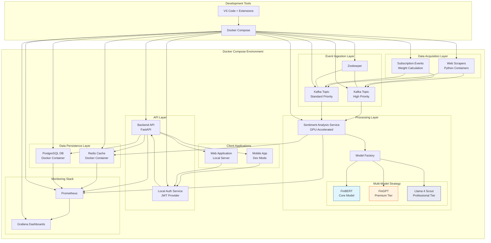

# Local Development Trading Sentiment Analysis Architecture

## Executive Summary

This document presents a comprehensive architecture for a local development environment that mirrors our production Azure architecture for trading sentiment analysis. The local setup enables faster development cycles while maintaining functional parity with the production environment. By leveraging containerization through Docker Compose, developers can work efficiently on their local machines before deploying to Azure.

## Architecture Diagram



## Core Technical Requirements

1. **Functional Parity**: Maintain feature compatibility with the Azure architecture
2. **Performance**: Optimize for development speed and quick iteration cycles
3. **Ease of Use**: Simplified setup and operation for developers
4. **Resource Efficiency**: Operate effectively on standard development hardware
5. **Staged Implementation**: Support phased rollout of model enhancements
6. **GPU Support**: Leverage local NVIDIA GPUs where available

## Technical Architecture Overview

### 1. Data Acquisition Layer

**Web Scrapers (Docker Containers)**
- Python-based scraper containers instead of Azure Functions
- Identical business logic for scraping financial news and social media
- Assigns initial event weight and source credibility scores
- Configurable polling intervals for development purposes
- Local file-based configuration instead of App Settings

**Subscription Event Receivers**
- Simulated subscription events for testing purposes
- Pre-processing and normalization identical to production
- Weight assignment based on same rules
- Local file-based storage for reference data

### 2. Event Ingestion Layer

**Kafka (Instead of Azure Event Hubs)**
- Kafka running in Docker containers with Zookeeper
- Topic partitioning mirroring Event Hub configuration
- Configurable retention policies
- Kafka UI for monitoring and management
- Dead letter queue implementation for error handling

**Kafka Topics**
- High Priority Topic for critical financial events
- Standard Priority Topic for regular market updates
- Partitioning strategy matching production

### 3. Processing Layer

**Sentiment Analysis Service (Container with Multi-Model Support)**
- Docker container with GPU passthrough when available
- Phased model implementation approach:
  - **Phase 1**: FinBERT as primary model for all sentiment analysis
  - **Phase 2**: FinGPT added for premium users and complex text
  - **Phase 3**: Llama 4 Scout for professional tier and document analysis
- Intelligent model routing based on:
  - User subscription tier
  - Content complexity 
  - Special event types
  - Premium ticker lists
- Model Factory pattern for unified interface
- Fallback mechanisms if advanced models fail
- ONNX Runtime optimization for FinBERT

**Model Configurations**
- FinBERT:
  - ONNX-optimized for speed
  - Small memory footprint (~440MB)
  - Very low latency for real-time processing
- FinGPT:
  - Llama 2-based with LoRA fine-tuning
  - 4-bit quantization to reduce memory needs
  - Medium context length (4K tokens)
- Llama 4 Scout:
  - MoE architecture with 16 experts
  - Multimodal capability for image+text analysis
  - Very long context window (10M tokens)
  - Scaled down parameter count through quantization

### 4. API & User Management Layer

**Backend API (FastAPI with Async)**
- FastAPI implementation identical to production
- JWT token authentication
- Model routing based on subscription tier
- Local development server with hot reload
- OpenAPI documentation and testing interface
- Rate limiting simulation

**User Management**
- Local authentication service for development
- Pre-configured test users with different subscription tiers
- JWT token-based session management
- Role permissions matching production

### 5. Data Persistence Layer

**Redis (Container)**
- Redis container with volume persistence
- Identical caching patterns to production
- Persistent storage between restarts
- Redis Commander UI for debugging

**PostgreSQL (Container)**
- PostgreSQL container with volume persistence
- Same schema as production environment
- Pre-loaded test data for development
- pgAdmin container for database management

### 6. Client Applications Layer

**Mobile Apps (Development Mode)**
- Local development builds connecting to local API
- Hot reloading for UI changes
- Debug tooling enabled
- Simulated push notifications

**Web Application (Local Server)**
- Development server with hot reloading
- Browser-based debugging tools
- WebSocket for real-time updates
- Connection to local API endpoints

### 7. Monitoring & DevOps Layer

**Local Monitoring Stack**
- Prometheus container for metrics collection
- Grafana dashboards for visualization
- Custom model performance metrics
- Container resource utilization monitoring

**Development Tools**
- Docker Compose for environment orchestration
- VS Code with DevContainer support
- Git workflow matching production
- Comprehensive testing framework:
  - Mock-based tests for fast development feedback
  - Unit tests for individual component validation
  - Integration tests for service interaction validation
  - End-to-end tests for complete data flow validation
  - Virtual environment-based testing to prevent dependency issues

## Architecture Flow

1. **Data Acquisition & Ingestion**:
   - Local scrapers collect financial data from configured sources
   - Events are classified by priority and pushed to Kafka topics
   - Kafka UI allows inspection of message flow

2. **Sentiment Processing**:
   - Sentiment Analysis Service consumes events from Kafka
   - Model Factory selects appropriate model based on configuration
   - Phase 1: FinBERT processes all requests
   - Phase 2: FinGPT handles premium content
   - Phase 3: Llama 4 Scout processes professional tier content
   - Results are stored in Redis cache

3. **User Authentication**:
   - User authenticates via local auth service
   - JWT tokens are issued with appropriate claims
   - Backend API validates tokens and subscription tier
   - Model selection is influenced by subscription tier

4. **Data Retrieval & Display**:
   - Client requests sentiment data from local API
   - API retrieves data from Redis cache
   - Different subscription tiers get different model results
   - Real-time updates via WebSockets

5. **Monitoring & Development**:
   - Prometheus collects metrics from all containers
   - Grafana provides visualizations and dashboards
   - Container logs available for debugging
   - VS Code integration for seamless development

## Implementation Approach

### Phased Model Integration Strategy

The architecture implements a 3-phase model integration strategy:

#### Phase 1: FinBERT Base (Current)
- FinBERT serves as the primary model for all sentiment analysis
- Fast inference with ONNX optimization
- Minimal GPU requirements
- Used for all subscription tiers

#### Phase 2: FinGPT Premium Integration (1-2 months)
- FinGPT added as premium model for higher-tier subscribers
- 4-bit quantization for efficient memory usage
- More nuanced sentiment analysis
- Applied selectively based on:
  - User subscription tier
  - Event importance (weight)
  - Special event types (earnings reports, filings)
  - Premium tickers list

#### Phase 3: Llama 4 Scout Professional Integration (3-6 months)
- Llama 4 Scout added for professional tier subscribers
- Specialized use cases:
  - Document analysis (10M token context window)
  - Visual content analysis (multimodal capabilities)
  - Comprehensive financial analysis

### Setup and Operation

#### Prerequisites
- Docker Desktop with Docker Compose
- NVIDIA GPU with CUDA support (optional but recommended)
- NVIDIA Container Toolkit installed
- Git client
- VS Code with recommended extensions

#### Project Structure
```
RTSentiment/
├── .env                        # Environment variables
├── docker-compose.yml          # Container orchestration
├── data_acquisition/           # Data acquisition components
├── sentiment_service/          # Sentiment analysis service
│   ├── models/                 # Model implementations
│   │   ├── finbert.py          # FinBERT model
│   │   ├── fingpt.py           # FinGPT model
│   │   ├── llama4_scout.py     # Llama 4 Scout model
│   │   └── model_factory.py    # Model selection logic
├── api/                        # Backend API implementation
├── auth_service/               # Local authentication service
├── client/                     # Client applications
└── monitoring/                 # Prometheus and Grafana
```

#### Development Workflow

1. **Initial Setup**:
   ```bash
   # Clone the repository
   git clone https://github.com/JCorners68/RTSentiment.git
   cd RTSentiment
   
   # Start with FinBERT only (Phase 1)
   docker compose up -d
   ```

2. **Phase 2 Development**:
   ```bash
   # Enable FinGPT
   USE_FINGPT=true docker compose up -d sentiment-analysis
   ```

3. **Phase 3 Development**:
   ```bash
   # Enable Llama 4 Scout
   USE_FINGPT=true USE_LLAMA4=true docker compose up -d sentiment-analysis
   ```

4. **Testing the Application**:
   ```bash
   # Run mock-based tests that don't require full environment
   ./run_tests.sh --mock
   
   # Run API unit tests in an isolated environment
   ./run_tests.sh --unit
   
   # Run full integration tests
   ./run_tests.sh --integration
   
   # Run end-to-end tests for the complete data flow
   ./run_e2e_tests.sh
   
   # Run targeted tests for specific model
   docker compose exec sentiment-analysis python -m pytest tests/test_fingpt.py
   ```

## Local vs. Azure Implementation

### Key Component Substitutions

| Azure Component | Local Development Equivalent |
|-----------------|------------------------------|
| Azure Functions | Docker containers with Python |
| Event Hubs | Kafka + Zookeeper containers |
| AKS on NCSv3 VMs | Container with GPU passthrough |
| Azure Cache for Redis | Redis container |
| Azure DB PostgreSQL | PostgreSQL container |
| Azure AD B2C | Local auth service container |
| Application Insights | Prometheus + Grafana |

### Maintaining Compatibility

1. **API Compatibility**: The API contract remains identical
2. **Event Schema**: Event formats and schemas are consistent
3. **Data Models**: Database schemas and Redis structures match
4. **Business Logic**: Core processing logic is identical

## Performance Considerations

### GPU Acceleration

- NVIDIA container runtime enables GPU access
- Models automatically use GPU when available
- Quantization reduces memory requirements
- Fallback to CPU when GPU unavailable

### Resource Optimization

- Memory limits configured in Docker Compose
- Model loading only when needed
- Prometheus metrics tracking resource usage
- Environment variables to enable/disable components

## Docker Compose Configuration Example

```yaml
version: '3.8'

services:
  # Data Acquisition Layer
  web-scraper:
    build:
      context: ./data_acquisition
      dockerfile: Dockerfile
    environment:
      - KAFKA_BOOTSTRAP_SERVERS=kafka:9092
    volumes:
      - ./data_acquisition:/app
    depends_on:
      - kafka

  # Event Ingestion Layer
  zookeeper:
    image: confluentinc/cp-zookeeper:7.3.1
    environment:
      ZOOKEEPER_CLIENT_PORT: 2181
    volumes:
      - zookeeper-data:/var/lib/zookeeper/data

  kafka:
    image: confluentinc/cp-kafka:7.3.1
    depends_on:
      - zookeeper
    environment:
      KAFKA_BROKER_ID: 1
      KAFKA_ZOOKEEPER_CONNECT: zookeeper:2181
      KAFKA_ADVERTISED_LISTENERS: PLAINTEXT://kafka:9092,PLAINTEXT_HOST://localhost:29092
      KAFKA_LISTENER_SECURITY_PROTOCOL_MAP: PLAINTEXT:PLAINTEXT,PLAINTEXT_HOST:PLAINTEXT
      KAFKA_INTER_BROKER_LISTENER_NAME: PLAINTEXT
      KAFKA_OFFSETS_TOPIC_REPLICATION_FACTOR: 1
    volumes:
      - kafka-data:/var/lib/kafka/data
    ports:
      - "29092:29092"

  # Processing Layer
  sentiment-analysis:
    build:
      context: ./sentiment_service
      dockerfile: Dockerfile
    environment:
      # Phase 1: FinBERT only (default)
      - USE_FINGPT=${USE_FINGPT:-false}
      - USE_LLAMA4=${USE_LLAMA4:-false}
      - REDIS_HOST=redis
      - KAFKA_BOOTSTRAP_SERVERS=kafka:9092
    volumes:
      - ./sentiment_service:/app
      - model-weights:/app/models/weights
    deploy:
      resources:
        reservations:
          devices:
            - driver: nvidia
              count: 1
              capabilities: [gpu]

  # API Layer
  api:
    build:
      context: ./api
      dockerfile: Dockerfile
    environment:
      - REDIS_HOST=redis
      - POSTGRES_HOST=postgres
      - AUTH_SERVICE_URL=http://auth-service:8002
    volumes:
      - ./api:/app
    ports:
      - "8001:8001"
    depends_on:
      - redis
      - postgres
      - auth-service

  # Auth Service
  auth-service:
    build:
      context: ./auth_service
      dockerfile: Dockerfile
    environment:
      - POSTGRES_HOST=postgres
      - JWT_SECRET=local_development_secret
    volumes:
      - ./auth_service:/app
    ports:
      - "8002:8002"

  # Data Persistence Layer
  redis:
    image: redis:7-alpine
    ports:
      - "6379:6379"
    volumes:
      - redis-data:/data
    command: redis-server --appendonly yes

  postgres:
    image: postgres:14
    environment:
      POSTGRES_USER: pgadmin
      POSTGRES_PASSWORD: localdev
      POSTGRES_DB: sentimentdb
    ports:
      - "5432:5432"
    volumes:
      - postgres-data:/var/lib/postgresql/data

  # Monitoring
  prometheus:
    image: prom/prometheus:latest
    volumes:
      - ./monitoring/prometheus.yml:/etc/prometheus/prometheus.yml
      - prometheus-data:/prometheus
    ports:
      - "9090:9090"

  grafana:
    image: grafana/grafana:latest
    depends_on:
      - prometheus
    ports:
      - "3000:3000"
    volumes:
      - ./monitoring/grafana/provisioning:/etc/grafana/provisioning
      - grafana-data:/var/lib/grafana
    environment:
      GF_SECURITY_ADMIN_USER: admin
      GF_SECURITY_ADMIN_PASSWORD: admin

volumes:
  zookeeper-data:
  kafka-data:
  redis-data:
  postgres-data:
  prometheus-data:
  grafana-data:
  model-weights:
```

## Conclusion

This local development architecture provides a complete, containerized environment that mirrors the Azure production setup while optimizing for developer productivity. The phased model implementation approach allows for gradual enhancement of the sentiment analysis capabilities, starting with a lightweight FinBERT foundation and progressing to more sophisticated models like FinGPT and Llama 4 Scout. This approach balances innovation with practical development constraints, ensuring that the team can deliver a high-quality trading sentiment analysis solution.