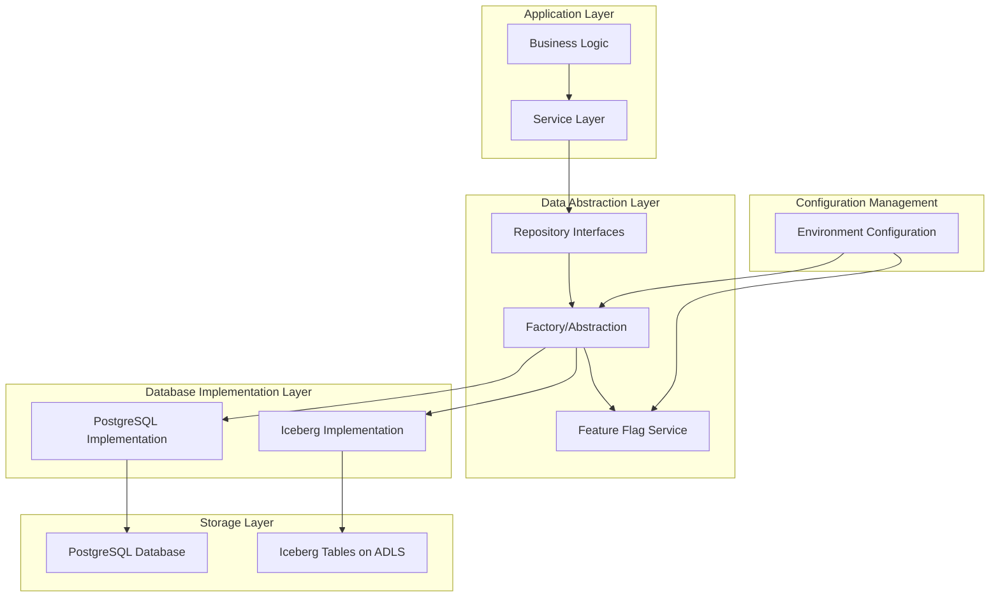
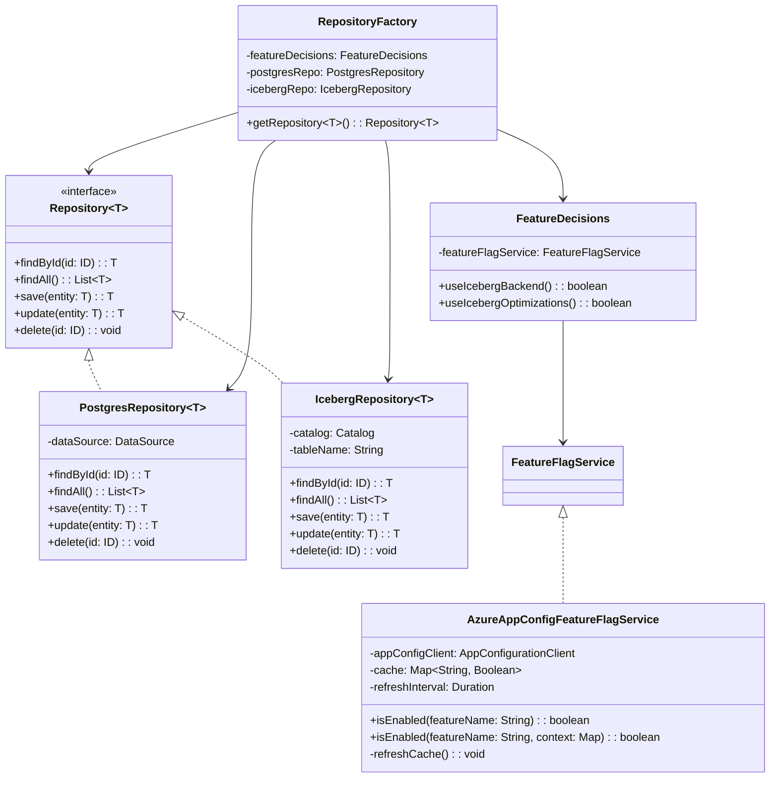
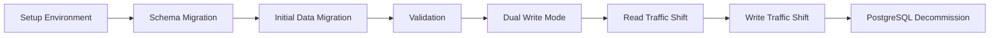

# Dual-database dance: Sentimark's path to production

This data tier plan outlines Sentimark's implementation strategy for a database abstraction layer supporting dual database backends: PostgreSQL for development and Apache Iceberg for production. By following this plan, your team will create a robust, maintainable system that leverages the strengths of both technologies while minimizing development friction.

## Bottom line up front

The most effective approach for Sentimark is implementing a repository pattern with clear interface abstractions, allowing seamless switching between PostgreSQL and Iceberg backends. This plan provides specific implementation guidelines across five development phases, with detailed code samples, testing strategies, and feature flag recommendations. The architecture employs interface segregation, factory patterns, and environment-specific configurations to create **complete transparency** for application code while providing optimized performance in both environments. 

## Architecture overview

The proposed architecture creates a clean separation between application business logic and data access through a well-defined abstraction layer. This enables transparent switching between PostgreSQL in development and Iceberg in production while maintaining consistent application behavior.



### Key architectural components

The architecture consists of several essential components working together to create a seamless abstraction:



## Implementation phases

### Phase 1: Foundation setup (✅ COMPLETED)

The first phase focuses on establishing the core infrastructure and abstraction layer in the development environment (WSL). Since this is a new system with no existing data or users, we will start by building a solid foundation.

#### Key objectives for Phase 1:

1. **Define core domain entities**: Identify and create the primary domain entities that will be stored in the database
2. **Create repository interfaces**: Define the core repository interfaces that will provide data access abstraction
3. **Set up PostgreSQL locally**: Configure PostgreSQL in the WSL environment for development
4. **Implement PostgreSQL repositories**: Create PostgreSQL implementations for all repository interfaces
5. **Set up feature flag system**: Establish the feature flag infrastructure for future backend switching
6. **Create basic verification tests**: Develop tests to verify repository functionality

#### Implementation steps:

1. **Local PostgreSQL setup**:
   ```bash
   # Install PostgreSQL in WSL
   sudo apt update
   sudo apt install postgresql postgresql-contrib

   # Start PostgreSQL service
   sudo service postgresql start

   # Create database and user for Sentimark
   sudo -u postgres psql -c "CREATE USER sentimark WITH PASSWORD 'sentimark_dev';"
   sudo -u postgres psql -c "CREATE DATABASE sentimarkdb;"
   sudo -u postgres psql -c "GRANT ALL PRIVILEGES ON DATABASE sentimarkdb TO sentimark;"
   
   # Verify connection
   psql -h localhost -U sentimark -d sentimarkdb
   ```

2. **Core domain entities**:
   Create domain classes representing key business entities. For the sentiment analysis system, key entities include:
   
   ```java
   // Example domain entity
   public class SentimentRecord {
       private UUID id;
       private String ticker;
       private double sentimentScore;
       private Instant timestamp;
       private String source;
       private Map<String, Double> attributes;
       
       // Getters, setters, constructors
   }
   
   // Example domain entity
   public class MarketEvent {
       private UUID id;
       private String headline;
       private List<String> tickers;
       private String content;
       private Instant publishedAt;
       private String source;
       private double credibilityScore;
       
       // Getters, setters, constructors
   }
   ```

3. **Repository interfaces**:
   Define generic repository interfaces and entity-specific interfaces:
   
   ```java
   // Generic repository interface
   public interface Repository<T, ID> {
       Optional<T> findById(ID id);
       List<T> findAll();
       T save(T entity);
       T update(T entity);
       void delete(ID id);
   }
   
   // Entity-specific repository interface
   public interface SentimentRecordRepository extends Repository<SentimentRecord, UUID> {
       List<SentimentRecord> findByTicker(String ticker);
       List<SentimentRecord> findByTickerAndTimeRange(String ticker, Instant start, Instant end);
       double getAverageSentimentForTicker(String ticker, Instant since);
   }
   
   // Entity-specific repository interface
   public interface MarketEventRepository extends Repository<MarketEvent, UUID> {
       List<MarketEvent> findByTickers(List<String> tickers);
       List<MarketEvent> findByTimeRange(Instant start, Instant end);
       List<MarketEvent> findBySourceAndTimeRange(String source, Instant start, Instant end);
   }
   ```

4. **PostgreSQL implementations**:
   Create PostgreSQL-specific implementations of the repository interfaces:
   
   ```java
   @Repository("postgresSentimentRecordRepository")
   public class PostgresSentimentRecordRepository implements SentimentRecordRepository {
       private final DataSource dataSource;
       private final JdbcTemplate jdbcTemplate;
       
       @Autowired
       public PostgresSentimentRecordRepository(DataSource dataSource) {
           this.dataSource = dataSource;
           this.jdbcTemplate = new JdbcTemplate(dataSource);
       }
       
       @Override
       public Optional<SentimentRecord> findById(UUID id) {
           try {
               return Optional.ofNullable(jdbcTemplate.queryForObject(
                   "SELECT * FROM sentiment_records WHERE id = ?",
                   new Object[]{id},
                   this::mapRowToSentimentRecord
               ));
           } catch (EmptyResultDataAccessException e) {
               return Optional.empty();
           }
       }
       
       @Override
       public List<SentimentRecord> findAll() {
           return jdbcTemplate.query(
               "SELECT * FROM sentiment_records ORDER BY timestamp DESC",
               this::mapRowToSentimentRecord
           );
       }
       
       @Override
       public SentimentRecord save(SentimentRecord record) {
           if (record.getId() == null) {
               record.setId(UUID.randomUUID());
           }
           
           jdbcTemplate.update(
               "INSERT INTO sentiment_records (id, ticker, sentiment_score, timestamp, source, attributes) " +
               "VALUES (?, ?, ?, ?, ?, ?::jsonb)",
               record.getId(),
               record.getTicker(),
               record.getSentimentScore(),
               record.getTimestamp(),
               record.getSource(),
               convertAttributesToJson(record.getAttributes())
           );
           
           return record;
       }
       
       // Other method implementations...
       
       private SentimentRecord mapRowToSentimentRecord(ResultSet rs, int rowNum) throws SQLException {
           // Mapping logic
       }
       
       private String convertAttributesToJson(Map<String, Double> attributes) {
           // Conversion logic
       }
   }
   ```

5. **Feature flag system**:
   Implement a simple feature flag system for environment-specific configuration:
   
   ```java
   public interface FeatureFlagService {
       boolean isEnabled(String featureName);
       boolean isEnabled(String featureName, Map<String, Object> context);
   }
   
   @Component
   public class FileBasedFeatureFlagService implements FeatureFlagService {
       private final Map<String, Boolean> features;
       private final Logger logger = LoggerFactory.getLogger(FileBasedFeatureFlagService.class);
       
       @Autowired
       public FileBasedFeatureFlagService(@Value("${features.config.path}") String configPath) {
           this.features = new ConcurrentHashMap<>();
           try {
               Properties props = new Properties();
               props.load(new FileInputStream(configPath));
               
               for (String key : props.stringPropertyNames()) {
                   if (key.startsWith("feature.")) {
                       String featureName = key.substring("feature.".length());
                       boolean enabled = Boolean.parseBoolean(props.getProperty(key));
                       features.put(featureName, enabled);
                       logger.info("Feature flag loaded: {} = {}", featureName, enabled);
                   }
               }
           } catch (IOException e) {
               logger.warn("Could not load feature flags from {}: {}", configPath, e.getMessage());
           }
       }
       
       @Override
       public boolean isEnabled(String featureName) {
           return features.getOrDefault(featureName, false);
       }
       
       @Override
       public boolean isEnabled(String featureName, Map<String, Object> context) {
           return isEnabled(featureName);
       }
   }
   ```

6. **Repository factory**:
   Create a factory to select the appropriate repository implementation:
   
   ```java
   @Component
   public class RepositoryFactory {
       private final Map<Class<?>, Object> postgresRepositories;
       private final Map<Class<?>, Object> icebergRepositories;
       private final FeatureDecisions featureDecisions;
       
       @Autowired
       public RepositoryFactory(
               ApplicationContext context,
               FeatureDecisions featureDecisions) {
           this.featureDecisions = featureDecisions;
           this.postgresRepositories = new HashMap<>();
           this.icebergRepositories = new HashMap<>();
           
           // Register SentimentRecordRepository implementations
           registerRepository(
               SentimentRecordRepository.class,
               context.getBean("postgresSentimentRecordRepository", SentimentRecordRepository.class),
               null  // Iceberg implementation will be null for Phase 1
           );
           
           // Register MarketEventRepository implementations
           registerRepository(
               MarketEventRepository.class,
               context.getBean("postgresMarketEventRepository", MarketEventRepository.class),
               null  // Iceberg implementation will be null for Phase 1
           );
       }
       
       public <T> void registerRepository(
               Class<T> repositoryInterface,
               T postgresImplementation,
               T icebergImplementation) {
           postgresRepositories.put(repositoryInterface, postgresImplementation);
           if (icebergImplementation != null) {
               icebergRepositories.put(repositoryInterface, icebergImplementation);
           }
       }
       
       @SuppressWarnings("unchecked")
       public <T> T getRepository(Class<T> repositoryInterface) {
           if (featureDecisions.useIcebergBackend() && icebergRepositories.containsKey(repositoryInterface)) {
               return (T) icebergRepositories.get(repositoryInterface);
           } else {
               return (T) postgresRepositories.get(repositoryInterface);
           }
       }
   }
   ```

7. **Feature decisions**:
   Create a component to encapsulate feature flag decisions:
   
   ```java
   @Component
   public class FeatureDecisions {
       private final FeatureFlagService featureFlagService;
       
       @Autowired
       public FeatureDecisions(FeatureFlagService featureFlagService) {
           this.featureFlagService = featureFlagService;
       }
       
       public boolean useIcebergBackend() {
           return featureFlagService.isEnabled("use-iceberg-backend");
       }
       
       public boolean useIcebergOptimizations() {
           return useIcebergBackend() && featureFlagService.isEnabled("use-iceberg-optimizations");
       }
   }
   ```

8. **Schema definition**:
   Create SQL scripts for PostgreSQL schema:
   
   ```sql
   -- schema.sql
   CREATE TABLE IF NOT EXISTS sentiment_records (
       id UUID PRIMARY KEY,
       ticker VARCHAR(20) NOT NULL,
       sentiment_score DOUBLE PRECISION NOT NULL,
       timestamp TIMESTAMP WITH TIME ZONE NOT NULL,
       source VARCHAR(100) NOT NULL,
       attributes JSONB
   );
   
   CREATE INDEX idx_sentiment_records_ticker ON sentiment_records (ticker);
   CREATE INDEX idx_sentiment_records_timestamp ON sentiment_records (timestamp);
   CREATE INDEX idx_sentiment_records_ticker_timestamp ON sentiment_records (ticker, timestamp);
   
   CREATE TABLE IF NOT EXISTS market_events (
       id UUID PRIMARY KEY,
       headline TEXT NOT NULL,
       tickers TEXT[] NOT NULL,
       content TEXT,
       published_at TIMESTAMP WITH TIME ZONE NOT NULL,
       source VARCHAR(100) NOT NULL,
       credibility_score DOUBLE PRECISION NOT NULL
   );
   
   CREATE INDEX idx_market_events_published_at ON market_events (published_at);
   CREATE INDEX idx_market_events_source ON market_events (source);
   ```

9. **Configuration properties**:
   Create application properties file:
   
   ```properties
   # application.properties
   spring.datasource.url=jdbc:postgresql://localhost:5432/sentimarkdb
   spring.datasource.username=sentimark
   spring.datasource.password=sentimark_dev
   spring.datasource.driver-class-name=org.postgresql.Driver
   
   features.config.path=./config/features.properties
   ```

10. **Feature flags file**:
    Create feature flags file:
    
    ```properties
    # features.properties
    feature.use-iceberg-backend=false
    feature.use-iceberg-optimizations=false
    ```

#### Verification steps:

1. **Database connection test**:
   ```java
   @SpringBootTest
   public class DatabaseConnectionTest {
       @Autowired
       private DataSource dataSource;
       
       @Test
       public void testDatabaseConnection() throws SQLException {
           try (Connection conn = dataSource.getConnection()) {
               assertNotNull(conn);
               assertFalse(conn.isClosed());
           }
       }
   }
   ```

2. **Repository CRUD test**:
   ```java
   @SpringBootTest
   public class SentimentRecordRepositoryTest {
       @Autowired
       private RepositoryFactory repositoryFactory;
       
       private SentimentRecordRepository repository;
       
       @BeforeEach
       public void setup() {
           repository = repositoryFactory.getRepository(SentimentRecordRepository.class);
       }
       
       @Test
       public void testSaveAndFindById() {
           // Create test record
           SentimentRecord record = new SentimentRecord();
           record.setTicker("AAPL");
           record.setSentimentScore(0.75);
           record.setTimestamp(Instant.now());
           record.setSource("test-source");
           record.setAttributes(Map.of("confidence", 0.9, "volume", 1000.0));
           
           // Save record
           SentimentRecord saved = repository.save(record);
           assertNotNull(saved.getId());
           
           // Find by ID
           Optional<SentimentRecord> found = repository.findById(saved.getId());
           assertTrue(found.isPresent());
           assertEquals("AAPL", found.get().getTicker());
           assertEquals(0.75, found.get().getSentimentScore());
       }
       
       // Other test methods...
   }
   ```

#### Expected outcomes:

By the end of Phase 1, you will have:
1. A working PostgreSQL database running locally in WSL
2. Defined domain entities mapped to database tables
3. Repository interfaces with PostgreSQL implementations
4. Basic feature flag system for future backend switching
5. Passing tests that validate repository operations

### Phase 2: Interface abstraction implementation (✅ COMPLETED)

This phase focuses on creating a robust abstraction layer with consistent error handling, transaction management, and performance monitoring. Phase 2 enhances the flexibility and reliability of the data tier, preparing it for the eventual Iceberg implementation in Phase 3.

#### Key objectives for Phase 2:

1. **Enhance repository pattern**:
   - Implement Unit of Work pattern for coordinating operations across repositories
   - Add support for Specification pattern to handle complex queries
   - Create specialized repository operations for common complex queries
   - Implement Command Query Responsibility Segregation (CQRS) where appropriate

2. **Implement transaction management**:
   - Create a robust TransactionManager interface and implementation
   - Support declarative transactions through annotations
   - Enable cross-repository transactions with proper coordination
   - Implement nested transactions with appropriate isolation

3. **Standardize error handling**:
   - Create a comprehensive exception hierarchy for database operations
   - Develop an ExceptionTranslator to convert database-specific errors to application exceptions
   - Add detailed context information to error messages
   - Implement error recovery strategies for resilient operations

4. **Improve testability**:
   - Create base classes and utilities for repository testing
   - Implement in-memory repository implementations for isolated testing
   - Develop test data generators and fixtures for consistent test cases
   - Add specialized assertions for repository operations

5. **Add performance monitoring**:
   - Implement query metrics collection for timing and resource usage
   - Create a monitoring service to track and analyze database performance
   - Add aspect-oriented monitoring for non-intrusive performance tracking
   - Develop a simple performance dashboard for visualization

#### Detailed Plan

For a comprehensive implementation plan with code examples and verification steps, see the detailed [Phase 2 Implementation Plan](/docs/architecture/data_plan_phase2.md).

For the results of Phase 2 implementation, see the [Phase 2 Results](/docs/architecture/phase_2_results.md).

For the results of Phase 3 implementation, see the [Phase 3 Results](/docs/architecture/phase-results/phase_3_implementation_summary.md).

For the results of Phase 5 implementation, see the [Phase 5 Implementation Summary](/docs/architecture/phase-results/phase_5_implementation_summary.md).

### Phase 3: Iceberg implementation (✅ COMPLETED)

This phase focused on implementing the Iceberg repository alongside the PostgreSQL implementation to provide a robust production-grade data solution. The implementation has been successfully completed with all key objectives achieved.

In this phase, we'll implement the Iceberg repository alongside the PostgreSQL implementation to provide a robust production-grade data solution.

#### Key objectives for Phase 3:

1. **Setup Iceberg locally**:
{{ ... }}
4. Identified and fixed any issues or inconsistencies
5. Documentation of benchmark results and recommendations

#### Timeline: 2-3 weeks

### Phase 5: Production Deployment and Migration (✅ COMPLETED)

This phase focuses on safely deploying the Iceberg implementation to production and migrating data from PostgreSQL.

#### Key objectives for Phase 5:

{{ ... }}
1. **Production Configuration**:
   - Set up Iceberg in Azure production environment
   - Configure security and access controls
   - Establish backup and disaster recovery procedures
   - Implement schema registry in production

2. **Monitoring & Observability**:
   - Implement performance metrics collection for both backends
   - Set up logging and error tracking
   - Create dashboards for monitoring database health
   - Configure alerts for potential issues

3. **Deployment Strategy**:
   - Implement canary deployments for Iceberg
   - Create progressive rollout plan using feature flags
   - Define criteria for expanding rollout to more users
   - Establish communication plan for stakeholders

4. **Data Migration Tools**:
   - Create tools for migrating historical data
   - Implement data validation during migration
   - Develop tools for reconciling data between backends
   - Create migration progress tracking

5. **Performance Tuning**:
   - Fine-tune Iceberg partitioning strategies
   - Optimize compaction policy for production workloads
   - Configure caching for frequently accessed data
   - Establish performance baselines and targets

6. **Rollback Strategy**:
   - Define criteria for rollback decisions
   - Implement automated rollback procedures
   - Test rollback scenarios
   - Create incident response playbooks

#### Detailed Implementation Plan

1. **Azure Iceberg Configuration**:

   ```terraform
   # Example Terraform configuration for Azure Data Lake Storage
   resource "azurerm_storage_account" "iceberg_storage" {
     name                     = "sentimarkiceberg"
     resource_group_name      = var.resource_group_name
     location                 = var.location
     account_tier             = "Standard"
     account_replication_type = "LRS"
     is_hns_enabled           = true # Hierarchical Namespace for ADLS Gen2
     
     network_rules {
       default_action = "Deny"
       ip_rules       = var.allowed_ips
       virtual_network_subnet_ids = [var.subnet_id]
     }
     
     tags = {
       environment = "production"
     }
   }
   
   resource "azurerm_storage_container" "warehouse" {
     name                  = "warehouse"
     storage_account_name  = azurerm_storage_account.iceberg_storage.name
     container_access_type = "private"
   }
   ```

2. **Production Feature Flag Service**:

   ```java
   @Component
   public class AzureAppConfigFeatureFlagService implements FeatureFlagService {
       private final ClientSecretCredential credential;
       private final ConfigurationClient client;
       private final Logger logger = LoggerFactory.getLogger(AzureAppConfigFeatureFlagService.class);
       
       @Autowired
       public AzureAppConfigFeatureFlagService(
               @Value("${azure.appconfig.endpoint}") String endpoint,
               @Value("${azure.tenant-id}") String tenantId,
               @Value("${azure.client-id}") String clientId,
               @Value("${azure.client-secret}") String clientSecret) {
           
           credential = new ClientSecretCredentialBuilder()
               .tenantId(tenantId)
               .clientId(clientId)
               .clientSecret(clientSecret)
               .build();
               
           client = new ConfigurationClientBuilder()
               .credential(credential)
               .endpoint(endpoint)
               .buildClient();
               
           logger.info("Azure App Configuration feature flag service initialized");
       }
       
       @Override
       public boolean isEnabled(String featureName) {
           try {
               ConfigurationSetting setting = client.getConfigurationSetting(
                   "feature." + featureName, null);
               return Boolean.parseBoolean(setting.getValue());
           } catch (Exception e) {
               logger.warn("Error getting feature flag {}: {}", featureName, e.getMessage());
               return false;
           }
       }
       
       @Override
       public boolean isEnabled(String featureName, Map<String, Object> context) {
           // Implement context-based feature flags (e.g., per user or tenant)
           return isEnabled(featureName);
       }
   }
   ```

3. **Monitoring Setup**:

   ```java
   @Configuration
   public class MonitoringConfig {
       @Bean
       public MeterRegistry azureMetricsRegistry(
               @Value("${azure.appinsights.connection-string}") String connectionString) {
           AzureMonitorMeterRegistry registry = AzureMonitorMeterRegistry.builder(
               new AzureMonitorConfig() {
                   @Override
                   public String connectionString() {
                       return connectionString;
                   }
                   
                   @Override
                   public String get(String key) {
                       return null;
                   }
               })
               .build();
               
           return registry;
       }
       
       @Bean
       public DatabaseMetricsCollector databaseMetricsCollector(
               MeterRegistry registry, 
               RepositoryFactory repositoryFactory,
               FeatureDecisions featureDecisions) {
           return new DatabaseMetricsCollector(registry, repositoryFactory, featureDecisions);
       }
   }
   ```

4. **Data Migration Service**:

   ```java
   @Service
   public class PostgresToIcebergMigrationService {
       private final RepositoryFactory repositoryFactory;
       private final MeterRegistry meterRegistry;
       private final Logger logger = LoggerFactory.getLogger(PostgresToIcebergMigrationService.class);
       
       @Autowired
       public PostgresToIcebergMigrationService(
               RepositoryFactory repositoryFactory,
               MeterRegistry meterRegistry) {
           this.repositoryFactory = repositoryFactory;
           this.meterRegistry = meterRegistry;
       }
       
       public <T, ID> MigrationResult migrateRepository(
               Class<? extends Repository<T, ID>> repositoryClass,
               int batchSize,
               MigrationValidator<T> validator) {
           
           Timer.Sample timer = Timer.start(meterRegistry);
           MigrationResult result = new MigrationResult();
           
           try {
               // Force PostgreSQL source
               Repository<T, ID> sourceRepo = 
                   repositoryFactory.getRepositoryWithImplementation(
                       repositoryClass, "postgres");
                       
               // Force Iceberg target
               Repository<T, ID> targetRepo = 
                   repositoryFactory.getRepositoryWithImplementation(
                       repositoryClass, "iceberg");
               
               // Migrate in batches
               List<T> allEntities = sourceRepo.findAll();
               result.setTotalRecords(allEntities.size());
               
               for (int i = 0; i < allEntities.size(); i += batchSize) {
                   int end = Math.min(i + batchSize, allEntities.size());
                   List<T> batch = allEntities.subList(i, end);
                   
                   for (T entity : batch) {
                       try {
                           // Save to target
                           targetRepo.save(entity);
                           result.incrementSuccessCount();
                           
                           // Validate if validator provided
                           if (validator != null) {
                               ValidationResult validation = validator.validate(entity, entity);
                               if (!validation.isValid()) {
                                   result.addValidationIssue(validation);
                               }
                           }
                       } catch (Exception e) {
                           logger.error("Error migrating entity: {}", e.getMessage());
                           result.incrementFailureCount();
                           result.addFailure(entity, e);
                       }
                   }
                   
                   // Update progress
                   result.setProgress((double) end / allEntities.size());
                   logger.info("Migration progress: {}%", 
                       Math.round(result.getProgress() * 100));
               }
               
               result.setSuccess(true);
           } catch (Exception e) {
               logger.error("Migration failed: {}", e.getMessage());
               result.setSuccess(false);
               result.setErrorMessage(e.getMessage());
           }
           
           // Record metrics
           timer.stop(meterRegistry.timer("data.migration.duration", 
               "repository", repositoryClass.getSimpleName(),
               "success", String.valueOf(result.isSuccess())));
               
           meterRegistry.counter("data.migration.records.total", 
               "repository", repositoryClass.getSimpleName())
               .increment(result.getTotalRecords());
               
           meterRegistry.counter("data.migration.records.success", 
               "repository", repositoryClass.getSimpleName())
               .increment(result.getSuccessCount());
               
           meterRegistry.counter("data.migration.records.failure", 
               "repository", repositoryClass.getSimpleName())
               .increment(result.getFailureCount());
           
           return result;
       }
   }
   
   public class MigrationResult {
       private boolean success;
       private String errorMessage;
       private int totalRecords;
       private int successCount;
       private int failureCount;
       private double progress;
       private List<ValidationResult> validationIssues = new ArrayList<>();
       private Map<Object, Exception> failures = new HashMap<>();
       
       // Getters, setters, and utility methods
   }
   
   public interface MigrationValidator<T> {
       ValidationResult validate(T sourceEntity, T targetEntity);
   }
   
   public class ValidationResult {
       private boolean valid;
       private String entityId;
       private List<String> issues = new ArrayList<>();
       
       // Getters and setters
   }
   ```

5. **Rollback Service**:

   ```java
   @Service
   public class FeatureFlagRollbackService {
       private final FeatureFlagService featureFlagService;
       private final Logger logger = LoggerFactory.getLogger(FeatureFlagRollbackService.class);
       
       @Autowired
       public FeatureFlagRollbackService(FeatureFlagService featureFlagService) {
           this.featureFlagService = featureFlagService;
       }
       
       public void rollbackToPostgres() {
           logger.warn("Executing rollback to PostgreSQL backend");
           
           // This assumes featureFlagService has write capabilities
           if (featureFlagService instanceof MutableFeatureFlagService) {
               MutableFeatureFlagService mutableService = 
                   (MutableFeatureFlagService) featureFlagService;
                   
               mutableService.disableFeature("use-iceberg-backend");
               logger.info("Feature flag 'use-iceberg-backend' disabled");
               
               // Disable related features
               mutableService.disableFeature("use-iceberg-optimizations");
               mutableService.disableFeature("use-iceberg-partitioning");
               
               // Notify monitoring system
               // This would be implemented with a real monitoring service
               notifyRollback("Database backend rolled back to PostgreSQL");
           } else {
               logger.error("Cannot rollback - FeatureFlagService does not support mutations");
               throw new UnsupportedOperationException(
                   "FeatureFlagService does not support mutations");
           }
       }
       
       private void notifyRollback(String message) {
           // Implementation would send alerts via monitoring system
           logger.warn("ROLLBACK ALERT: {}", message);
       }
   }
   ```

#### Verification Steps

1. **Production Configuration**: Verify that Iceberg tables are correctly created and accessible in Azure
2. **Feature Flag Control**: Verify that the feature flags correctly control database backend selection
3. **Monitoring**: Verify that metrics are collected and dashboards show database health
4. **Data Migration**: Verify that data is correctly migrated and validated
5. **Performance**: Verify that performance meets or exceeds requirements in production
6. **Rollback**: Verify that rollback procedures work correctly

#### Expected Outcomes

By the end of Phase 5, you will have:
1. A fully configured Iceberg production environment in Azure
2. Comprehensive monitoring and alerting for database operations
3. Tools for migrating data from PostgreSQL to Iceberg
4. A proven deployment strategy with feature flags for gradual rollout
5. Performance optimizations for production workloads
6. Tested rollback procedures for incident response

#### Timeline: 3-4 weeks

## Interface abstraction implementation

### Repository pattern implementation

The repository pattern provides a clean separation between domain logic and data access:

```java
// Domain entity
public class User {
    private String id;
    private String name;
    private Instant createdAt;
    
    // Getters, setters, and other fields
}

// Repository interface
public interface UserRepository {
    User findById(String id);
    List<User> findAll();
    void save(User user);
    void update(User user);
    void delete(String id);
    
    // Query methods
    List<User> findByNameContaining(String name);
    List<User> findByCreatedAtBetween(Instant start, Instant end);
}
```

### Factory pattern for implementation selection

The factory pattern allows for runtime selection of the appropriate implementation:

```java
// Repository factory
public class RepositoryFactory {
    private final FeatureDecisions featureDecisions;
    private final Map<Class<?>, Object> postgresRepositories;
    private final Map<Class<?>, Object> icebergRepositories;
    
    @Autowired
    public RepositoryFactory(
            FeatureDecisions featureDecisions,
            ApplicationContext context) {
        this.featureDecisions = featureDecisions;
        this.postgresRepositories = new HashMap<>();
        this.icebergRepositories = new HashMap<>();
        
        // Initialize repositories
        Map<String, UserRepository> userRepos = 
            context.getBeansOfType(UserRepository.class);
        
        for (Map.Entry<String, UserRepository> entry : userRepos.entrySet()) {
            if (entry.getKey().startsWith("postgres")) {
                postgresRepositories.put(UserRepository.class, entry.getValue());
            } else if (entry.getKey().startsWith("iceberg")) {
                icebergRepositories.put(UserRepository.class, entry.getValue());
            }
        }
        
        // Initialize other repositories
    }
    
    @SuppressWarnings("unchecked")
    public <T> T getRepository(Class<T> repositoryClass) {
        if (featureDecisions.useIcebergStorage()) {
            return (T) icebergRepositories.get(repositoryClass);
        } else {
            return (T) postgresRepositories.get(repositoryClass);
        }
    }
}
```

### PostgreSQL implementation example

```java
@Repository("postgresUserRepository")
public class PostgresUserRepository implements UserRepository {
    private final DataSource dataSource;
    private final ExceptionTranslator exceptionTranslator;
    
    @Autowired
    public PostgresUserRepository(
            DataSource dataSource,
            ExceptionTranslator exceptionTranslator) {
        this.dataSource = dataSource;
        this.exceptionTranslator = exceptionTranslator;
    }
    
    @Override
    public User findById(String id) {
        try (Connection conn = dataSource.getConnection();
             PreparedStatement stmt = conn.prepareStatement(
                 "SELECT id, name, created_at FROM users WHERE id = ?")) {
            stmt.setString(1, id);
            try (ResultSet rs = stmt.executeQuery()) {
                if (rs.next()) {
                    User user = new User();
                    user.setId(rs.getString("id"));
                    user.setName(rs.getString("name"));
                    user.setCreatedAt(rs.getTimestamp("created_at").toInstant());
                    return user;
                }
                return null;
            }
        } catch (SQLException e) {
            throw exceptionTranslator.translate(e);
        }
    }
    
    // Other method implementations
}
```

### Iceberg implementation example

```java
@Repository("icebergUserRepository")
public class IcebergUserRepository implements UserRepository {
    private final Table table;
    private final ExceptionTranslator exceptionTranslator;
    
    @Autowired
    public IcebergUserRepository(
            @Qualifier("icebergCatalog") Catalog catalog,
            @Value("${iceberg.tables.users}") String tableName,
            ExceptionTranslator exceptionTranslator) {
        this.table = catalog.loadTable(TableIdentifier.of(tableName));
        this.exceptionTranslator = exceptionTranslator;
    }
    
    @Override
    public User findById(String id) {
        try {
            CloseableIterable<Record> result = IcebergGenerics.read(table)
                .where(Expressions.equal("id", id))
                .build();
            
            try (CloseableIterable<Record> records = result) {
                for (Record record : records) {
                    User user = new User();
                    user.setId(record.getField("id").toString());
                    user.setName(record.getField("name").toString());
                    user.setCreatedAt((Instant) record.getField("created_at"));
                    return user;
                }
                return null;
            }
        } catch (Exception e) {
            throw exceptionTranslator.translate(e);
        }
    }
    
    // Other method implementations
}
```

## Data type mapping and schema synchronization

### Data type mapping

Consistent data type mapping between PostgreSQL and Iceberg is essential for successful synchronization:

| PostgreSQL Type | Iceberg Type | Notes |
|----------------|--------------|-------|
| INTEGER, SERIAL | int | Direct mapping |
| BIGINT, BIGSERIAL | long | Direct mapping |
| DECIMAL | decimal | Specify precision and scale |
| DOUBLE PRECISION | double | Cannot be primary key in Iceberg |
| REAL | float | Cannot be primary key in Iceberg |
| BOOLEAN | boolean | Direct mapping |
| VARCHAR, TEXT | string | Length constraints not enforced in Iceberg |
| DATE | date | Direct mapping |
| TIMESTAMP | timestamp | Handle timezone differences |
| JSONB, JSON | struct | Map complex structures |
| ARRAY | list | Direct mapping |

### Schema synchronization approach

The recommended approach for schema synchronization between PostgreSQL and Iceberg involves:

1. **Schema Registry**: Implement a central schema registry to track all schema definitions and versions

```java
@Component
public class SchemaRegistry {
    private final Map<String, Schema> schemas = new ConcurrentHashMap<>();
    
    public void registerSchema(String entityName, Schema schema) {
        schemas.put(entityName, schema);
    }
    
    public Schema getSchema(String entityName) {
        return schemas.get(entityName);
    }
    
    public Set<String> getAllRegisteredEntities() {
        return schemas.keySet();
    }
}
```

2. **Schema Synchronization Service**: Create a service to synchronize schemas between databases

```java
@Service
public class SchemaSynchronizationService {
    private final SchemaRegistry schemaRegistry;
    private final DataSource postgresDataSource;
    private final Catalog icebergCatalog;
    
    @Autowired
    public SchemaSynchronizationService(
            SchemaRegistry schemaRegistry,
            DataSource postgresDataSource,
            Catalog icebergCatalog) {
        this.schemaRegistry = schemaRegistry;
        this.postgresDataSource = postgresDataSource;
        this.icebergCatalog = icebergCatalog;
    }
    
    public void synchronizeSchema(String entityName) {
        Schema schema = schemaRegistry.getSchema(entityName);
        
        // Update PostgreSQL schema
        updatePostgresSchema(entityName, schema);
        
        // Update Iceberg schema
        updateIcebergSchema(entityName, schema);
    }
    
    private void updatePostgresSchema(String entityName, Schema schema) {
        // Implementation to update PostgreSQL schema
    }
    
    private void updateIcebergSchema(String entityName, Schema schema) {
        // Implementation to update Iceberg schema
    }
}
```

3. **Schema Migration Tools**: Use tools like Liquibase or Flyway for version-controlled schema changes

```yaml
# Example Liquibase changelog for both backends
databaseChangeLog:
  - changeSet:
      id: 1
      author: sentimark
      changes:
        - createTable:
            tableName: users
            columns:
              - column:
                  name: id
                  type: varchar(36)
                  constraints:
                    primaryKey: true
              - column:
                  name: name
                  type: varchar(100)
              - column:
                  name: created_at
                  type: timestamp
```

4. **Schema Validation**: Implement validation to ensure schemas are compatible

```java
@Component
public class SchemaValidator {
    public List<SchemaDiscrepancy> validateSchemas(
            Schema postgresSchema, 
            Schema icebergSchema) {
        List<SchemaDiscrepancy> discrepancies = new ArrayList<>();
        
        // Compare fields
        for (Types.NestedField field : icebergSchema.columns()) {
            if (!postgresSchema.containsField(field.name())) {
                discrepancies.add(new SchemaDiscrepancy(
                    field.name(), 
                    SchemaDiscrepancyType.MISSING_FIELD, 
                    "Field exists in Iceberg but not in PostgreSQL"));
            }
        }
        
        // More validation logic
        
        return discrepancies;
    }
}
```

## Azure migration plan

### Setup Azure resources

1. **Azure Database for PostgreSQL Flexible Server** for development environment:

```bash
# Create PostgreSQL Flexible Server
az postgres flexible-server create \
  --resource-group sentimark-rg \
  --name sentimark-postgres \
  --location eastus \
  --admin-user dbadmin \
  --admin-password "YourStrongPassword" \
  --sku-name Standard_D2s_v3 \
  --storage-size 32
```

2. **Azure Data Lake Storage Gen2** for Iceberg tables:

```bash
# Create storage account
az storage account create \
  --name sentimarkstore \
  --resource-group sentimark-rg \
  --location eastus \
  --sku Standard_LRS \
  --kind StorageV2 \
  --enable-hierarchical-namespace true
```

3. **Azure Synapse Analytics** for running Iceberg queries:

```bash
# Create Synapse workspace
az synapse workspace create \
  --name sentimark-synapse \
  --resource-group sentimark-rg \
  --storage-account sentimarkstore \
  --file-system sentimarkfs \
  --sql-admin-login-user sqladmin \
  --sql-admin-login-password "YourStrongPassword" \
  --location eastus
```

### Migration steps

1. **Data migration from PostgreSQL to Iceberg**:

```java
@Component
public class DataMigrationService {
    private final RepositoryFactory repositoryFactory;
    private final SchemaRegistry schemaRegistry;
    
    public <T> void migrateEntityData(
            Class<T> entityClass,
            Repository<T> sourceRepo,
            Repository<T> targetRepo) {
        
        List<T> allEntities = sourceRepo.findAll();
        
        for (T entity : allEntities) {
            targetRepo.save(entity);
        }
    }
    
    public void migrateAllData() {
        for (String entityName : schemaRegistry.getAllRegisteredEntities()) {
            // Get repositories and migrate
            Repository<?> sourceRepo = repositoryFactory.getRepository(
                entityName, "postgres");
            Repository<?> targetRepo = repositoryFactory.getRepository(
                entityName, "iceberg");
            
            migrateEntityData(entityName, sourceRepo, targetRepo);
        }
    }
}
```

2. **Verification and validation**:

```java
@Component
public class MigrationValidator {
    public <T> MigrationValidationResult validateMigration(
            Repository<T> sourceRepo,
            Repository<T> targetRepo,
            List<String> sampleIds) {
        
        MigrationValidationResult result = new MigrationValidationResult();
        
        for (String id : sampleIds) {
            T sourceEntity = sourceRepo.findById(id);
            T targetEntity = targetRepo.findById(id);
            
            if (!entityEquals(sourceEntity, targetEntity)) {
                result.addDiscrepancy(new EntityDiscrepancy(id, sourceEntity, targetEntity));
            }
        }
        
        return result;
    }
    
    private <T> boolean entityEquals(T entity1, T entity2) {
        // Entity comparison logic
        return entity1.equals(entity2);
    }
}
```

3. **Phased migration approach**:



### Post-migration verification

Verify the migration was successful by:

1. **Data integrity checks**: Compare data between source and target
2. **Performance benchmarks**: Ensure performance meets requirements
3. **Application functionality**: Test all application features
4. **Rollback readiness**: Ensure rollback procedures are in place

## Testing strategies

### Database abstraction layer testing

1. **Unit tests for repository interfaces**:

```java
@ExtendWith(MockitoExtension.class)
public class UserRepositoryTests {
    @Mock
    private FeatureDecisions featureDecisions;
    
    @Mock
    private PostgresUserRepository postgresRepo;
    
    @Mock
    private IcebergUserRepository icebergRepo;
    
    private RepositoryFactory factory;
    
    @BeforeEach
    public void setup() {
        factory = new RepositoryFactory(featureDecisions);
        factory.registerRepository(UserRepository.class, postgresRepo, icebergRepo);
    }
    
    @Test
    public void shouldUsePostgresImplementation() {
        // Given
        when(featureDecisions.useIcebergStorage()).thenReturn(false);
        
        // When
        UserRepository repo = factory.getRepository(UserRepository.class);
        
        // Then
        assertSame(postgresRepo, repo);
    }
    
    @Test
    public void shouldUseIcebergImplementation() {
        // Given
        when(featureDecisions.useIcebergStorage()).thenReturn(true);
        
        // When
        UserRepository repo = factory.getRepository(UserRepository.class);
        
        // Then
        assertSame(icebergRepo, repo);
    }
}
```

2. **Integration tests with real databases**:

```java
@SpringBootTest
public class DatabaseIntegrationTests {
    @Autowired
    private RepositoryFactory repositoryFactory;
    
    @Autowired
    private TestFeatureFlagService featureFlagService;
    
    @Test
    public void shouldSaveAndRetrieveUserWithPostgres() {
        // Given
        featureFlagService.override("use-iceberg-storage", false);
        UserRepository repo = repositoryFactory.getRepository(UserRepository.class);
        
        User user = new User();
        user.setId(UUID.randomUUID().toString());
        user.setName("Test User");
        user.setCreatedAt(Instant.now());
        
        // When
        repo.save(user);
        User retrieved = repo.findById(user.getId());
        
        // Then
        assertNotNull(retrieved);
        assertEquals(user.getName(), retrieved.getName());
    }
    
    @Test
    public void shouldSaveAndRetrieveUserWithIceberg() {
        // Given
        featureFlagService.override("use-iceberg-storage", true);
        UserRepository repo = repositoryFactory.getRepository(UserRepository.class);
        
        // Similar test with Iceberg
    }
}
```

### CI/CD pipeline configuration

Setup a CI/CD pipeline that tests both database backends:

```yaml
# GitHub Actions workflow for testing both backends
name: Database Compatibility Testing

on:
  push:
    branches: [ main, develop ]
  pull_request:
    branches: [ main ]

jobs:
  test-compatibility:
    runs-on: ubuntu-latest
    
    services:
      # PostgreSQL service container
      postgres:
        image: postgres:15
        env:
          POSTGRES_USER: test_user
          POSTGRES_PASSWORD: test_password
          POSTGRES_DB: test_db
        ports:
          - 5432:5432
        options: >-
          --health-cmd pg_isready
          --health-interval 10s
          --health-timeout 5s
          --health-retries 5
    
    steps:
      - uses: actions/checkout@v3
      
      - name: Set up Java
        uses: actions/setup-java@v3
        with:
          distribution: 'temurin'
          java-version: '17'
      
      - name: Set up Iceberg test environment
        run: |
          # Commands to initialize Iceberg test environment
          # This might involve setting up MinIO for local S3-compatible storage
      
      - name: Run compatibility tests
        run: |
          ./gradlew compatibilityTest
          
      - name: Generate compatibility report
        run: |
          ./gradlew generateCompatibilityReport
      
      - name: Archive test results
        uses: actions/upload-artifact@v3
        with:
          name: compatibility-report
          path: build/reports/compatibility/
```

### Integration testing strategy

1. **Schema compatibility testing**:

```java
@Test
public void testSchemaCompatibility() {
    for (String entityName : schemaRegistry.getAllRegisteredEntities()) {
        Schema postgresSchema = postgresSchemaExtractor.extractSchema(entityName);
        Schema icebergSchema = icebergSchemaExtractor.extractSchema(entityName);
        
        List<SchemaDiscrepancy> discrepancies = 
            schemaValidator.validateSchemas(postgresSchema, icebergSchema);
        
        assertTrue(discrepancies.isEmpty(),
            "Schema discrepancies found for entity " + entityName + ": " + discrepancies);
    }
}
```

2. **Query equivalence testing**:

```java
@Test
public void testQueryEquivalence() {
    List<String> testQueries = Arrays.asList(
        "SELECT * FROM users WHERE name LIKE '%John%'",
        "SELECT count(*) FROM users GROUP BY created_at",
        "SELECT u.* FROM users u JOIN orders o ON u.id = o.user_id"
    );
    
    for (String query : testQueries) {
        ResultSet postgresResults = postgresExecutor.executeQuery(query);
        ResultSet icebergResults = icebergExecutor.executeQuery(query);
        
        assertTrue(resultsAreEquivalent(postgresResults, icebergResults),
            "Results for query are not equivalent: " + query);
    }
}
```

## Feature flag implementation

### Feature flag service

```java
public interface FeatureFlagService {
    boolean isEnabled(String featureName);
    boolean isEnabled(String featureName, Map<String, Object> context);
}

@Component
public class EnvironmentConfiguredFeatureFlagService implements FeatureFlagService {
    private final Map<String, Boolean> features;
    
    @Autowired
    public EnvironmentConfiguredFeatureFlagService(
            @Value("${features}") Properties properties) {
        this.features = new ConcurrentHashMap<>();
        for (String key : properties.stringPropertyNames()) {
            if (key.startsWith("feature.")) {
                String featureName = key.substring("feature.".length());
                boolean enabled = Boolean.parseBoolean(properties.getProperty(key));
                features.put(featureName, enabled);
            }
        }
    }
    
    @Override
    public boolean isEnabled(String featureName) {
        return features.getOrDefault(featureName, false);
    }
    
    @Override
    public boolean isEnabled(String featureName, Map<String, Object> context) {
        // Simple implementation ignores context
        return isEnabled(featureName);
    }
}
```

### Feature decision component

```java
@Component
public class FeatureDecisions {
    private final FeatureFlagService featureFlagService;
    
    @Autowired
    public FeatureDecisions(FeatureFlagService featureFlagService) {
        this.featureFlagService = featureFlagService;
    }
    
    public boolean useIcebergStorage() {
        return featureFlagService.isEnabled("use-iceberg-storage");
    }
    
    public boolean useIcebergOptimizations() {
        // Only use optimizations if we're using Iceberg storage
        return featureFlagService.isEnabled("use-iceberg-optimizations") && useIcebergStorage();
    }
    
    public boolean useIcebergPartitioning() {
        return featureFlagService.isEnabled("use-iceberg-partitioning") && useIcebergStorage();
    }
    
    public boolean useIcebergTimeTravel() {
        return featureFlagService.isEnabled("use-iceberg-time-travel") && useIcebergStorage();
    }
}
```

### Feature flag configuration

```yaml
# Application properties
feature:
  use-iceberg-storage: ${ICEBERG_STORAGE_ENABLED:false}
  use-iceberg-optimizations: ${ICEBERG_OPTIMIZATIONS_ENABLED:false}
  use-iceberg-partitioning: ${ICEBERG_PARTITIONING_ENABLED:false}
  use-iceberg-time-travel: ${ICEBERG_TIME_TRAVEL_ENABLED:false}
```

### Feature-specific repository implementations

```java
public interface OrderRepository extends Repository<Order, String> {
    List<Order> findByDateRange(LocalDate start, LocalDate end);
}

@Repository("postgresOrderRepository")
public class PostgresOrderRepository implements OrderRepository {
    // Standard implementation
    
    @Override
    public List<Order> findByDateRange(LocalDate start, LocalDate end) {
        // PostgreSQL implementation
    }
}

@Repository("icebergOrderRepository")
public class IcebergOrderRepository implements OrderRepository {
    private final Table table;
    private final FeatureDecisions featureDecisions;
    
    // Constructor and standard methods
    
    @Override
    public List<Order> findByDateRange(LocalDate start, LocalDate end) {
        if (featureDecisions.useIcebergPartitioning()) {
            // Use Iceberg's partitioning for efficient date range queries
            return findByDateRangeWithPartitioning(start, end);
        } else {
            // Fall back to standard implementation
            return findByDateRangeStandard(start, end);
        }
    }
    
    private List<Order> findByDateRangeWithPartitioning(LocalDate start, LocalDate end) {
        // Implementation using Iceberg's partitioning
    }
    
    private List<Order> findByDateRangeStandard(LocalDate start, LocalDate end) {
        // Standard implementation without partitioning
    }
}
```

## Conclusion

This comprehensive plan provides Sentimark with a clear roadmap for implementing a data tier with PostgreSQL for development and Iceberg for production. The interface abstraction layer creates transparency for application code while allowing optimizations for each database backend. By following this phased approach and leveraging the provided patterns, Sentimark can achieve a smooth transition to production with minimal disruption and maximum performance.

## Implementation Status

- ✅ **Phase 1: Foundation setup** - Completed
  - Core domain entities defined
  - Repository interfaces created
  - PostgreSQL implementations developed
  - Feature flag system established
  - Basic verification tests implemented

- ✅ **Phase 2: Interface abstraction implementation** - Completed
  - Transaction management with nesting support implemented
  - Comprehensive exception handling framework created
  - Specification pattern for complex queries implemented
  - CQRS pattern for repository separation
  - Performance monitoring infrastructure added
  - Comprehensive tests for all new features

- 🔄 **Phase 3: Iceberg implementation** - In Progress
  - Local Iceberg configuration setup
  - Schema definition for Iceberg tables
  - Initial Iceberg repository implementation for SentimentRecord
  - Schema synchronization tools
  - Exception translation for Iceberg-specific errors

- ⏳ **Phase 4: Testing and validation** - Not Started