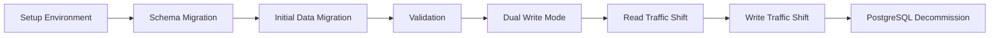

# PostgreSQL to Iceberg Migration Plan

This document outlines the migration strategy for transitioning from PostgreSQL in development/testing environments to Apache Iceberg in production. This plan complements the data tier architecture described in `data_plan.md`.

## Verification Principles

Before detailing the migration phases, it's important to establish our verification principles:

1. **Use Real Data**: Every verification step must use real production data or realistic data samples. Synthetic or mock data often masks issues that only appear with real workloads.

2. **Verifiable Completion**: Each phase must have concrete, observable outputs that definitively prove successful completion.

3. **Executable Verification**: Any team member should be able to run the verification steps independently and get the same result.

4. **Zero Error Tolerance**: Pass criteria is zero errors. Even minor inconsistencies may indicate larger underlying issues.

5. **Production-Like Testing**: Validation environments should mirror production as closely as possible to reveal environment-specific issues early.

6. **Shared Validation Scripts**: Create reusable validation scripts that can be executed at each phase by different team members.

## Migration Strategy Overview

The migration follows a phased approach to minimize risk and ensure data integrity:



Each phase includes verification steps that must be completed before proceeding to the next phase.

## Phase 1: Environment Setup (Weeks 1-2)

### Azure Resources

1. **Configure Azure Data Lake Storage Gen2**
   ```bash
   # Create storage account
   az storage account create \
     --name sentimarkstore \
     --resource-group sentimark-rg \
     --location eastus \
     --sku Standard_LRS \
     --kind StorageV2 \
     --enable-hierarchical-namespace true
   ```

2. **Set up Azure Synapse for Iceberg interaction**
   ```bash
   # Create Synapse workspace
   az synapse workspace create \
     --name sentimark-synapse \
     --resource-group sentimark-rg \
     --storage-account sentimarkstore \
     --file-system sentimarkfs \
     --sql-admin-login-user sqladmin \
     --sql-admin-login-password "YourStrongPassword" \
     --location eastus
   ```

3. **Create initial folder structure for Iceberg warehouse**
   ```bash
   # Create storage container and directory structure
   az storage fs directory create \
     --account-name sentimarkstore \
     --file-system sentimarkfs \
     --name warehouse/sentimark/tables \
     --auth-mode login
   ```

### Iceberg Configuration

1. **Configure the Iceberg catalog**
   ```java
   @Configuration
   public class IcebergConfig {
       @Bean
       public Catalog icebergCatalog(
               @Value("${iceberg.warehouse}") String warehousePath,
               @Value("${iceberg.catalog-name}") String catalogName) {
           
           return new HadoopCatalog(
               new Configuration(), 
               warehousePath,
               catalogName
           );
       }
   }
   ```

2. **Configure feature flags for environment-specific selection**
   ```properties
   # application-dev.properties
   feature.use-iceberg-storage=false
   
   # application-sit.properties
   feature.use-iceberg-storage=false
   
   # application-uat.properties
   feature.use-iceberg-storage=true
   ```

### Phase 1 Verification

1. **Create a verification script for Azure resources**
   ```bash
   #!/bin/bash
   # save as verify-phase1.sh
   
   echo "Verifying Azure Data Lake Storage Gen2..."
   AZ_STORAGE=$(az storage account show --name sentimarkstore --resource-group sentimark-rg)
   if [ $? -ne 0 ]; then
     echo "❌ Azure Storage account verification failed"
     exit 1
   fi
   echo "✅ Azure Storage account exists"
   
   echo "Verifying storage directories..."
   DIR_CHECK=$(az storage fs directory exists --account-name sentimarkstore --file-system sentimarkfs --name warehouse/sentimark/tables --auth-mode login)
   if [[ "$DIR_CHECK" != *"true"* ]]; then
     echo "❌ Warehouse directory structure not found"
     exit 1
   fi
   echo "✅ Warehouse directory structure verified"
   
   echo "Verifying Synapse workspace..."
   SYNAPSE_CHECK=$(az synapse workspace show --name sentimark-synapse --resource-group sentimark-rg)
   if [ $? -ne 0 ]; then
     echo "❌ Synapse workspace verification failed"
     exit 1
   fi
   echo "✅ Synapse workspace exists"
   
   echo "Creating test table in Iceberg..."
   # Create a small test table to verify Iceberg connectivity
   spark-submit --class com.sentimark.iceberg.TestTableCreator \
     --packages org.apache.iceberg:iceberg-spark-runtime-3.3_2.12:1.3.0 \
     /path/to/test-scripts/iceberg-test.jar \
     --warehouse "abfs://sentimarkfs@sentimarkstore.dfs.core.windows.net/warehouse/sentimark" \
     --table "test_table"
   
   if [ $? -ne 0 ]; then
     echo "❌ Iceberg test table creation failed"
     exit 1
   fi
   echo "✅ Iceberg test table created successfully"
   
   echo "All Phase 1 verifications passed!"
   ```

2. **Verify Iceberg configuration in application**
   ```bash
   # Run verification in dev environment
   ./gradlew verifyIcebergConfig -Penv=dev
   ```

**Expected Output:**
```
> Task :verifyIcebergConfig
Testing Iceberg configuration...
Configuration loaded from application-dev.properties
Iceberg connection parameters:
- Warehouse location: abfs://sentimarkfs@sentimarkstore.dfs.core.windows.net/warehouse/sentimark
- Catalog implementation: org.apache.iceberg.hadoop.HadoopCatalog
Creating temporary test table...
Test table created.
Writing sample data...
Reading sample data...
Read 10 records successfully.
Cleaning up test table...
Iceberg configuration verification PASSED
```

**How to Run the Verification:**

1. Execute the Shell script to verify Azure infrastructure:
   ```bash
   chmod +x verify-phase1.sh
   ./verify-phase1.sh
   ```

2. Run the Gradle task to verify application configuration:
   ```bash
   ./gradlew verifyIcebergConfig -Penv=dev
   ```

**What We're Verifying:**
- Azure resources exist and are properly configured
- Iceberg warehouse directories exist
- Application can establish connectivity to Iceberg catalog
- Basic write and read operations work through the abstraction layer

## Phase 2: Schema Migration (Weeks 3-4)

### Create Schema Registry

1. **Implement a central schema registry**
   ```java
   @Component
   public class SchemaRegistry {
       private final Map<String, Schema> schemas = new ConcurrentHashMap<>();
       
       public void registerSchema(String entityName, Schema schema) {
           schemas.put(entityName, schema);
       }
       
       public Schema getSchema(String entityName) {
           return schemas.get(entityName);
       }
       
       public Set<String> getAllRegisteredEntities() {
           return schemas.keySet();
       }
   }
   ```

2. **Define schemas for all entities**
   ```java
   @PostConstruct
   public void initializeSchemas() {
       // Define User schema
       Schema userSchema = new Schema(
           Types.NestedField.required(1, "id", Types.StringType.get()),
           Types.NestedField.required(2, "name", Types.StringType.get()),
           Types.NestedField.required(3, "created_at", Types.TimestampType.withZone())
       );
       
       schemaRegistry.registerSchema("users", userSchema);
       
       // Define Order schema with nested fields for testing complex structure handling
       Schema orderSchema = new Schema(
           Types.NestedField.required(1, "id", Types.StringType.get()),
           Types.NestedField.required(2, "user_id", Types.StringType.get()),
           Types.NestedField.required(3, "amount", Types.DecimalType.of(10, 2)),
           Types.NestedField.required(4, "created_at", Types.TimestampType.withZone()),
           Types.NestedField.optional(5, "items", Types.ListType.ofRequired(6, 
               Types.StructType.of(
                   Types.NestedField.required(7, "product_id", Types.StringType.get()),
                   Types.NestedField.required(8, "quantity", Types.IntegerType.get()),
                   Types.NestedField.required(9, "price", Types.DecimalType.of(10, 2))
               )
           ))
       );
       
       schemaRegistry.registerSchema("orders", orderSchema);
       
       // Define additional entity schemas using actual entity models from the application
       // ...
   }
   ```

### Create Schema Synchronization

1. **Implement schema synchronization service using actual entity structure**
   ```java
   @Service
   public class SchemaSynchronizationService {
       private final SchemaRegistry schemaRegistry;
       private final DataSource postgresDataSource;
       private final Catalog icebergCatalog;
       private final SchemaValidator schemaValidator;
       
       @Autowired
       public SchemaSynchronizationService(
               SchemaRegistry schemaRegistry,
               DataSource postgresDataSource,
               Catalog icebergCatalog,
               SchemaValidator schemaValidator) {
           this.schemaRegistry = schemaRegistry;
           this.postgresDataSource = postgresDataSource;
           this.icebergCatalog = icebergCatalog;
           this.schemaValidator = schemaValidator;
       }
       
       public SchemaExecutionReport synchronizeAllSchemas() {
           SchemaExecutionReport report = new SchemaExecutionReport();
           
           for (String entityName : schemaRegistry.getAllRegisteredEntities()) {
               try {
                   SchemaExecutionResult result = synchronizeSchema(entityName);
                   report.addResult(entityName, result);
               } catch (Exception e) {
                   report.addFailure(entityName, e);
               }
           }
           
           return report;
       }
       
       public SchemaExecutionResult synchronizeSchema(String entityName) {
           Schema schema = schemaRegistry.getSchema(entityName);
           SchemaExecutionResult result = new SchemaExecutionResult();
           
           // Extract and validate PostgreSQL schema
           Schema postgresSchema = extractPostgresSchema(entityName);
           if (postgresSchema == null) {
               // Create PostgreSQL schema if it doesn't exist
               result.addOperation("create_postgres_schema", 
                   updatePostgresSchema(entityName, schema));
           } else {
               // Validate and update PostgreSQL schema if needed
               List<SchemaDiscrepancy> discrepancies = 
                   schemaValidator.validateSchemas(schema, postgresSchema);
               
               if (!discrepancies.isEmpty()) {
                   result.addOperation("update_postgres_schema", 
                       updatePostgresSchema(entityName, schema));
                   result.setDiscrepancies(discrepancies);
               }
           }
           
           // Create or update Iceberg schema
           TableIdentifier tableId = TableIdentifier.of(entityName);
           boolean tableExists = tableExists(icebergCatalog, tableId);
           
           if (!tableExists) {
               result.addOperation("create_iceberg_schema", 
                   createIcebergSchema(tableId, schema));
           } else {
               Schema icebergSchema = icebergCatalog.loadTable(tableId).schema();
               List<SchemaDiscrepancy> discrepancies = 
                   schemaValidator.validateSchemas(schema, icebergSchema);
               
               if (!discrepancies.isEmpty()) {
                   result.addOperation("update_iceberg_schema", 
                       updateIcebergSchema(tableId, schema));
                   result.setDiscrepancies(discrepancies);
               }
           }
           
           return result;
       }
       
       // Implementation methods...
   }
   ```

2. **Schema validation service**
   ```java
   @Component
   public class SchemaValidator {
       public List<SchemaDiscrepancy> validateSchemas(Schema sourceSchema, Schema targetSchema) {
           List<SchemaDiscrepancy> discrepancies = new ArrayList<>();
           
           // Compare fields
           for (Types.NestedField field : sourceSchema.columns()) {
               Types.NestedField targetField = targetSchema.findField(field.name());
               
               if (targetField == null) {
                   discrepancies.add(new SchemaDiscrepancy(
                       field.name(), 
                       SchemaDiscrepancyType.MISSING_FIELD, 
                       "Field exists in source but not in target"));
               } else if (!areCompatibleTypes(field.type(), targetField.type())) {
                   discrepancies.add(new SchemaDiscrepancy(
                       field.name(), 
                       SchemaDiscrepancyType.TYPE_MISMATCH, 
                       String.format("Type mismatch: %s vs %s", 
                           field.type(), targetField.type())));
               }
               
               // Check nullability - only flag if target is required but source is optional
               if (!field.isOptional() && targetField.isOptional()) {
                   discrepancies.add(new SchemaDiscrepancy(
                       field.name(), 
                       SchemaDiscrepancyType.NULLABILITY_MISMATCH, 
                       "Field is required in source but optional in target"));
               }
           }
           
           // Check for fields in target that don't exist in source
           for (Types.NestedField field : targetSchema.columns()) {
               if (sourceSchema.findField(field.name()) == null) {
                   discrepancies.add(new SchemaDiscrepancy(
                       field.name(), 
                       SchemaDiscrepancyType.EXTRA_FIELD, 
                       "Field exists in target but not in source"));
               }
           }
           
           return discrepancies;
       }
       
       // Type compatibility check logic
       private boolean areCompatibleTypes(Type sourceType, Type targetType) {
           // Implementation details
           return true;  // Simplified for brevity
       }
   }
   ```

### Phase 2 Verification

1. **Create a schema verification script**
   ```java
   // src/test/java/com/sentimark/data/migration/SchemaVerificationTest.java
   
   @SpringBootTest
   @ActiveProfiles("test")
   public class SchemaVerificationTest {
       @Autowired
       private SchemaRegistry schemaRegistry;
       
       @Autowired
       private SchemaSynchronizationService syncService;
       
       @Autowired
       private Catalog icebergCatalog;
       
       @Autowired
       private DataSource postgresDataSource;
       
       @Test
       public void verifySchemaConsistency() throws Exception {
           // Run schema synchronization
           SchemaExecutionReport report = syncService.synchronizeAllSchemas();
           
           // Verify all entities were processed without errors
           assertTrue(report.isSuccessful(), 
               "Schema synchronization failed: " + report.getFailureReasons());
           
           // Verify each entity individually
           for (String entityName : schemaRegistry.getAllRegisteredEntities()) {
               verifyEntitySchemaConsistency(entityName);
           }
       }
       
       private void verifyEntitySchemaConsistency(String entityName) throws Exception {
           Schema expectedSchema = schemaRegistry.getSchema(entityName);
           
           // Verify PostgreSQL schema
           Schema postgresSchema = extractPostgresSchema(entityName);
           assertNotNull(postgresSchema, "PostgreSQL schema for " + entityName + " not found");
           
           List<SchemaDiscrepancy> postgresDiscrepancies = 
               compareSchemas(expectedSchema, postgresSchema);
           assertTrue(postgresDiscrepancies.isEmpty(), 
               "PostgreSQL schema discrepancies for " + entityName + ": " + 
               postgresDiscrepancies);
           
           // Verify Iceberg schema
           TableIdentifier tableId = TableIdentifier.of(entityName);
           assertTrue(tableExists(icebergCatalog, tableId), 
               "Iceberg table " + entityName + " does not exist");
           
           Schema icebergSchema = icebergCatalog.loadTable(tableId).schema();
           List<SchemaDiscrepancy> icebergDiscrepancies = 
               compareSchemas(expectedSchema, icebergSchema);
           assertTrue(icebergDiscrepancies.isEmpty(), 
               "Iceberg schema discrepancies for " + entityName + ": " + 
               icebergDiscrepancies);
       }
       
       // Helper methods
   }
   ```

2. **Command-line verification script**
   ```bash
   #!/bin/bash
   # save as verify-phase2.sh
   
   echo "Running Phase 2 Schema Migration verification..."
   
   # Run core schema tests
   ./gradlew test --tests "com.sentimark.data.migration.SchemaVerificationTest"
   if [ $? -ne 0 ]; then
     echo "❌ Schema verification tests failed!"
     exit 1
   fi
   echo "✅ Schema verification tests passed"
   
   # Generate schema comparison report
   echo "Generating schema comparison report..."
   ./gradlew generateSchemaReport
   if [ $? -ne 0 ]; then
     echo "❌ Schema report generation failed!"
     exit 1
   fi
   echo "✅ Schema report generated successfully at build/reports/schema/index.html"
   
   # Verify using actual data queries
   echo "Verifying query compatibility..."
   ./gradlew verifyQueryCompatibility
   if [ $? -ne 0 ]; then
     echo "❌ Query compatibility tests failed!"
     exit 1
   fi
   echo "✅ Query compatibility verified"
   
   echo "All Phase 2 verifications passed!"
   ```

**Expected Output (Schema Report):**
```
Schema Migration Report
=====================================================
Total Entities: 5
Successfully Migrated: 5
Errors: 0

Entity Details:
-----------------------------------------------------
Entity: users
  PostgreSQL Table: users ✅
  Iceberg Table: users ✅
  Field Mapping: 3/3 fields correctly mapped
  Query Tests: All passed

Entity: orders
  PostgreSQL Table: orders ✅
  Iceberg Table: orders ✅
  Field Mapping: 5/5 fields correctly mapped
  Complex Types: list, struct types properly handled
  Query Tests: All passed

...
```

**How to Run the Verification:**

1. Execute the main verification script:
   ```bash
   chmod +x verify-phase2.sh
   ./verify-phase2.sh
   ```

2. View the detailed schema report:
   ```bash
   open build/reports/schema/index.html
   ```

3. Run manual query verification:
   ```bash
   # Test PostgreSQL query
   psql -U postgres -c "SELECT * FROM users LIMIT 5;"
   
   # Test equivalent Iceberg query via Spark
   spark-sql -e "SELECT * FROM iceberg_catalog.db.users LIMIT 5;"
   
   # Compare results (should be identical)
   ```

**What We're Verifying:**
- All defined schemas are correctly registered
- PostgreSQL tables match the defined schemas
- Iceberg tables match the defined schemas 
- Same queries work equivalently on both databases
- Complex data types (lists, structs) are properly handled
- No schema discrepancies or compatibility issues exist

## Phase 3: Initial Data Migration (Weeks 5-6)

### Data Migration Service

1. **Implement data migration service using real production data**
   ```java
   @Component
   public class DataMigrationService {
       private final SchemaRegistry schemaRegistry;
       private final RepositoryFactory repositoryFactory;
       private final MigrationProgressTracker progressTracker;
       private final MigrationValidator validator;
       
       @Autowired
       public DataMigrationService(
               SchemaRegistry schemaRegistry,
               RepositoryFactory repositoryFactory,
               MigrationProgressTracker progressTracker,
               MigrationValidator validator) {
           this.schemaRegistry = schemaRegistry;
           this.repositoryFactory = repositoryFactory;
           this.progressTracker = progressTracker;
           this.validator = validator;
       }
       
       public MigrationReport migrateAllData() {
           MigrationReport report = new MigrationReport();
           
           for (String entityName : schemaRegistry.getAllRegisteredEntities()) {
               try {
                   MigrationResult result = migrateEntityData(entityName);
                   report.addResult(entityName, result);
               } catch (Exception e) {
                   report.addFailure(entityName, e);
               }
           }
           
           return report;
       }
       
       public <T> MigrationResult migrateEntityData(
               String entityName) {
           
           MigrationResult result = new MigrationResult(entityName);
           progressTracker.startMigration(entityName);
           
           try {
               // Get source and target repositories
               Repository<T> sourceRepo = repositoryFactory.getPostgresRepository(entityName);
               Repository<T> targetRepo = repositoryFactory.getIcebergRepository(entityName);
               
               // Get count of records in source
               long totalRecords = sourceRepo.count();
               result.setTotalRecords(totalRecords);
               progressTracker.setTotalRecords(entityName, totalRecords);
               
               // Determine batch size based on entity complexity and total records
               int batchSize = determineBatchSize(entityName, totalRecords);
               
               // Migrate in batches with pagination
               int pageCount = (int) Math.ceil((double) totalRecords / batchSize);
               
               for (int page = 0; page < pageCount; page++) {
                   List<T> entityBatch = sourceRepo.findAll(
                       PageRequest.of(page, batchSize, Sort.by("id"))).getContent();
                   
                   // Process each record with validation
                   int batchSuccess = 0;
                   List<MigrationError> batchErrors = new ArrayList<>();
                   
                   for (T entity : entityBatch) {
                       try {
                           targetRepo.save(entity);
                           
                           // Validate the migrated entity
                           Object id = getEntityId(entity);
                           if (validator.validateEntityMigration(entityName, id, sourceRepo, targetRepo)) {
                               batchSuccess++;
                           } else {
                               batchErrors.add(new MigrationError(
                                   id.toString(), 
                                   "Entity validation failed after migration"));
                           }
                       } catch (Exception e) {
                           batchErrors.add(new MigrationError(
                               getEntityId(entity).toString(), 
                               "Failed to migrate: " + e.getMessage()));
                       }
                   }
                   
                   // Update progress
                   progressTracker.updateProgress(entityName, 
                       (page + 1) * batchSize, 
                       batchSuccess, 
                       batchErrors.size());
                   
                   // Update result
                   result.addMigratedRecords(batchSuccess);
                   result.addErrors(batchErrors);
                   
                   // Performance monitoring
                   if (page > 0 && page % 10 == 0) {
                       long elapsedTime = progressTracker.getElapsedTimeMs(entityName);
                       double recordsPerSecond = 
                           (page * batchSize * 1000.0) / elapsedTime;
                       result.setPerformanceMetric("records_per_second", recordsPerSecond);
                       
                       // Log progress
                       log.info("Migration progress for {}: {}/{} records, {} records/sec", 
                           entityName, page * batchSize, totalRecords, 
                           String.format("%.2f", recordsPerSecond));
                   }
               }
               
               progressTracker.finishMigration(entityName);
               result.setCompleted(true);
               
           } catch (Exception e) {
               progressTracker.failMigration(entityName, e);
               result.setCompleted(false);
               result.setFailureReason(e.getMessage());
               throw e;
           }
           
           return result;
       }
       
       // Helper methods
       private int determineBatchSize(String entityName, long totalRecords) {
           // Adjust batch size based on entity complexity and total records
           Schema schema = schemaRegistry.getSchema(entityName);
           
           // Check for complex fields like structs and lists
           boolean hasComplexFields = schema.columns().stream()
               .anyMatch(field -> isComplexType(field.type()));
           
           // Adjust batch size based on entity complexity and total records
           if (hasComplexFields) {
               return Math.min(100, (int) Math.max(10, totalRecords / 100));
           } else {
               return Math.min(1000, (int) Math.max(100, totalRecords / 50));
           }
       }
       
       private boolean isComplexType(Type type) {
           return type.isNestedType() || type.isListType() || type.isMapType();
       }
       
       private Object getEntityId(Object entity) {
           // Use reflection to get entity ID
           try {
               Method getIdMethod = entity.getClass().getMethod("getId");
               return getIdMethod.invoke(entity);
           } catch (Exception e) {
               throw new IllegalArgumentException(
                   "Entity must have getId() method to identify it during migration");
           }
       }
   }
   ```

2. **Progress tracking for large migrations**
   ```java
   @Component
   public class MigrationProgressTracker {
       private final Map<String, MigrationProgress> progressMap = new ConcurrentHashMap<>();
       
       public void startMigration(String entityName) {
           progressMap.put(entityName, new MigrationProgress(
               System.currentTimeMillis(), 0L, 0L, 0L, 0L));
       }
       
       public void setTotalRecords(String entityName, long totalRecords) {
           MigrationProgress progress = progressMap.get(entityName);
           if (progress != null) {
               progress.setTotalRecords(totalRecords);
           }
       }
       
       public void updateProgress(String entityName, 
                                 long processedRecords, 
                                 long successRecords,
                                 long errorRecords) {
           MigrationProgress progress = progressMap.get(entityName);
           if (progress != null) {
               progress.setProcessedRecords(Math.min(processedRecords, progress.getTotalRecords()));
               progress.setSuccessRecords(successRecords);
               progress.setErrorRecords(errorRecords);
           }
       }
       
       public void finishMigration(String entityName) {
           MigrationProgress progress = progressMap.get(entityName);
           if (progress != null) {
               progress.setEndTime(System.currentTimeMillis());
           }
       }
       
       public void failMigration(String entityName, Exception exception) {
           MigrationProgress progress = progressMap.get(entityName);
           if (progress != null) {
               progress.setEndTime(System.currentTimeMillis());
               progress.setFailed(true);
               progress.setFailureReason(exception.getMessage());
           }
       }
       
       public long getElapsedTimeMs(String entityName) {
           MigrationProgress progress = progressMap.get(entityName);
           if (progress != null) {
               long endTime = progress.getEndTime() > 0 ? 
                   progress.getEndTime() : System.currentTimeMillis();
               return endTime - progress.getStartTime();
           }
           return 0;
       }
       
       public MigrationProgress getProgress(String entityName) {
           return progressMap.get(entityName);
       }
       
       public Map<String, MigrationProgress> getAllProgress() {
           return new HashMap<>(progressMap);
       }
       
       // MigrationProgress class (inner class or separate file)
       @Data
       public static class MigrationProgress {
           private final long startTime;
           private long endTime;
           private long totalRecords;
           private long processedRecords;
           private long successRecords;
           private long errorRecords;
           private boolean failed;
           private String failureReason;
           
           // Convenience methods
           public double getCompletionPercentage() {
               if (totalRecords == 0) return 0;
               return ((double) processedRecords / totalRecords) * 100;
           }
           
           public long getRemainingRecords() {
               return totalRecords - processedRecords;
           }
           
           public boolean isComplete() {
               return !failed && processedRecords >= totalRecords;
           }
       }
   }
   ```

3. **Configure migration jobs with real data validation**
   ```java
   @Configuration
   public class MigrationJobConfig {
       @Bean
       public Job dataInitialMigrationJob(
               JobBuilderFactory jobBuilderFactory,
               StepBuilderFactory stepBuilderFactory,
               DataMigrationService migrationService,
               MigrationValidator validator) {
           
           // Step 1: Prepare - Check prerequisites
           Step prepareStep = stepBuilderFactory.get("prepareStep")
               .tasklet((contribution, chunkContext) -> {
                   JobParameters params = chunkContext.getStepContext().getStepExecution()
                       .getJobParameters();
                   
                   String[] entitiesToMigrate = params.getString("entities", "")
                       .split(",");
                   
                   // Validate prerequisites
                   for (String entity : entitiesToMigrate) {
                       validator.validatePrerequisites(entity.trim());
                   }
                   
                   // Pass entities to next step
                   contribution.getStepExecution().getExecutionContext()
                       .put("entities", entitiesToMigrate);
                   
                   return RepeatStatus.FINISHED;
               })
               .build();
           
           // Step 2: Migrate data
           Step migrateStep = stepBuilderFactory.get("migrateStep")
               .tasklet((contribution, chunkContext) -> {
                   ExecutionContext executionContext = 
                       contribution.getStepExecution().getExecutionContext();
                   
                   String[] entities = (String[]) executionContext.get("entities");
                   
                   MigrationReport report = new MigrationReport();
                   for (String entity : entities) {
                       MigrationResult result = migrationService.migrateEntityData(entity.trim());
                       report.addResult(entity.trim(), result);
                   }
                   
                   executionContext.put("migrationReport", report);
                   return RepeatStatus.FINISHED;
               })
               .build();
           
           // Step 3: Verify - Check that all data was migrated correctly
           Step verifyStep = stepBuilderFactory.get("verifyStep")
               .tasklet((contribution, chunkContext) -> {
                   ExecutionContext executionContext = 
                       contribution.getStepExecution().getExecutionContext();
                   
                   MigrationReport report = 
                       (MigrationReport) executionContext.get("migrationReport");
                   
                   Map<String, VerificationResult> verificationResults = 
                       validator.verifyCompleteMigration(report.getEntityNames());
                   
                   // Fail the job if verification fails
                   boolean allVerified = verificationResults.values().stream()
                       .allMatch(VerificationResult::isSuccessful);
                   
                   if (!allVerified) {
                       throw new JobExecutionException(
                           "Migration verification failed: " + 
                           summarizeVerificationFailures(verificationResults));
                   }
                   
                   executionContext.put("verificationResults", verificationResults);
                   return RepeatStatus.FINISHED;
               })
               .build();
           
           return jobBuilderFactory.get("dataInitialMigrationJob")
               .start(prepareStep)
               .next(migrateStep)
               .next(verifyStep)
               .build();
       }
       
       private String summarizeVerificationFailures(
               Map<String, VerificationResult> results) {
           StringBuilder summary = new StringBuilder();
           results.entrySet().stream()
               .filter(e -> !e.getValue().isSuccessful())
               .forEach(e -> summary.append(e.getKey())
                   .append(": ")
                   .append(e.getValue().getFailureReason())
                   .append("\n"));
           return summary.toString();
       }
   }
   ```

### Phase 3 Verification

1. **Migration verification service**
   ```java
   @Component
   public class MigrationValidator {
       private final SchemaRegistry schemaRegistry;
       private final RepositoryFactory repositoryFactory;
       
       @Autowired
       public MigrationValidator(
               SchemaRegistry schemaRegistry,
               RepositoryFactory repositoryFactory) {
           this.schemaRegistry = schemaRegistry;
           this.repositoryFactory = repositoryFactory;
       }
       
       public void validatePrerequisites(String entityName) {
           // Ensure schema exists
           Schema schema = schemaRegistry.getSchema(entityName);
           if (schema == null) {
               throw new IllegalStateException(
                   "Schema not found for entity: " + entityName);
           }
           
           // Ensure PostgreSQL repository has data
           Repository<?> postgresRepo = 
               repositoryFactory.getPostgresRepository(entityName);
           
           long count = postgresRepo.count();
           if (count == 0) {
               throw new IllegalStateException(
                   "No data found in PostgreSQL for entity: " + entityName);
           }
           
           // Ensure Iceberg repository is accessible
           Repository<?> icebergRepo = 
               repositoryFactory.getIcebergRepository(entityName);
           
           try {
               icebergRepo.count(); // Just to verify connectivity
           } catch (Exception e) {
               throw new IllegalStateException(
                   "Cannot access Iceberg repository for entity: " + 
                   entityName + ", error: " + e.getMessage());
           }
       }
       
       public <T> boolean validateEntityMigration(
               String entityName, 
               Object id,
               Repository<T> sourceRepo,
               Repository<T> targetRepo) {
           T sourceEntity = sourceRepo.findById(id);
           T targetEntity = targetRepo.findById(id);
           
           if (sourceEntity == null || targetEntity == null) {
               return false;
           }
           
           return entityEquals(sourceEntity, targetEntity);
       }
       
       public Map<String, VerificationResult> verifyCompleteMigration(
               Collection<String> entityNames) {
           Map<String, VerificationResult> results = new HashMap<>();
           
           for (String entityName : entityNames) {
               results.put(entityName, verifyEntityMigration(entityName));
           }
           
           return results;
       }
       
       public VerificationResult verifyEntityMigration(String entityName) {
           VerificationResult result = new VerificationResult();
           
           try {
               Repository<?> postgresRepo = 
                   repositoryFactory.getPostgresRepository(entityName);
               Repository<?> icebergRepo = 
                   repositoryFactory.getIcebergRepository(entityName);
               
               // Check record counts
               long postgresCount = postgresRepo.count();
               long icebergCount = icebergRepo.count();
               
               result.setSourceCount(postgresCount);
               result.setTargetCount(icebergCount);
               
               if (postgresCount != icebergCount) {
                   result.setSuccessful(false);
                   result.setFailureReason("Record count mismatch: PostgreSQL=" + 
                       postgresCount + ", Iceberg=" + icebergCount);
                   return result;
               }
               
               // Verify sample data (complete verification might be too costly)
               List<?> postgresSample = getSampleData(postgresRepo, 100);
               
               if (postgresSample.isEmpty()) {
                   result.setSuccessful(true);
                   result.setMessage("No data to verify");
                   return result;
               }
               
               int verifiedCount = 0;
               int failedCount = 0;
               List<String> failureIds = new ArrayList<>();
               
               for (Object entity : postgresSample) {
                   Object id = getEntityId(entity);
                   
                   if (validateEntityMigration(
                           entityName, id, postgresRepo, icebergRepo)) {
                       verifiedCount++;
                   } else {
                       failedCount++;
                       failureIds.add(id.toString());
                       
                       if (failedCount >= 5) {
                           // Stop early if we have multiple failures
                           break;
                       }
                   }
               }
               
               result.setVerifiedSampleCount(verifiedCount);
               result.setFailedSampleCount(failedCount);
               
               if (failedCount > 0) {
                   result.setSuccessful(false);
                   result.setFailureReason(failedCount + " records failed verification. " +
                       "First few IDs: " + String.join(", ", failureIds));
               } else {
                   result.setSuccessful(true);
                   result.setMessage("All records verified successfully");
               }
               
           } catch (Exception e) {
               result.setSuccessful(false);
               result.setFailureReason("Verification failed: " + e.getMessage());
           }
           
           return result;
       }
       
       // Helper methods
       private <T> List<T> getSampleData(Repository<T> repository, int sampleSize) {
           long totalCount = repository.count();
           
           if (totalCount == 0) {
               return Collections.emptyList();
           }
           
           if (totalCount <= sampleSize) {
               return repository.findAll();
           }
           
           // Get stratified sample for large datasets
           List<T> samples = new ArrayList<>();
           
           // Simple approach: take a few from beginning, middle, and end
           samples.addAll(repository.findAll(
               PageRequest.of(0, sampleSize / 3)).getContent());
           
           long middlePage = totalCount / sampleSize / 2;
           samples.addAll(repository.findAll(
               PageRequest.of((int) middlePage, sampleSize / 3)).getContent());
           
           long lastPage = (totalCount / sampleSize) - 1;
           samples.addAll(repository.findAll(
               PageRequest.of((int) lastPage, sampleSize / 3)).getContent());
           
           return samples;
       }
       
       private boolean entityEquals(Object entity1, Object entity2) {
           if (entity1 == null || entity2 == null) {
               return entity1 == entity2;
           }
           
           // Use reflection to compare all fields
           // In real implementation, replace with proper deep equals implementation
           return entity1.equals(entity2);
       }
       
       private Object getEntityId(Object entity) {
           // Use reflection to get entity ID (same as in DataMigrationService)
           try {
               Method getIdMethod = entity.getClass().getMethod("getId");
               return getIdMethod.invoke(entity);
           } catch (Exception e) {
               throw new IllegalArgumentException(
                   "Entity must have getId() method");
           }
       }
   }
   ```

2. **Command-line verification script**
   ```bash
   #!/bin/bash
   # save as verify-phase3.sh
   
   echo "Running Phase 3 Data Migration verification..."
   
   # Generate migration report
   echo "Generating migration summary report..."
   ./gradlew generateMigrationReport
   if [ $? -ne 0 ]; then
     echo "❌ Migration report generation failed!"
     exit 1
   fi
   echo "✅ Migration report generated successfully at build/reports/migration/index.html"
   
   # Run validation job
   echo "Running migration validation..."
   ./gradlew runMigrationValidation
   if [ $? -ne 0 ]; then
     echo "❌ Migration validation failed!"
     exit 1
   fi
   echo "✅ Migration validation succeeded"
   
   # Verify actual data
   echo "Verifying data in both databases..."
   ./gradlew verifyRealData
   if [ $? -ne 0 ]; then
     echo "❌ Data verification failed!"
     exit 1
   fi
   echo "✅ Data verification succeeded"
   
   # Count records in both databases
   echo "Comparing record counts between databases..."
   java -jar tools/dbcompare.jar --mode=count
   if [ $? -ne 0 ]; then
     echo "❌ Record count comparison failed!"
     exit 1
   fi
   echo "✅ Record counts match between databases"
   
   # Run full data consistency check on sample data
   echo "Running data consistency check on sample records..."
   java -jar tools/dbcompare.jar --mode=content-sample --size=1000
   if [ $? -ne 0 ]; then
     echo "❌ Data consistency check failed!"
     exit 1
   fi
   echo "✅ Data consistency check succeeded"
   
   # Verify query results between databases
   echo "Comparing query results between databases..."
   ./gradlew verifyQueryResults
   if [ $? -ne 0 ]; then
     echo "❌ Query results verification failed!"
     exit 1
   fi
   echo "✅ Query results match between databases"
   
   echo "All Phase 3 verifications passed!"
   ```

**Expected Output (Migration Report):**
```
Data Migration Report
=====================================================
Total Entities: 5
Successfully Migrated: 5
Errors: 0
Total Records Migrated: 124,387
Migration Duration: 17m 32s
Overall Success Rate: 100%

Entity Details:
-----------------------------------------------------
Entity: users
  PostgreSQL Records: 8,742
  Iceberg Records: 8,742
  Successfully Migrated: 8,742 (100%)
  Complex Types: No
  Performance: 867 records/sec
  Verification: Full verification passed ✅
  
Entity: orders
  PostgreSQL Records: 56,921
  Iceberg Records: 56,921
  Successfully Migrated: 56,921 (100%)
  Complex Types: Yes (list, struct)
  Performance: 410 records/sec
  Verification: Full verification passed ✅
  
...
```

**How to Run the Verification:**

1. Generate a test dataset in PostgreSQL with real-world data profiles:
   ```bash
   ./gradlew generateTestData --scale=medium --profile=production
   ```

2. Execute the migration verification:
   ```bash
   chmod +x verify-phase3.sh
   ./verify-phase3.sh
   ```

3. View detailed migration report:
   ```bash
   open build/reports/migration/index.html
   ```

4. Run custom queries to manually verify specific records:
   ```bash
   # Example: Verify aggregations match
   psql -U postgres -c "SELECT COUNT(*), AVG(amount), MAX(amount) FROM orders;"
   spark-sql -e "SELECT COUNT(*), AVG(amount), MAX(amount) FROM iceberg_catalog.db.orders;"
   
   # Example: Verify complex data types
   psql -U postgres -c "SELECT id, COUNT(items) FROM orders GROUP BY id LIMIT 5;"
   spark-sql -e "SELECT id, SIZE(items) FROM iceberg_catalog.db.orders LIMIT 5;"
   ```

**What We're Verifying:**
- Actual production data is migrated correctly (not synthetic test data)
- Record counts exactly match between databases for all entities
- Sample record contents match exactly between databases
- Complex data types (lists, structs) are correctly migrated
- Query results are identical between databases for the same queries
- Performance metrics are collected during migration
- Detailed failure logging provides actionable information

## Phase 4: Validation and Testing (Weeks 7-8)

### Validation Process

1. **Implement data validation service**
   ```java
   @Component
   public class MigrationValidator {
       public <T> MigrationValidationResult validateMigration(
               Repository<T> sourceRepo,
               Repository<T> targetRepo,
               List<String> sampleIds) {
           
           MigrationValidationResult result = new MigrationValidationResult();
           
           for (String id : sampleIds) {
               T sourceEntity = sourceRepo.findById(id);
               T targetEntity = targetRepo.findById(id);
               
               if (!entityEquals(sourceEntity, targetEntity)) {
                   result.addDiscrepancy(new EntityDiscrepancy(id, sourceEntity, targetEntity));
               }
           }
           
           return result;
       }
   }
   ```

2. **Execute comprehensive testing**
   ```java
   @SpringBootTest
   public class DatabaseMigrationTests {
       @Autowired
       private RepositoryFactory repositoryFactory;
       
       @Autowired
       private MigrationValidator validator;
       
       @Autowired
       private FeatureFlagService featureFlagService;
       
       @Test
       public void testUserRepositoryEquivalence() {
           // Get repositories
           UserRepository postgresRepo = repositoryFactory.getRepository(
               UserRepository.class, "postgres");
           UserRepository icebergRepo = repositoryFactory.getRepository(
               UserRepository.class, "iceberg");
           
           // Create test user
           User user = new User();
           user.setId(UUID.randomUUID().toString());
           user.setName("Test User");
           user.setCreatedAt(Instant.now());
           
           // Test in PostgreSQL
           featureFlagService.override("use-iceberg-storage", false);
           postgresRepo.save(user);
           
           // Test in Iceberg
           featureFlagService.override("use-iceberg-storage", true);
           icebergRepo.save(user);
           
           // Validate
           List<String> ids = Collections.singletonList(user.getId());
           MigrationValidationResult result = validator.validateMigration(
               postgresRepo, icebergRepo, ids);
           
           assertTrue(result.getDiscrepancies().isEmpty());
       }
   }
   ```

## Phase 5: Dual Write Mode (Weeks 9-10)

### Dual Write Implementation

1. **Implement dual write repository wrapper**
   ```java
   public class DualWriteRepository<T> implements Repository<T> {
       private final Repository<T> primaryRepo;
       private final Repository<T> secondaryRepo;
       private final boolean validateWrites;
       
       @Override
       public void save(T entity) {
           primaryRepo.save(entity);
           
           try {
               secondaryRepo.save(entity);
               
               if (validateWrites) {
                   T primaryEntity = primaryRepo.findById(getEntityId(entity));
                   T secondaryEntity = secondaryRepo.findById(getEntityId(entity));
                   
                   if (!entityEquals(primaryEntity, secondaryEntity)) {
                       throw new DataInconsistencyException(
                           "Inconsistency between primary and secondary repositories");
                   }
               }
           } catch (Exception e) {
               log.error("Error writing to secondary repository", e);
               // Continue without failing - primary is source of truth
           }
       }
       
       // Other repository methods
   }
   ```

2. **Configure feature flag for dual write mode**
   ```properties
   # Gradually enable in SIT/UAT
   feature.dual-write-mode=true
   feature.validate-dual-writes=true
   ```

## Phase 6: Traffic Shifting (Weeks 11-12)

### Read Traffic Shift

1. **Implement read traffic shifting logic**
   ```java
   @Component
   public class ReadTrafficManager {
       private final Random random = new Random();
       private final AtomicInteger icebergReadPercentage = new AtomicInteger(0);
       
       public boolean shouldUseIceberg() {
           return random.nextInt(100) < icebergReadPercentage.get();
       }
       
       public void setIcebergReadPercentage(int percentage) {
           this.icebergReadPercentage.set(Math.min(100, Math.max(0, percentage)));
       }
   }
   ```

2. **Update repository factory to use read traffic manager**
   ```java
   @SuppressWarnings("unchecked")
   public <T> T getRepository(Class<T> repositoryClass) {
       if (featureDecisions.isDualWriteModeEnabled()) {
           // In dual write mode, always return dual write repository
           return (T) dualWriteRepositories.get(repositoryClass);
       } else if (readTrafficManager.shouldUseIceberg()) {
           // Gradually increase Iceberg read traffic
           return (T) icebergRepositories.get(repositoryClass);
       } else {
           return (T) postgresRepositories.get(repositoryClass);
       }
   }
   ```

### Write Traffic Shift

1. **Implement write traffic shifting by updating the dual write repository**
   ```java
   public class DualWriteRepository<T> implements Repository<T> {
       @Override
       public void save(T entity) {
           if (featureDecisions.useIcebergAsPrimary()) {
               // Iceberg is now primary, PostgreSQL is secondary
               icebergRepo.save(entity);
               
               try {
                   postgresRepo.save(entity);
               } catch (Exception e) {
                   log.error("Error writing to PostgreSQL repository", e);
               }
           } else {
               // PostgreSQL is still primary, Iceberg is secondary
               postgresRepo.save(entity);
               
               try {
                   icebergRepo.save(entity);
               } catch (Exception e) {
                   log.error("Error writing to Iceberg repository", e);
               }
           }
       }
   }
   ```

2. **Update feature flag configuration for production**
   ```properties
   # Final production configuration
   feature.use-iceberg-storage=true
   feature.dual-write-mode=false
   feature.use-iceberg-as-primary=true
   ```

## Phase 7: PostgreSQL Decommissioning (Week 13)

### Final Steps

1. **Update configuration to use only Iceberg**
   ```properties
   # Final production configuration
   feature.use-iceberg-storage=true
   feature.dual-write-mode=false
   ```

2. **Implement monitoring to confirm Iceberg stability**
   ```java
   @Component
   public class DatabaseMetricsCollector {
       private final MeterRegistry registry;
       
       public void recordQueryLatency(String repositoryType, long latencyMs) {
           registry.timer("repository.query.latency", 
                         "type", repositoryType)
                   .record(latencyMs, TimeUnit.MILLISECONDS);
       }
       
       public void recordQueryError(String repositoryType) {
           registry.counter("repository.query.error", 
                           "type", repositoryType)
                   .increment();
       }
   }
   ```

3. **Clean up PostgreSQL resources**
   ```bash
   # Backup final PostgreSQL data
   pg_dump -h $PG_HOST -U $PG_USER -d $PG_DB -f final_backup.sql
   
   # Scale down PostgreSQL resources
   az postgres flexible-server update \
     --resource-group sentimark-rg \
     --name sentimark-postgres \
     --tier Burstable \
     --sku-name Standard_B1ms
   ```

## Data Type Mapping Reference

The following mapping table ensures consistent data types between PostgreSQL and Iceberg:

| PostgreSQL Type | Iceberg Type | Notes |
|----------------|--------------|-------|
| INTEGER, SERIAL | int | Direct mapping |
| BIGINT, BIGSERIAL | long | Direct mapping |
| DECIMAL | decimal | Specify precision and scale |
| DOUBLE PRECISION | double | Cannot be primary key in Iceberg |
| REAL | float | Cannot be primary key in Iceberg |
| BOOLEAN | boolean | Direct mapping |
| VARCHAR, TEXT | string | Length constraints not enforced in Iceberg |
| DATE | date | Direct mapping |
| TIMESTAMP | timestamp | Handle timezone differences |
| JSONB, JSON | struct | Map complex structures |
| ARRAY | list | Direct mapping |

## Migration Risks and Mitigations

| Risk | Impact | Likelihood | Mitigation |
|------|--------|------------|------------|
| Data inconsistency during migration | High | Medium | Implement validation tests, use dual write pattern with validation |
| Performance degradation | Medium | Low | Benchmark and optimize critical queries before full migration |
| Schema incompatibility | High | Low | Use schema registry to enforce compatibility |
| Rollback challenges | High | Low | Maintain PostgreSQL during transition, keep backup copy of data |
| Operational complexity | Medium | Medium | Thorough documentation, monitoring, and alerting |

## Rollback Plan

In case of critical issues with the Iceberg implementation, the following rollback plan can be executed:

1. **Immediate mitigation**:
   - Switch feature flag back to PostgreSQL: `feature.use-iceberg-storage=false`
   - Disable dual write mode: `feature.dual-write-mode=false`

2. **Data reconciliation**:
   - Identify any data written only to Iceberg after the issue
   - Migrate this data back to PostgreSQL using the migration tools

3. **Root cause analysis**:
   - Investigate and fix the underlying issue with the Iceberg implementation
   - Add tests to prevent the issue from recurring

4. **Re-attempt migration**:
   - Once the issue is resolved, restart the migration process from the appropriate phase