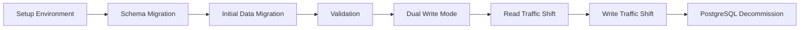

# PostgreSQL to Iceberg Migration Plan

This document outlines the migration strategy for transitioning from PostgreSQL in development/testing environments to Apache Iceberg in production. This plan complements the data tier architecture described in `data_plan.md`.

## Migration Strategy Overview

The migration follows a phased approach to minimize risk and ensure data integrity:



## Phase 1: Environment Setup (Weeks 1-2)

### Azure Resources

1. **Configure Azure Data Lake Storage Gen2**
   ```bash
   # Create storage account
   az storage account create \
     --name sentimarkstore \
     --resource-group sentimark-rg \
     --location eastus \
     --sku Standard_LRS \
     --kind StorageV2 \
     --enable-hierarchical-namespace true
   ```

2. **Set up Azure Synapse for Iceberg interaction**
   ```bash
   # Create Synapse workspace
   az synapse workspace create \
     --name sentimark-synapse \
     --resource-group sentimark-rg \
     --storage-account sentimarkstore \
     --file-system sentimarkfs \
     --sql-admin-login-user sqladmin \
     --sql-admin-login-password "YourStrongPassword" \
     --location eastus
   ```

### Iceberg Configuration

1. **Configure the Iceberg catalog**
   ```java
   @Configuration
   public class IcebergConfig {
       @Bean
       public Catalog icebergCatalog(
               @Value("${iceberg.warehouse}") String warehousePath,
               @Value("${iceberg.catalog-name}") String catalogName) {
           
           return new HadoopCatalog(
               new Configuration(), 
               warehousePath,
               catalogName
           );
       }
   }
   ```

2. **Configure feature flags for environment-specific selection**
   ```properties
   # application-dev.properties
   feature.use-iceberg-storage=false
   
   # application-sit.properties
   feature.use-iceberg-storage=false
   
   # application-uat.properties
   feature.use-iceberg-storage=true
   ```

## Phase 2: Schema Migration (Weeks 3-4)

### Create Schema Registry

1. **Implement a central schema registry**
   ```java
   @Component
   public class SchemaRegistry {
       private final Map<String, Schema> schemas = new ConcurrentHashMap<>();
       
       public void registerSchema(String entityName, Schema schema) {
           schemas.put(entityName, schema);
       }
       
       public Schema getSchema(String entityName) {
           return schemas.get(entityName);
       }
       
       public Set<String> getAllRegisteredEntities() {
           return schemas.keySet();
       }
   }
   ```

2. **Define schemas for all entities**
   ```java
   @PostConstruct
   public void initializeSchemas() {
       // Define User schema
       Schema userSchema = new Schema(
           Types.NestedField.required(1, "id", Types.StringType.get()),
           Types.NestedField.required(2, "name", Types.StringType.get()),
           Types.NestedField.required(3, "created_at", Types.TimestampType.withZone())
       );
       
       schemaRegistry.registerSchema("users", userSchema);
       
       // Define additional entity schemas
       // ...
   }
   ```

### Create Schema Synchronization

1. **Implement schema synchronization service**
   ```java
   @Service
   public class SchemaSynchronizationService {
       private final SchemaRegistry schemaRegistry;
       private final DataSource postgresDataSource;
       private final Catalog icebergCatalog;
       
       public void synchronizeAllSchemas() {
           for (String entityName : schemaRegistry.getAllRegisteredEntities()) {
               synchronizeSchema(entityName);
           }
       }
       
       public void synchronizeSchema(String entityName) {
           Schema schema = schemaRegistry.getSchema(entityName);
           
           // Create/update PostgreSQL schema
           updatePostgresSchema(entityName, schema);
           
           // Create/update Iceberg schema
           updateIcebergSchema(entityName, schema);
       }
   }
   ```

## Phase 3: Initial Data Migration (Weeks 5-6)

### Data Migration Service

1. **Implement data migration service**
   ```java
   @Component
   public class DataMigrationService {
       public <T> void migrateEntityData(
               String entityName,
               Repository<T> sourceRepo,
               Repository<T> targetRepo) {
           
           List<T> allEntities = sourceRepo.findAll();
           
           for (T entity : allEntities) {
               targetRepo.save(entity);
           }
       }
       
       public void migrateAllData() {
           for (String entityName : schemaRegistry.getAllRegisteredEntities()) {
               migrateEntityData(entityName);
           }
       }
   }
   ```

2. **Configure migration jobs**
   ```java
   @Configuration
   public class MigrationJobConfig {
       @Bean
       public Job dataInitialMigrationJob(
               JobBuilderFactory jobBuilderFactory,
               StepBuilderFactory stepBuilderFactory,
               DataMigrationService migrationService) {
           
           Step migrateStep = stepBuilderFactory.get("migrateStep")
               .tasklet((contribution, chunkContext) -> {
                   migrationService.migrateAllData();
                   return RepeatStatus.FINISHED;
               })
               .build();
           
           return jobBuilderFactory.get("dataInitialMigrationJob")
               .start(migrateStep)
               .build();
       }
   }
   ```

## Phase 4: Validation and Testing (Weeks 7-8)

### Validation Process

1. **Implement data validation service**
   ```java
   @Component
   public class MigrationValidator {
       public <T> MigrationValidationResult validateMigration(
               Repository<T> sourceRepo,
               Repository<T> targetRepo,
               List<String> sampleIds) {
           
           MigrationValidationResult result = new MigrationValidationResult();
           
           for (String id : sampleIds) {
               T sourceEntity = sourceRepo.findById(id);
               T targetEntity = targetRepo.findById(id);
               
               if (!entityEquals(sourceEntity, targetEntity)) {
                   result.addDiscrepancy(new EntityDiscrepancy(id, sourceEntity, targetEntity));
               }
           }
           
           return result;
       }
   }
   ```

2. **Execute comprehensive testing**
   ```java
   @SpringBootTest
   public class DatabaseMigrationTests {
       @Autowired
       private RepositoryFactory repositoryFactory;
       
       @Autowired
       private MigrationValidator validator;
       
       @Autowired
       private FeatureFlagService featureFlagService;
       
       @Test
       public void testUserRepositoryEquivalence() {
           // Get repositories
           UserRepository postgresRepo = repositoryFactory.getRepository(
               UserRepository.class, "postgres");
           UserRepository icebergRepo = repositoryFactory.getRepository(
               UserRepository.class, "iceberg");
           
           // Create test user
           User user = new User();
           user.setId(UUID.randomUUID().toString());
           user.setName("Test User");
           user.setCreatedAt(Instant.now());
           
           // Test in PostgreSQL
           featureFlagService.override("use-iceberg-storage", false);
           postgresRepo.save(user);
           
           // Test in Iceberg
           featureFlagService.override("use-iceberg-storage", true);
           icebergRepo.save(user);
           
           // Validate
           List<String> ids = Collections.singletonList(user.getId());
           MigrationValidationResult result = validator.validateMigration(
               postgresRepo, icebergRepo, ids);
           
           assertTrue(result.getDiscrepancies().isEmpty());
       }
   }
   ```

## Phase 5: Dual Write Mode (Weeks 9-10)

### Dual Write Implementation

1. **Implement dual write repository wrapper**
   ```java
   public class DualWriteRepository<T> implements Repository<T> {
       private final Repository<T> primaryRepo;
       private final Repository<T> secondaryRepo;
       private final boolean validateWrites;
       
       @Override
       public void save(T entity) {
           primaryRepo.save(entity);
           
           try {
               secondaryRepo.save(entity);
               
               if (validateWrites) {
                   T primaryEntity = primaryRepo.findById(getEntityId(entity));
                   T secondaryEntity = secondaryRepo.findById(getEntityId(entity));
                   
                   if (!entityEquals(primaryEntity, secondaryEntity)) {
                       throw new DataInconsistencyException(
                           "Inconsistency between primary and secondary repositories");
                   }
               }
           } catch (Exception e) {
               log.error("Error writing to secondary repository", e);
               // Continue without failing - primary is source of truth
           }
       }
       
       // Other repository methods
   }
   ```

2. **Configure feature flag for dual write mode**
   ```properties
   # Gradually enable in SIT/UAT
   feature.dual-write-mode=true
   feature.validate-dual-writes=true
   ```

## Phase 6: Traffic Shifting (Weeks 11-12)

### Read Traffic Shift

1. **Implement read traffic shifting logic**
   ```java
   @Component
   public class ReadTrafficManager {
       private final Random random = new Random();
       private final AtomicInteger icebergReadPercentage = new AtomicInteger(0);
       
       public boolean shouldUseIceberg() {
           return random.nextInt(100) < icebergReadPercentage.get();
       }
       
       public void setIcebergReadPercentage(int percentage) {
           this.icebergReadPercentage.set(Math.min(100, Math.max(0, percentage)));
       }
   }
   ```

2. **Update repository factory to use read traffic manager**
   ```java
   @SuppressWarnings("unchecked")
   public <T> T getRepository(Class<T> repositoryClass) {
       if (featureDecisions.isDualWriteModeEnabled()) {
           // In dual write mode, always return dual write repository
           return (T) dualWriteRepositories.get(repositoryClass);
       } else if (readTrafficManager.shouldUseIceberg()) {
           // Gradually increase Iceberg read traffic
           return (T) icebergRepositories.get(repositoryClass);
       } else {
           return (T) postgresRepositories.get(repositoryClass);
       }
   }
   ```

### Write Traffic Shift

1. **Implement write traffic shifting by updating the dual write repository**
   ```java
   public class DualWriteRepository<T> implements Repository<T> {
       @Override
       public void save(T entity) {
           if (featureDecisions.useIcebergAsPrimary()) {
               // Iceberg is now primary, PostgreSQL is secondary
               icebergRepo.save(entity);
               
               try {
                   postgresRepo.save(entity);
               } catch (Exception e) {
                   log.error("Error writing to PostgreSQL repository", e);
               }
           } else {
               // PostgreSQL is still primary, Iceberg is secondary
               postgresRepo.save(entity);
               
               try {
                   icebergRepo.save(entity);
               } catch (Exception e) {
                   log.error("Error writing to Iceberg repository", e);
               }
           }
       }
   }
   ```

2. **Update feature flag configuration for production**
   ```properties
   # Final production configuration
   feature.use-iceberg-storage=true
   feature.dual-write-mode=false
   feature.use-iceberg-as-primary=true
   ```

## Phase 7: PostgreSQL Decommissioning (Week 13)

### Final Steps

1. **Update configuration to use only Iceberg**
   ```properties
   # Final production configuration
   feature.use-iceberg-storage=true
   feature.dual-write-mode=false
   ```

2. **Implement monitoring to confirm Iceberg stability**
   ```java
   @Component
   public class DatabaseMetricsCollector {
       private final MeterRegistry registry;
       
       public void recordQueryLatency(String repositoryType, long latencyMs) {
           registry.timer("repository.query.latency", 
                         "type", repositoryType)
                   .record(latencyMs, TimeUnit.MILLISECONDS);
       }
       
       public void recordQueryError(String repositoryType) {
           registry.counter("repository.query.error", 
                           "type", repositoryType)
                   .increment();
       }
   }
   ```

3. **Clean up PostgreSQL resources**
   ```bash
   # Backup final PostgreSQL data
   pg_dump -h $PG_HOST -U $PG_USER -d $PG_DB -f final_backup.sql
   
   # Scale down PostgreSQL resources
   az postgres flexible-server update \
     --resource-group sentimark-rg \
     --name sentimark-postgres \
     --tier Burstable \
     --sku-name Standard_B1ms
   ```

## Data Type Mapping Reference

The following mapping table ensures consistent data types between PostgreSQL and Iceberg:

| PostgreSQL Type | Iceberg Type | Notes |
|----------------|--------------|-------|
| INTEGER, SERIAL | int | Direct mapping |
| BIGINT, BIGSERIAL | long | Direct mapping |
| DECIMAL | decimal | Specify precision and scale |
| DOUBLE PRECISION | double | Cannot be primary key in Iceberg |
| REAL | float | Cannot be primary key in Iceberg |
| BOOLEAN | boolean | Direct mapping |
| VARCHAR, TEXT | string | Length constraints not enforced in Iceberg |
| DATE | date | Direct mapping |
| TIMESTAMP | timestamp | Handle timezone differences |
| JSONB, JSON | struct | Map complex structures |
| ARRAY | list | Direct mapping |

## Migration Risks and Mitigations

| Risk | Impact | Likelihood | Mitigation |
|------|--------|------------|------------|
| Data inconsistency during migration | High | Medium | Implement validation tests, use dual write pattern with validation |
| Performance degradation | Medium | Low | Benchmark and optimize critical queries before full migration |
| Schema incompatibility | High | Low | Use schema registry to enforce compatibility |
| Rollback challenges | High | Low | Maintain PostgreSQL during transition, keep backup copy of data |
| Operational complexity | Medium | Medium | Thorough documentation, monitoring, and alerting |

## Rollback Plan

In case of critical issues with the Iceberg implementation, the following rollback plan can be executed:

1. **Immediate mitigation**:
   - Switch feature flag back to PostgreSQL: `feature.use-iceberg-storage=false`
   - Disable dual write mode: `feature.dual-write-mode=false`

2. **Data reconciliation**:
   - Identify any data written only to Iceberg after the issue
   - Migrate this data back to PostgreSQL using the migration tools

3. **Root cause analysis**:
   - Investigate and fix the underlying issue with the Iceberg implementation
   - Add tests to prevent the issue from recurring

4. **Re-attempt migration**:
   - Once the issue is resolved, restart the migration process from the appropriate phase