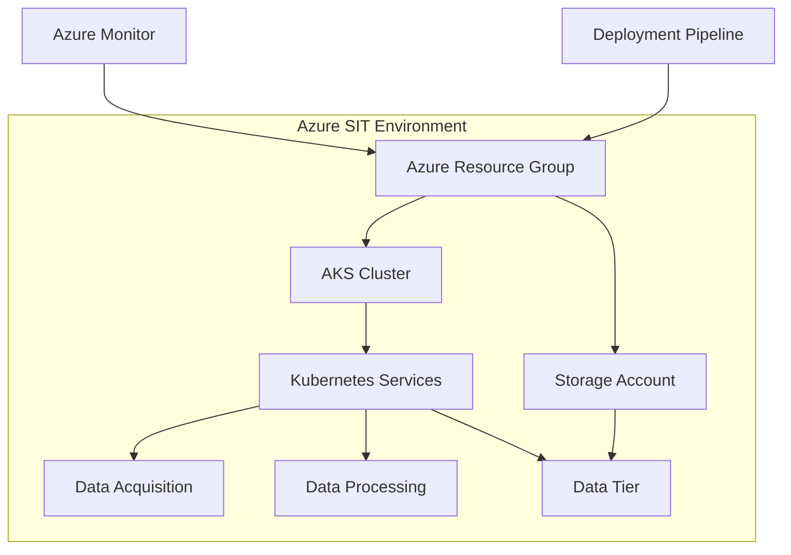

# Sentimark SIT Environment Deployment Guide

This document provides deployment instructions for the Sentimark System Integration Testing (SIT) environment.

## Environment Overview

The SIT environment provides a lightweight Azure environment for integration testing with minimal costs. It is designed to validate all system integration aspects while keeping resource utilization and costs down.

## Prerequisites

- Docker installed locally (for running Terraform)
- Azure account with proper permissions
- Service Principal with appropriate permissions
- Terraform 1.0.0+ (handled by the run-terraform.sh script using Docker)

## Architecture Diagram



## Configuration

The SIT environment uses the following components:

- **AKS Cluster**: Small node sizes (Standard_B2s) with minimal node count (1 per workload type)
- **Standard Storage**: LRS (Locally Redundant Storage) for cost efficiency
- **Minimal Redundancy**: Single replica services
- **Basic Monitoring**: Essential Azure Monitor metrics only

## Infrastructure Specifications

| Resource | Specification |
|----------|---------------|
| Resource Group | sentimark-sit-rg |
| Location | westus |
| AKS Cluster | sentimark-sit-aks |
| Node VM Size | Standard_B2s |
| Node Count | 1 per pool (2 total) |
| Storage Account | Standard LRS |
| Backup | None |
| Monitoring | Basic |

## Authentication Options

The `run-terraform.sh` script uses **Service Principal Authentication exclusively**. No Azure CLI fallbacks are used:

### 1. Service Principal Authentication

For deployment, use the Service Principal credentials:

```bash
cd infrastructure/terraform/azure
./run-terraform.sh --client-id=[CLIENT_ID] --client-secret=[CLIENT_SECRET] --tenant-id=[TENANT_ID] --subscription-id=[SUBSCRIPTION_ID] init
./run-terraform.sh --client-id=[CLIENT_ID] --client-secret=[CLIENT_SECRET] --tenant-id=[TENANT_ID] --subscription-id=[SUBSCRIPTION_ID] plan -var-file=terraform.sit.tfvars -out=tfplan.sit
./run-terraform.sh --client-id=[CLIENT_ID] --client-secret=[CLIENT_SECRET] --tenant-id=[TENANT_ID] --subscription-id=[SUBSCRIPTION_ID] apply tfplan.sit
```

### 2. Using providers.tf Credentials

If Service Principal credentials are already configured in `providers.tf`, you can run:

```bash
cd infrastructure/terraform/azure
./run-terraform.sh init
./run-terraform.sh plan -var-file=terraform.sit.tfvars -out=tfplan.sit
./run-terraform.sh apply tfplan.sit
```

### 3. Bash Aliases (Optional)

For frequently used credentials, add to your `~/.bash_aliases`:

```bash
# SIT environment credentials
export SIT_CLIENT_ID="your-sit-client-id"
export SIT_CLIENT_SECRET="your-sit-client-secret"
export SIT_TENANT_ID="your-sit-tenant-id"
export SIT_SUBSCRIPTION_ID="your-sit-subscription-id"
```

Then run: `source ~/.bash_aliases` and use the script normally.

## Deployment Process

1. **Addressing Common Deployment Issues**:
   
   Before deploying, ensure:
   
   - Your state files don't reference UAT resources that shouldn't be destroyed
   - Your var files are properly specifying the correct environment resources
   - You've updated providers.tf with appropriate credentials

2. **Terraform Initialization**:
   ```bash
   cd infrastructure/terraform/azure
   ./run-terraform.sh init
   ```

3. **Deployment Planning**:
   ```bash
   # Make sure terraform.sit.tfvars has correct settings
   ./run-terraform.sh plan -var-file=terraform.sit.tfvars -out=tfplan.sit
   
   # Verify in the plan output that:
   # - No unexpected resources are being destroyed (especially from other environments)
   # - All expected SIT resources are being created
   # - State file mappings are correct
   ```

4. **Resource Provisioning**:
   ```bash
   ./run-terraform.sh apply tfplan.sit
   ```

5. **Service Deployment**:
   ```bash
   cd environments/sit
   export KUBECONFIG=./config/kubeconfig
   ./deploy_services.sh
   ```

6. **Integration Testing**:
   ```bash
   cd environments/sit/tests
   pytest test_azure_sit.py
   ```

## Deployment Verification

For SIT environments, use these CLI utilities to verify successful deployment:

```bash
# 1. Verify Azure Resource Group and Resources
az group show --name sentimark-sit-rg --query properties.provisioningState
az aks show --resource-group sentimark-sit-rg --name sentimark-sit-aks --query provisioningState
az storage account show --resource-group sentimark-sit-rg --name sentimarksitstorage --query statusOfPrimary

# 2. Verify Kubernetes Access and Resources
export KUBECONFIG=./config/kubeconfig
kubectl cluster-info
kubectl get nodes -o wide
kubectl get pods -n sit
kubectl get services -n sit

# 3. Verify Service Health
# Get the external IP of the service
SERVICE_IP=$(kubectl get svc -n sit data-acquisition-service -o jsonpath='{.status.loadBalancer.ingress[0].ip}')
# Check service health
curl http://${SERVICE_IP}:8002/health

# 4. Run Automated Verification Tests
cd environments/sit
./verify_deployment.sh
```

Expected Success Output:
```
Azure Resources:
✅ Resource Group: "Succeeded"
✅ AKS Cluster: "Succeeded"
✅ Storage Account: "Available"

Kubernetes Resources:
✅ Cluster Connection: Connected to "sentimark-sit-aks"
✅ All 2 nodes are in "Ready" state
✅ All 3 pods are in "Running" state
✅ All services have assigned External IPs

Service Health:
✅ Data Acquisition Service: Healthy
✅ Data Processing Service: Healthy
✅ Data Tier Service: Healthy

Verification Tests:
✅ All deployment tests passed
```

## Cleanup Process

It's important to destroy the SIT environment when not in use to minimize costs:

```bash
cd infrastructure/terraform/azure
./run-terraform.sh destroy -var-file=terraform.sit.tfvars -auto-approve
```

## Troubleshooting

### State File Issues

1. **Resource conflict between environments**:
   If Terraform is trying to destroy UAT resources while creating SIT resources, you likely have a state file issue:
   ```bash
   # Check current state
   ./run-terraform.sh state list
   
   # If UAT resources are in SIT state, remove them
   ./run-terraform.sh state rm <UAT_RESOURCE_ADDRESS>
   
   # Example:
   # ./run-terraform.sh state rm azurerm_resource_group.rg["/subscriptions/644936a7-e58a-4ccb-a882-0005f213f5bd/resourceGroups/rt-sentiment-uat"]
   ```

2. **Importing Existing Resources**:
   If resources exist but aren't in your state file:
   ```bash
   ./run-terraform.sh import -var-file=terraform.sit.tfvars <RESOURCE_ADDRESS> <RESOURCE_ID>
   
   # Example:
   # ./run-terraform.sh import -var-file=terraform.sit.tfvars azurerm_resource_group.rg /subscriptions/644936a7-e58a-4ccb-a882-0005f213f5bd/resourceGroups/sentimark-sit-rg
   ```

### Authentication Issues

1. **Service Principal Permissions**:
   Ensure your Service Principal has:
   - Contributor role on the subscription
   - User Access Administrator role for RBAC
   - Network Contributor role for VNet configuration

2. **Credential Issues**:
   ```bash
   # Verify providers.tf has correct credentials
   grep -A 5 "client_id" /home/jonat/real_senti/infrastructure/terraform/azure/providers.tf
   
   # Check terraform.sit.tfvars has correct credentials
   grep -A 5 "client_id" /home/jonat/real_senti/infrastructure/terraform/azure/terraform.sit.tfvars
   ```

### Script Execution Issues

1. **Script Not Executable**:
   ```bash
   chmod +x ./run-terraform.sh
   ```

2. **Docker Not Running**:
   ```bash
   systemctl start docker
   ```

3. **Azure CLI Messages in Output**:
   If you still see Azure CLI messages, ensure:
   - `providers.tf` has `use_cli = false` and `use_msi = false`
   - Your `terraform.auto.tfvars` is being created correctly
   - ENV variables aren't overriding settings

## Environment-Specific State Management

### Managing Multiple Environments

The Terraform output showing `azurerm_resource_group.rg: Still destroying... [id=/subscriptions/644936a7-e58a-4ccb-a882-...13f5bd/resourceGroups/rt-sentiment-uat, 40s elapsed]` while creating SIT resources indicates a state file conflict.

This happens when:
1. The same state file is being used for multiple environments
2. Resource identifiers in `main.tf` don't have environment-specific names
3. Variable values from one environment are applied to another

### Solutions:

1. **Separate State Files** (Recommended):
   ```bash
   # Initialize with environment-specific backend configuration
   ./run-terraform.sh init -backend-config=backends/sit.tfbackend
   
   # The backend config would contain:
   # key = "sit/terraform.tfstate"
   ```

2. **State Migration**:
   If UAT resources are in your SIT state, use state management:
   ```bash
   # List all resources in current state
   ./run-terraform.sh state list
   
   # Remove UAT resources from SIT state
   ./run-terraform.sh state rm <UAT_RESOURCE_ADDRESS>
   ```

3. **Environment-Specific Code**:
   Consider using a more modular approach with environment-specific modules or workspaces.

## Related Documentation

- [Development Deployment Guide](./deployment_dev.md)
- [UAT Deployment Guide](./deployment_uat.md)
- [Production Deployment Guide](./deployment_prod.md)
- [Terraform State Management](https://www.terraform.io/docs/language/state/index.html)