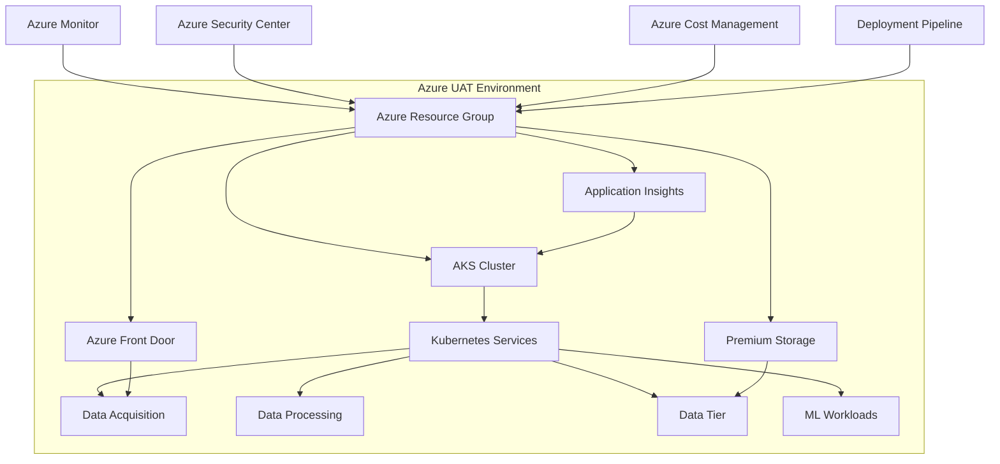

# Sentimark UAT Environment Deployment Guide

This document provides deployment instructions for the Sentimark User Acceptance Testing (UAT) environment.

## Environment Overview

The UAT environment mirrors the production environment with full-scale resources for accurate performance testing. It is designed to provide a production-like environment for final validation before going live.

## Architecture Diagram



## Configuration

The UAT environment uses the following components:

- **AKS Cluster**: Production-grade VM sizes (Standard_D4s_v3) with multiple nodes per pool
- **Premium Storage**: GRS (Geo-Redundant Storage) for data durability
- **High Availability**: Multiple replicas for critical services
- **Advanced Monitoring**: Full Application Insights and Log Analytics
- **Security Measures**: Network Security Groups, Azure Front Door WAF, RBAC

## Infrastructure Specifications

| Resource | Specification |
|----------|---------------|
| Resource Group | rt-sentiment-uat-rg |
| Location | westus |
| AKS Cluster | rt-sentiment-uat-aks |
| Node VM Size | Standard_D4s_v3 |
| Node Count | 2-3 per pool (6-9 total) |
| Storage Account | Premium GRS |
| Backup | Enabled (Daily) |
| Monitoring | Advanced |
| Security | Azure Security Center, WAF |

## Deployment Process

1. **Terraform Initialization**:
   ```bash
   cd infrastructure/terraform/azure
   ./run-terraform.sh --client-id=[CLIENT_ID] --client-secret=[CLIENT_SECRET] --tenant-id=[TENANT_ID] --subscription-id=[SUBSCRIPTION_ID] init
   ```

   Or with bash aliases:
   ```bash
   cd infrastructure/terraform/azure
   ./run-terraform.sh init
   ```

2. **Deployment Planning**:
   ```bash
   ./run-terraform.sh --client-id=[CLIENT_ID] --client-secret=[CLIENT_SECRET] --tenant-id=[TENANT_ID] --subscription-id=[SUBSCRIPTION_ID] plan -var-file=terraform.uat.tfvars -out=tfplan.uat
   ```

   Or with bash aliases:
   ```bash
   ./run-terraform.sh plan -var-file=terraform.uat.tfvars -out=tfplan.uat
   ```

3. **Resource Provisioning**:
   ```bash
   ./run-terraform.sh --client-id=[CLIENT_ID] --client-secret=[CLIENT_SECRET] --tenant-id=[TENANT_ID] --subscription-id=[SUBSCRIPTION_ID] apply tfplan.uat
   ```
   
   Or with bash aliases:
   ```bash
   ./run-terraform.sh apply tfplan.uat
   ```

4. **Service Deployment**:
   ```bash
   cd environments/uat
   export KUBECONFIG=./config/kubeconfig
   ./deploy_services.sh
   ```

5. **Acceptance Testing**:
   ```bash
   cd environments/uat/tests
   pytest test_azure_uat.py
   ```

## Deployment Verification

UAT environments require rigorous verification across multiple dimensions. Use the following verification script:

```bash
#!/bin/bash
# verify_uat_deployment.sh

echo "====== UAT ENVIRONMENT DEPLOYMENT VERIFICATION ======"
echo "Region: westus"
echo "Environment: UAT"
echo "Starting verification at $(date)"
echo

# 1. Azure Resource Verification
echo "===== AZURE RESOURCE VERIFICATION ====="
az login --service-principal --username $CLIENT_ID --password $CLIENT_SECRET --tenant $TENANT_ID

# Check Resource Group
az group show --name rt-sentiment-uat-rg --query properties.provisioningState -o tsv

# Check AKS Cluster
echo "Verifying AKS Cluster..."
AKS_STATUS=$(az aks show --resource-group rt-sentiment-uat-rg --name rt-sentiment-uat-aks --query provisioningState -o tsv)
echo "AKS Status: $AKS_STATUS"

# Check Node Count and Status
NODE_COUNT=$(az aks show --resource-group rt-sentiment-uat-rg --name rt-sentiment-uat-aks --query agentPoolProfiles[*].count -o tsv | awk '{sum+=$1} END {print sum}')
echo "Total Node Count: $NODE_COUNT"

# Check Storage Account
STORAGE_STATUS=$(az storage account show --resource-group rt-sentiment-uat-rg --name rtsentimenduatstorage --query statusOfPrimary -o tsv)
echo "Storage Status: $STORAGE_STATUS"

# Check Front Door
FRONTDOOR_STATUS=$(az network front-door show --resource-group rt-sentiment-uat-rg --name rt-sentiment-uat-fd --query resourceState -o tsv)
echo "Front Door Status: $FRONTDOOR_STATUS"

# 2. Kubernetes Verification
echo
echo "===== KUBERNETES VERIFICATION ====="
export KUBECONFIG=./config/kubeconfig

# Cluster Connection
kubectl cluster-info

# Node Status
echo "Verifying Node Status..."
kubectl get nodes -o wide

# Pod Status
echo "Verifying Pod Status..."
kubectl get pods --all-namespaces

# Service Status
echo "Verifying Service Status..."
kubectl get services --all-namespaces

# Deployment Status
echo "Verifying Deployments..."
kubectl get deployments --all-namespaces

# 3. Application Health Checks
echo
echo "===== APPLICATION HEALTH CHECKS ====="

# Get service endpoints
DATA_ACQ_IP=$(kubectl get svc -n uat data-acquisition-service -o jsonpath='{.status.loadBalancer.ingress[0].ip}')
DATA_TIER_IP=$(kubectl get svc -n uat data-tier-service -o jsonpath='{.status.loadBalancer.ingress[0].ip}')

# Health checks
echo "Data Acquisition Service Health: $(curl -s -o /dev/null -w "%{http_code}" http://${DATA_ACQ_IP}:8002/health)"
echo "Data Tier Service Health: $(curl -s -o /dev/null -w "%{http_code}" http://${DATA_TIER_IP}:8004/health)"

# 4. Application Performance Tests
echo
echo "===== APPLICATION PERFORMANCE TESTS ====="
cd tests/performance
python3 run_load_tests.py --environment uat --duration 60 --users 10

# 5. Integration Tests
echo
echo "===== INTEGRATION TESTS ====="
cd ../integration
pytest -xvs test_uat_integration.py

# 6. Log Analysis
echo
echo "===== LOG ANALYSIS ====="
az monitor log-analytics query --workspace $WORKSPACE_ID --analytics-query "KubePodInventory | where ClusterName == 'rt-sentiment-uat-aks' | summarize count() by PodStatus" -o table

# 7. Security Verification
echo
echo "===== SECURITY VERIFICATION ====="
az security assessment list --resource-group rt-sentiment-uat-rg --query "[?resourceDetails.source=='Azure Security Center'].{Name:displayName, Status:status.code, Severity:metadata.severity}" -o table

echo
echo "====== VERIFICATION COMPLETE ======"
echo "Completed at $(date)"
```

Expected Output for Successful Deployment:
```
====== UAT ENVIRONMENT DEPLOYMENT VERIFICATION ======
Region: westus
Environment: UAT
Starting verification at Mon May 6 18:15:23 UTC 2025

===== AZURE RESOURCE VERIFICATION =====
Succeeded
Verifying AKS Cluster...
AKS Status: Succeeded
Total Node Count: 6
Storage Status: available
Front Door Status: Enabled

===== KUBERNETES VERIFICATION =====
Kubernetes control plane is running at https://rt-sentiment-uat-aks-12345.hcp.westus.azmk8s.io:443
Verifying Node Status...
NAME                                STATUS   ROLES   AGE   VERSION   INTERNAL-IP    EXTERNAL-IP   OS-IMAGE             KERNEL-VERSION     CONTAINER-RUNTIME
aks-agentpool-12345678-vmss000000   Ready    agent   1h    v1.24.9   10.240.0.4     <none>        Ubuntu 22.04.1 LTS   5.15.0-1033-azure   containerd://1.6.12
aks-agentpool-12345678-vmss000001   Ready    agent   1h    v1.24.9   10.240.0.5     <none>        Ubuntu 22.04.1 LTS   5.15.0-1033-azure   containerd://1.6.12
aks-datapool-12345678-vmss000000    Ready    agent   1h    v1.24.9   10.240.0.6     <none>        Ubuntu 22.04.1 LTS   5.15.0-1033-azure   containerd://1.6.12
aks-datapool-12345678-vmss000001    Ready    agent   1h    v1.24.9   10.240.0.7     <none>        Ubuntu 22.04.1 LTS   5.15.0-1033-azure   containerd://1.6.12
aks-mlpool-12345678-vmss000000      Ready    agent   1h    v1.24.9   10.240.0.8     <none>        Ubuntu 22.04.1 LTS   5.15.0-1033-azure   containerd://1.6.12
aks-mlpool-12345678-vmss000001      Ready    agent   1h    v1.24.9   10.240.0.9     <none>        Ubuntu 22.04.1 LTS   5.15.0-1033-azure   containerd://1.6.12

[...additional output truncated for brevity...]

====== VERIFICATION COMPLETE ======
Completed at Mon May 6 18:20:45 UTC 2025
```

## Cleanup Process

It's important to destroy the UAT environment when not in use to minimize costs:

```bash
cd infrastructure/terraform/azure
./run-terraform.sh --client-id=[CLIENT_ID] --client-secret=[CLIENT_SECRET] --tenant-id=[TENANT_ID] --subscription-id=[SUBSCRIPTION_ID] destroy -var-file=terraform.uat.tfvars -auto-approve
```

Or with bash aliases:
```bash
cd infrastructure/terraform/azure
./run-terraform.sh destroy -var-file=terraform.uat.tfvars -auto-approve
```

## Setting Up Bash Aliases

To simplify Terraform commands with the updated `run-terraform.sh` script, you can add the following to your `~/.bash_aliases` file:

```bash
# UAT environment credentials
export UAT_CLIENT_ID="your-uat-client-id" 
export UAT_CLIENT_SECRET="your-uat-client-secret"
export UAT_TENANT_ID="your-uat-tenant-id"
export UAT_SUBSCRIPTION_ID="your-uat-subscription-id"
```

After adding these aliases, run `source ~/.bash_aliases` or start a new terminal session for the changes to take effect.

## Service Principal Permissions

The Service Principal used for UAT deployments requires the following permissions:

```
- Contributor role on the subscription
- User Access Administrator role for managing resource-specific RBAC
- Network Contributor role for configuring VNet and related resources
```

## Related Documentation

- [Development Deployment Guide](./deployment_dev.md)
- [SIT Deployment Guide](./deployment_sit.md)
- [Production Deployment Guide](./deployment_prod.md)