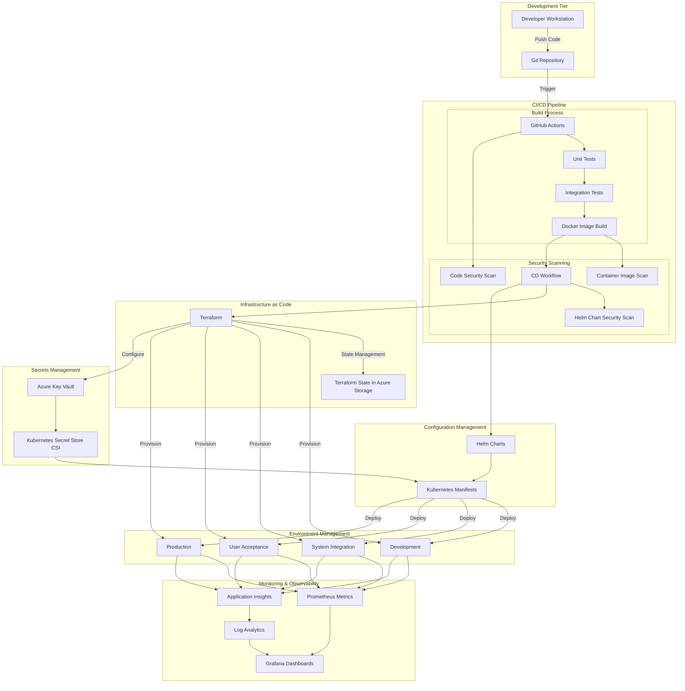

# Sentimark DevOps Architecture

## Overview

The Sentimark DevOps architecture provides a comprehensive, scalable, and secure deployment pipeline for the Sentimark platform across multiple environments. This document outlines the architectural components, workflows, and best practices implemented in the DevOps infrastructure.

## Infrastructure Architecture

## Key Components

### 1. Infrastructure as Code (IaC)

The Sentimark platform uses Terraform to provision and manage all cloud infrastructure components. This approach ensures:

- **Consistency**: All environments are provisioned using the same code
- **Versioning**: Infrastructure changes are versioned in Git
- **Auditability**: All changes are tracked and can be audited
- **Reproducibility**: Environments can be recreated reliably from code

#### Terraform Implementation:

- **State Management**: Terraform state is stored in Azure Storage with state locking to prevent concurrent modifications
- **Module Structure**: A modular approach with reusable components for AKS, monitoring, cost management, and data services
- **Environment Segregation**: Separate configurations for Development, SIT, UAT, and Production environments
- **Pipeline Integration**: Terraform execution is integrated into CI/CD workflows

### 2. Kubernetes Deployment with Helm

All Sentimark services are deployed to Azure Kubernetes Service (AKS) using Helm charts:

- **Common Charts**: Shared configurations across services in `sentimark-common`
- **Service-Specific Charts**: Individual service configurations in `sentimark-services`
- **Security Context**: Container-level security settings for compliance with security best practices
- **Resource Management**: CPU and memory limits for optimal resource utilization
- **Health Checks**: Readiness and liveness probes for self-healing capabilities
- **Autoscaling**: Horizontal Pod Autoscaler configurations based on CPU/memory metrics

### 3. CI/CD Pipeline

The Continuous Integration and Continuous Deployment pipeline automates the build, test, and deployment processes:

- **Automated Testing**: Unit tests, integration tests, and end-to-end tests
- **Security Scanning**: Code scans, container image scanning, and Helm chart validation
- **Deployment Automation**: Automated deployment to Development and SIT environments with manual approvals for UAT and Production
- **Enhanced Logging**: Comprehensive logging for feature flag changes, data migrations, Iceberg operations, and rollbacks
- **Monitoring**: Deployment metric collection for success rates and performance analysis

### 4. Monitoring and Observability

The observability stack provides comprehensive monitoring of all environment components:

- **Metrics Collection**: Prometheus for infrastructure and application metrics
- **Logs Management**: Azure Log Analytics with custom log tables for specialized events
- **Application Performance**: Application Insights for detailed application telemetry
- **Visualization**: Grafana dashboards for metrics and log analysis
- **Alerting**: Alertmanager and Azure Monitor alerts for proactive issue detection

### 5. Secrets Management

Sensitive information is securely managed across all environments:

- **Central Storage**: Azure Key Vault for centralized secrets storage
- **Integration**: Kubernetes Secret Store CSI driver for securely injecting secrets into pods
- **Rotation**: Automated secret rotation for database credentials and API keys
- **Access Control**: RBAC controls for secrets access in both Azure and Kubernetes

## Deployment Workflow

The deployment process follows these steps:

1. **Code Commit**: Developers push code to the Git repository
2. **CI Pipeline**: GitHub Actions triggers the CI pipeline:
   - Builds the code
   - Runs unit and integration tests
   - Builds Docker images
   - Performs security scans
   - Pushes images to Azure Container Registry
3. **CD Pipeline**: For approved changes:
   - Updates infrastructure with Terraform if needed
   - Packages Helm charts with updated versions
   - Deploys to target environment
   - Runs post-deployment tests
   - Updates deployment status and metrics

## Environment Architecture

### Development Environment (WSL)

- **Purpose**: Local developer testing and WSL-based development
- **Components**:
  - Docker and Docker Compose for local services
  - Minikube for local Kubernetes testing
  - Local monitoring stack with Prometheus and Grafana

### System Integration Testing (SIT)

- **Purpose**: Integration testing of all components
- **Infrastructure**:
  - AKS cluster with development-sized node pools
  - Azure PostgreSQL Flexible Server
  - Azure Cache for Redis
  - Azure Event Hubs
  - Application Gateway for API access

### User Acceptance Testing (UAT)

- **Purpose**: Customer validation and performance testing
- **Infrastructure**:
  - AKS cluster with production-like sizing
  - High-availability database configuration
  - Full monitoring stack
  - Production-equivalent networking and security

### Production

- **Purpose**: Live system serving customer workloads
- **Infrastructure**:
  - Multi-region AKS deployment
  - Premium tier services with high availability
  - Enhanced security controls and monitoring
  - Disaster recovery capabilities

## Security Framework

The DevOps architecture implements several security measures:

1. **Infrastructure Security**:
   - Private AKS clusters
   - Network Security Groups and Azure Firewall
   - Private Endpoints for Azure services

2. **Application Security**:
   - Container image scanning
   - Kubernetes security policies
   - Security context configuration
   - Automated vulnerability scanning

3. **Operational Security**:
   - RBAC for all components
   - Just-in-time access for management
   - Audit logging for all operations
   - Automated security patch management

## Cost Management

Cost optimization is built into the DevOps architecture:

1. **Resource Optimization**:
   - Right-sized infrastructure for each environment
   - Automated scaling based on actual usage
   - Dev/Test subscriptions for non-production environments

2. **Cost Monitoring**:
   - Azure Cost Management integration
   - Environment-specific budgets and alerts
   - Service-level cost tracking
   - Usage-based optimization recommendations

3. **Optimization Strategies**:
   - Spot instances for fault-tolerant workloads
   - Automated scaling to zero for development environments
   - Reserved instances for steady-state workloads
   - Resource cleanup automation

## Future Growth Areas

### 1. Multi-Region Deployment

Expanding the deployment to multiple Azure regions for:
- Reduced latency for global users
- Enhanced disaster recovery capabilities
- Geographic data residency compliance

Implementation strategy:
- Regional AKS clusters with traffic manager
- Cross-region data replication
- GitOps-based multi-region deployment

### 2. GitOps Implementation

Enhancing deployment with GitOps principles:
- Flux or ArgoCD integration
- Declarative configuration for all environments
- Automated drift detection and remediation
- Enhanced auditability and compliance

### 3. Enhanced Automation

Further automation opportunities:
- Automated canary deployments
- ML-based anomaly detection for deployments
- Auto-remediation for common failure scenarios
- Self-service developer platforms

### 4. Serverless Integration

Integrating serverless components:
- Azure Functions for event-driven processing
- Container Apps for scaling to zero
- Event-driven architecture enhancements
- Reduced operational overhead

### 5. Advanced Security Posture

Evolving security capabilities:
- Runtime container security
- Service mesh implementation
- Zero-trust networking architecture
- Automated compliance auditing and reporting

## Conclusion

The Sentimark DevOps architecture provides a robust, secure, and scalable foundation for deploying and operating the Sentimark platform. By leveraging infrastructure as code, containerization, automated pipelines, and comprehensive monitoring, the architecture enables rapid, reliable deployments while maintaining high standards for security and operational excellence.

As the platform evolves, the architectural foundations established here will support growth in scale, features, and geographic reach while continuing to optimize for cost, security, and operational efficiency.
