# Sentimark Deployment Architecture

## Overview

This document serves as the unified reference for the Sentimark deployment architecture, consolidating information from the various deployment-related documents. It describes the infrastructure, deployment pipelines, environment configurations, and operational processes used to deploy and maintain the platform across various environments.

## Infrastructure Architecture

```mermaid
flowchart TB
    subgraph "Source Control"
        GitHub["GitHub Repository"]
    end
    
    subgraph "CI/CD Pipeline"
        GHA["GitHub Actions"]
        
        subgraph "Build & Test"
            Unit["Unit Tests"]
            Integration["Integration Tests"]
            Security["Security Scans"]
            DockerBuild["Docker Image Build"]
        end
        
        subgraph "Deployment"
            TerraformDeploy["Terraform Deployment"]
            HelmDeploy["Helm Chart Deployment"]
            Verify["Deployment Verification"]
        end
    end
    
    subgraph "Infrastructure"
        subgraph "Azure Cloud"
            ACR["Azure Container Registry"]
            KeyVault["Azure Key Vault"]
            Storage["Azure Storage"]
            AppInsights["Application Insights"]
            LogAnalytics["Log Analytics"]
            
            subgraph "Development"
                DevAKS["AKS Dev Cluster"]
                DevDB["Azure Database Dev"]
                DevRedis["Azure Redis Dev"]
            end
            
            subgraph "SIT"
                SITAKS["AKS SIT Cluster"]
                SITDB["Azure Database SIT"]
                SITRedis["Azure Redis SIT"]
                SITEventHub["Azure Event Hub SIT"]
            end
            
            subgraph "UAT"
                UATAKS["AKS UAT Cluster"]
                UATDB["Azure Database UAT"]
                UATRedis["Azure Redis UAT"]
                UATEventHub["Azure Event Hub UAT"]
            end
            
            subgraph "Production"
                ProdAKS["AKS Production Cluster"]
                ProdDB["Azure Database Prod"]
                ProdRedis["Azure Redis Prod"]
                ProdEventHub["Azure Event Hub Prod"]
            end
        end
    end
    
    GitHub --> GHA
    GHA --> Unit
    Unit --> Integration
    Integration --> Security
    Security --> DockerBuild
    DockerBuild --> ACR
    
    GHA --> TerraformDeploy
    TerraformDeploy --> DevAKS
    TerraformDeploy --> SITAKS
    TerraformDeploy --> UATAKS
    TerraformDeploy --> ProdAKS
    
    ACR --> HelmDeploy
    KeyVault --> HelmDeploy
    
    HelmDeploy --> DevAKS
    HelmDeploy --> SITAKS
    HelmDeploy --> UATAKS
    HelmDeploy --> ProdAKS
    
    HelmDeploy --> Verify
```

## Deployment Workflow

The Sentimark platform follows a comprehensive deployment workflow that ensures consistent, secure, and reliable deployments across all environments.

### 1. Code Preparation

- Developers commit code to feature branches
- Pull requests are created for code review
- Automated CI checks run on pull requests:
  - Unit tests
  - Integration tests
  - Security scans
  - Code quality checks

### 2. Infrastructure Provisioning

Infrastructure is managed through Terraform with the following components:

- **Azure Resources**: AKS clusters, databases, storage, networking
- **Node Pools**: Including specialized spot instance pools for cost optimization
- **Network Security**: Private clusters, network security groups, Azure Firewall
- **Monitoring**: Application Insights, Log Analytics

### 3. Application Deployment

Applications are deployed using Helm charts with these key considerations:

- **Containerization**: All services run as containers in Kubernetes
- **Configuration Management**: Environment-specific configurations via Helm values
- **Secrets Management**: Integration with Azure Key Vault via CSI driver
- **Security Context**: Container-level security settings following best practices
- **Resource Management**: Appropriate resource requests and limits

### 4. Deployment Verification

Deployments include comprehensive verification steps:

- **Health Checks**: Verifying service readiness and liveness
- **Functional Tests**: Testing API endpoints and core functionality
- **Security Verification**: Confirming proper security configurations
- **Performance Validation**: Basic load testing to ensure system stability

## Environment Architecture

### Development Environment (DEV)

- **Purpose**: Development and testing
- **Deployment Frequency**: Continuous
- **Infrastructure**:
  - Small-scale AKS cluster
  - Development tier databases
  - Ephemeral resources with auto-shutdown

### System Integration Testing (SIT)

- **Purpose**: Integration testing and system validation
- **Deployment Frequency**: Daily
- **Infrastructure**:
  - Medium-scale AKS cluster
  - Standard tier databases
  - Limited redundancy
  - Test data generators

### User Acceptance Testing (UAT)

- **Purpose**: User testing and pre-production validation
- **Deployment Frequency**: Weekly
- **Infrastructure**:
  - Production-like AKS cluster
  - Standard tier databases with high availability
  - Full monitoring stack
  - Production-comparable scaling

### Production Environment (PROD)

- **Purpose**: Production workloads
- **Deployment Frequency**: Scheduled releases
- **Infrastructure**:
  - Enterprise-grade AKS cluster
  - Premium tier databases with high availability
  - Geo-redundancy for critical services
  - Comprehensive monitoring and alerting
  - Enhanced security measures

## CI/CD Pipeline

The CI/CD pipeline is implemented using GitHub Actions with these key features:

### Build Pipeline

- **Triggered By**: Pull requests and merges to main branch
- **Key Steps**:
  - Code checkout
  - Dependency installation
  - Unit testing
  - Integration testing
  - Security scanning
  - Docker image building
  - Image pushing to ACR

### Deployment Pipeline

- **Triggered By**: Successful build pipeline and/or manual approval
- **Key Steps**:
  - Infrastructure provisioning/updating (Terraform)
  - Secrets retrieval from Key Vault
  - Helm chart preparation
  - Kubernetes deployment
  - Post-deployment verification
  - Monitoring alert configuration

### Environment Promotion

- **Development**: Automatic deployment on code merge
- **SIT**: Automatic deployment after successful development deployment
- **UAT**: Manual approval required for deployment
- **Production**: Manual approval with required approvers

## Helm Chart Deployment

### Enhanced Helm Deployment Process

The enhanced Helm deployment process has been implemented to address critical challenges:

1. **Secure Private AKS Deployments**: Enables deployments to private AKS clusters with no public IP exposure
2. **Robust Base64 Handling**: Fixes encoding/decoding issues when transferring Helm charts
3. **Comprehensive Error Handling**: Provides detailed error reporting and automatic recovery
4. **Deployment Verification**: Built-in verification steps to ensure successful service deployment
5. **Spot Instance Support**: Optimized deployment for cost-effective Azure spot instances
6. **Detailed Logging**: Structured logging for auditing and troubleshooting

### Helm Chart Security Context

Security context configuration in Helm charts follows these best practices:

1. **Pod-level Security Context**: Limited to `fsGroup` and other pod-specific settings
2. **Container-level Security Context**: Properties such as:
   - `runAsNonRoot`
   - `runAsUser`
   - `runAsGroup`
   - `allowPrivilegeEscalation`
   - `capabilities`
   - `readOnlyRootFilesystem`

3. **YAML Best Practices**:
   - Consistent indentation
   - Proper YAML document separators
   - Proper list formatting

### Helm Deployment Scripts

The deployment scripts have been enhanced to:

1. **Handle Private AKS**: Using `az aks command invoke` for private clusters
2. **Support Large Charts**: Chunking large base64-encoded chart packages
3. **Verify Deployments**: Automated post-deployment verification
4. **Handle Failures**: Comprehensive error handling and reporting

## Security Measures

The deployment architecture incorporates comprehensive security measures:

### Infrastructure Security

- **Network Isolation**: Private AKS clusters with no public endpoints
- **Private Endpoints**: For Azure services (ACR, Key Vault, databases)
- **Network Security Groups**: Restrictive access controls
- **Just-In-Time Access**: For management operations

### Application Security

- **Container Scanning**: Vulnerability scanning for all container images
- **Secret Management**: No secrets in code, configuration, or pipeline variables
- **Pod Security**: Strict pod security standards enforcement
- **RBAC**: Role-based access control for Kubernetes resources

### Pipeline Security

- **Source Control Protections**: Branch protection rules, required reviews
- **Dependency Scanning**: Automated scanning for vulnerable dependencies
- **Infrastructure Validation**: Terraform plan review and approval
- **Deployment Approvals**: Required approvers for sensitive environments

## CICD Logging Integration

A comprehensive logging system has been implemented for CI/CD operations:

1. **Azure Monitor Integration**: Connection to Azure Log Analytics workspace
2. **Specialized Logging**:
   - Feature flag changes
   - Data migration processes
   - Iceberg operations
   - Deployment rollbacks

3. **Client Libraries**:
   - Bash client for shell scripts and CI/CD processes
   - Java client for data tier service integration

4. **Integration Hooks**:
   - Event listeners for capturing operational events
   - Decorators for instrumenting critical functions

## Disaster Recovery

The deployment architecture includes disaster recovery capabilities:

- **Automated Backups**: For all critical data stores
- **Restore Procedures**: Documented processes for restore operations
- **Multi-Region Readiness**: Architecture designed for future multi-region deployment
- **Rollback Capabilities**: Helm rollback for failed deployments

## Future Roadmap

The deployment architecture roadmap includes:

1. **GitOps Implementation**: Flux or ArgoCD for declarative deployments
2. **Multi-Region Deployment**: Enhanced resilience and global presence
3. **Canary Deployments**: Progressive rollouts with automated verification
4. **Service Mesh Integration**: Advanced traffic management and security
5. **Serverless Component Integration**: For suitable workloads

## Conclusion

The Sentimark deployment architecture provides a robust foundation for deploying and operating the platform across multiple environments. By leveraging infrastructure as code, containerization, and automated pipelines, it ensures consistent, secure, and efficient deployments that can scale with the platform's growth.

## Related Documentation

- [DevOps Architecture](../architecture/devops/devops_architecture.md)
- [Cost Management Strategy](../architecture/cost_management/cost_optimization_strategy.md)
- [Infrastructure Documentation](../infrastructure/README.md)
- [Helm Chart Validation Guide](./helm_chart_validation_guide.md)
