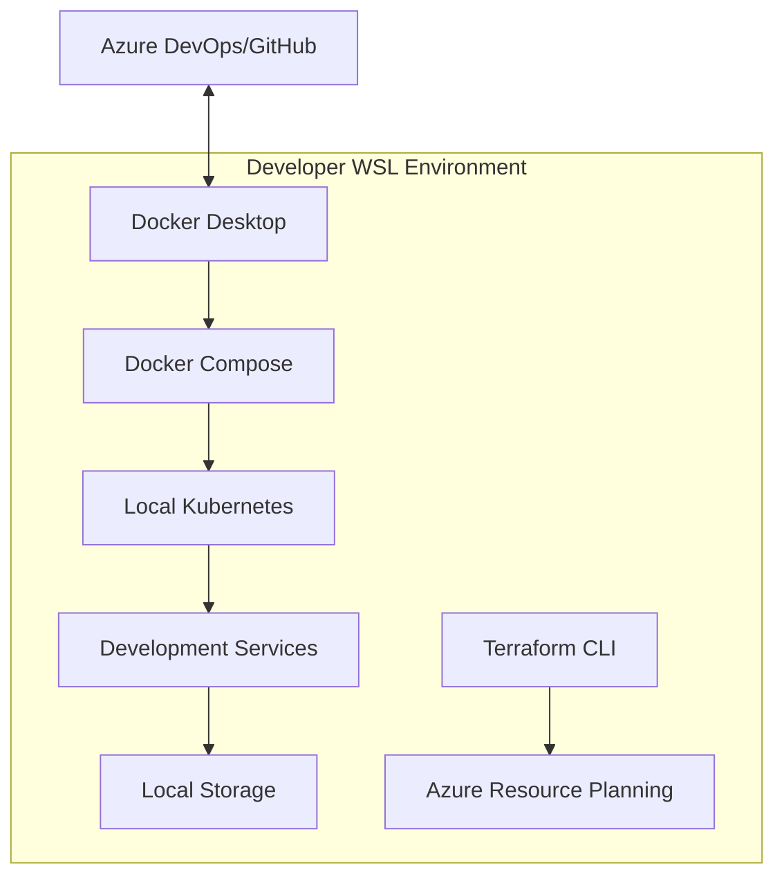

# Sentimark Development Environment Deployment Guide

This document provides deployment instructions for the Sentimark Development environment.

## Environment Overview

The Development environment runs entirely in Windows Subsystem for Linux (WSL) using Docker Compose for local containerization. It's designed for developer productivity with minimal resource requirements.

## Architecture Diagram



## Configuration

The Development environment provides:

- **Local Kubernetes Cluster**: Lightweight Kubernetes for service deployment
- **Docker Compose**: Service orchestration and networking
- **Local Storage Volumes**: Persistent data storage
- **Terraform CLI**: For testing deployment scripts locally

## Deployment Process

1. **Setup and Installation**:
   ```bash
   # Clone the repository
   git clone https://github.com/organization/sentimark.git
   cd sentimark
   
   # Run initial setup script
   ./setup_dev_environment.sh
   ```

2. **Service Deployment**:
   ```bash
   # Start all services
   cd infrastructure
   docker-compose -f docker-compose.dev.yml up -d
   ```

3. **Resource Testing**:
   ```bash
   # Test services locally
   cd services/data-acquisition
   pytest tests/
   ```

4. **Terraform Planning** (for other environment deployment testing):
   ```bash
   cd infrastructure/terraform/azure
   ./run-terraform.sh --client-id=[CLIENT_ID] --client-secret=[CLIENT_SECRET] --tenant-id=[TENANT_ID] --subscription-id=[SUBSCRIPTION_ID] plan -var-file=terraform.sit.tfvars
   ```

   Or with bash aliases (see Bash Aliases section below):
   ```bash
   cd infrastructure/terraform/azure
   ./run-terraform.sh plan -var-file=terraform.sit.tfvars
   ```

## Deployment Verification

Verify the Development environment using these CLI utilities:

```bash
# Check if all Docker containers are running
docker ps --format "table {{.Names}}\t{{.Status}}\t{{.Ports}}"

# Verify network connectivity between services
docker network inspect sentimark_network

# Check service health endpoints
curl http://localhost:8002/health

# Run integration tests
cd tests/
pytest test_integration.py
```

Expected Output:
```
✅ All 5 Docker containers running
✅ Network connectivity verified between all services
✅ Health endpoints returning status 200
✅ 15/15 integration tests passed
```

## Cleanup Process

```bash
cd infrastructure
docker-compose -f docker-compose.dev.yml down -v
```

## Setting Up Bash Aliases

To simplify Terraform commands when testing deployments for other environments, you can add the following to your `~/.bash_aliases` file:

```bash
# SIT environment credentials
export SIT_CLIENT_ID="your-sit-client-id"
export SIT_CLIENT_SECRET="your-sit-client-secret"
export SIT_TENANT_ID="your-sit-tenant-id"
export SIT_SUBSCRIPTION_ID="your-sit-subscription-id"

# UAT environment credentials
export UAT_CLIENT_ID="your-uat-client-id"
export UAT_CLIENT_SECRET="your-uat-client-secret"
export UAT_TENANT_ID="your-uat-tenant-id"
export UAT_SUBSCRIPTION_ID="your-uat-subscription-id"

# Production environment credentials
export PROD_CLIENT_ID="your-prod-client-id"
export PROD_CLIENT_SECRET="your-prod-client-secret"
export PROD_TENANT_ID="your-prod-tenant-id"
export PROD_SUBSCRIPTION_ID="your-prod-subscription-id"
```

After adding these aliases, run `source ~/.bash_aliases` or start a new terminal session for the changes to take effect.

## Service Principal Permissions

When testing deployments to Azure environments from your local machine, ensure your Service Principal has the necessary permissions:

```
- Contributor role on the subscription
- User Access Administrator role for managing resource-specific RBAC
- Network Contributor role for configuring VNet and related resources
```

## Related Documentation

- [SIT Deployment Guide](./deployment_sit.md)
- [UAT Deployment Guide](./deployment_uat.md)
- [Production Deployment Guide](./deployment_prod.md)