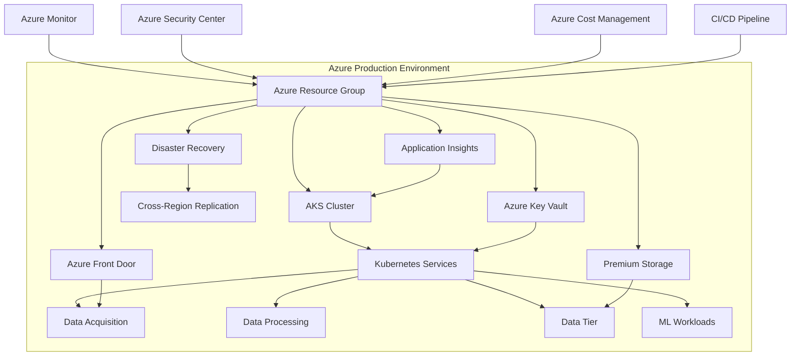

# Sentimark Production Environment Deployment Guide

This document provides deployment instructions for the Sentimark Production environment.

## Environment Overview

The Production environment is the full-scale, high-availability deployment of the Sentimark platform used for real-world operations. It includes all security, scaling, and disaster recovery features.

## Architecture Diagram



## Configuration

The Production environment uses identical specifications to UAT but with additional enterprise features:

- **Disaster Recovery**: Cross-region replication and backup
- **Enhanced Security**: Regular security audits, Key Vault integration
- **SLA-Backed Services**: Enterprise support
- **Release Management**: Controlled deployments through CI/CD

## Infrastructure Specifications

| Resource | Specification |
|----------|---------------|
| Resource Group | rt-sentiment-prod-rg |
| Location | westus (primary), eastus (secondary) |
| AKS Cluster | rt-sentiment-prod-aks |
| Node VM Size | Standard_D4s_v3 |
| Node Count | 2-3 per pool (6-9 total) |
| Storage Account | Premium GRS with cross-region replication |
| Backup | Enabled (Daily + Weekly) |
| Monitoring | Advanced with alerts |
| Security | Azure Security Center, WAF, Key Vault |

## Deployment Process

1. **Terraform Initialization**:
   ```bash
   cd infrastructure/terraform/azure
   ./run-terraform.sh --client-id=[CLIENT_ID] --client-secret=[CLIENT_SECRET] --tenant-id=[TENANT_ID] --subscription-id=[SUBSCRIPTION_ID] init
   ```

   Or with bash aliases:
   ```bash
   cd infrastructure/terraform/azure
   ./run-terraform.sh init
   ```

2. **Deployment Planning**:
   ```bash
   ./run-terraform.sh --client-id=[CLIENT_ID] --client-secret=[CLIENT_SECRET] --tenant-id=[TENANT_ID] --subscription-id=[SUBSCRIPTION_ID] plan -var-file=terraform.prod.tfvars -out=tfplan.prod
   ```

   Or with bash aliases:
   ```bash
   ./run-terraform.sh plan -var-file=terraform.prod.tfvars -out=tfplan.prod
   ```

3. **Resource Provisioning**:
   ```bash
   ./run-terraform.sh --client-id=[CLIENT_ID] --client-secret=[CLIENT_SECRET] --tenant-id=[TENANT_ID] --subscription-id=[SUBSCRIPTION_ID] apply tfplan.prod
   ```
   
   Or with bash aliases:
   ```bash
   ./run-terraform.sh apply tfplan.prod
   ```

4. **Service Deployment**:
   ```bash
   cd environments/prod
   export KUBECONFIG=./config/kubeconfig
   ./deploy_services.sh
   ```

5. **Deployment Verification**:
   ```bash
   ./verify_deployment.sh
   ```

## Deployment Verification

Production verification must be comprehensive and automated, with a focus on all critical aspects:

```bash
#!/bin/bash
# verify_production_deployment.sh

echo "======================================"
echo "PRODUCTION DEPLOYMENT VERIFICATION"
echo "Region: westus (Primary), eastus (Secondary)"
echo "Started at $(date)"
echo "======================================"

# Initialize log file
LOG_FILE="prod_verification_$(date +%Y%m%d_%H%M%S).log"
exec > >(tee -a "$LOG_FILE") 2>&1

# Set exit code
VERIFICATION_EXIT_CODE=0

# Function to check status
check_status() {
  if [[ $1 -eq 0 ]]; then
    echo "✅ PASS: $2"
  else
    echo "❌ FAIL: $2"
    VERIFICATION_EXIT_CODE=1
  fi
}

# 1. Azure Resource Verification
echo
echo "===== INFRASTRUCTURE VERIFICATION ====="

# Resource Group
echo "Checking Resource Group..."
RG_STATUS=$(az group show --name rt-sentiment-prod-rg --query properties.provisioningState -o tsv)
[[ "$RG_STATUS" == "Succeeded" ]]
check_status $? "Resource Group: $RG_STATUS"

# AKS Cluster
echo "Checking AKS Cluster..."
AKS_STATUS=$(az aks show --resource-group rt-sentiment-prod-rg --name rt-sentiment-prod-aks --query provisioningState -o tsv)
[[ "$AKS_STATUS" == "Succeeded" ]]
check_status $? "AKS Cluster: $AKS_STATUS"

# Node Pools
echo "Checking Node Pools..."
for pool in agentpool datapool mlpool; do
  POOL_STATUS=$(az aks nodepool show --resource-group rt-sentiment-prod-rg --cluster-name rt-sentiment-prod-aks --name $pool --query provisioningState -o tsv)
  [[ "$POOL_STATUS" == "Succeeded" ]]
  check_status $? "Node Pool '$pool': $POOL_STATUS"
done

# Storage Account
echo "Checking Storage Account..."
STORAGE_STATUS=$(az storage account show --resource-group rt-sentiment-prod-rg --name rtsentimentprodstorage --query statusOfPrimary -o tsv)
[[ "$STORAGE_STATUS" == "available" ]]
check_status $? "Storage Account: $STORAGE_STATUS"

# Front Door
echo "Checking Front Door..."
FD_STATUS=$(az network front-door show --resource-group rt-sentiment-prod-rg --name rt-sentiment-prod-fd --query resourceState -o tsv)
[[ "$FD_STATUS" == "Enabled" ]]
check_status $? "Front Door: $FD_STATUS"

# Key Vault
echo "Checking Key Vault..."
KV_STATUS=$(az keyvault show --name rt-sentiment-prod-kv --resource-group rt-sentiment-prod-rg --query properties.provisioningState -o tsv)
[[ "$KV_STATUS" == "Succeeded" ]]
check_status $? "Key Vault: $KV_STATUS"

# 2. Kubernetes Verification
echo
echo "===== KUBERNETES VERIFICATION ====="
export KUBECONFIG=./config/kubeconfig

# Cluster Connection
echo "Checking Cluster Connection..."
kubectl cluster-info &>/dev/null
check_status $? "Cluster Connection"

# Node Status
echo "Checking Node Status..."
NODE_COUNT=$(kubectl get nodes | grep -c Ready)
EXPECTED_NODE_COUNT=6
[[ "$NODE_COUNT" -eq "$EXPECTED_NODE_COUNT" ]]
check_status $? "Node Status ($NODE_COUNT/$EXPECTED_NODE_COUNT Ready)"

# System Pods Status
echo "Checking System Pods..."
SYSTEM_PODS_RUNNING=$(kubectl get pods -n kube-system | grep -c Running)
SYSTEM_PODS_TOTAL=$(kubectl get pods -n kube-system | grep -v NAME | wc -l)
[[ "$SYSTEM_PODS_RUNNING" -eq "$SYSTEM_PODS_TOTAL" ]]
check_status $? "System Pods ($SYSTEM_PODS_RUNNING/$SYSTEM_PODS_TOTAL Running)"

# Application Pods Status
echo "Checking Application Pods..."
APP_PODS_RUNNING=$(kubectl get pods -n prod | grep -c Running)
APP_PODS_TOTAL=$(kubectl get pods -n prod | grep -v NAME | wc -l)
[[ "$APP_PODS_RUNNING" -eq "$APP_PODS_TOTAL" ]]
check_status $? "Application Pods ($APP_PODS_RUNNING/$APP_PODS_TOTAL Running)"

# Service Status
echo "Checking Services..."
SERVICES_WITH_IP=$(kubectl get svc -n prod | grep -v pending | grep -c LoadBalancer)
SERVICES_TOTAL=$(kubectl get svc -n prod | grep -c LoadBalancer)
[[ "$SERVICES_WITH_IP" -eq "$SERVICES_TOTAL" ]]
check_status $? "Services with External IPs ($SERVICES_WITH_IP/$SERVICES_TOTAL)"

# 3. Application Health Verification
echo
echo "===== APPLICATION HEALTH VERIFICATION ====="

# Check service endpoints using both Front Door and direct access
echo "Checking Front Door Endpoints..."
FD_ENDPOINT="rt-sentiment-prod-fd.azurefd.net"
curl -s -o /dev/null -w "%{http_code}" "https://$FD_ENDPOINT/health" | grep -q "200"
check_status $? "Front Door Health Endpoint"

echo "Checking Direct Service Endpoints..."
# Get service endpoints
DATA_ACQ_IP=$(kubectl get svc -n prod data-acquisition-service -o jsonpath='{.status.loadBalancer.ingress[0].ip}')
DATA_TIER_IP=$(kubectl get svc -n prod data-tier-service -o jsonpath='{.status.loadBalancer.ingress[0].ip}')

# Health checks
curl -s -o /dev/null -w "%{http_code}" "http://$DATA_ACQ_IP:8002/health" | grep -q "200"
check_status $? "Data Acquisition Service Health"

curl -s -o /dev/null -w "%{http_code}" "http://$DATA_TIER_IP:8004/health" | grep -q "200"
check_status $? "Data Tier Service Health"

# 4. Data Path Verification
echo
echo "===== DATA PATH VERIFICATION ====="

# Test data ingestion path
echo "Testing Data Ingestion Path..."
INGESTION_RESPONSE=$(curl -s -X POST -H "Content-Type: application/json" -d '{"ticker": "TEST", "text": "Test message for verification", "source": "verification"}' "http://$DATA_ACQ_IP:8002/data")
echo $INGESTION_RESPONSE | grep -q "success"
check_status $? "Data Ingestion"

# Test data retrieval path
echo "Testing Data Retrieval Path..."
sleep 5  # Allow time for data processing
RETRIEVAL_RESPONSE=$(curl -s "http://$DATA_TIER_IP:8004/data?ticker=TEST&limit=1")
echo $RETRIEVAL_RESPONSE | grep -q "Test message for verification"
check_status $? "Data Retrieval"

# 5. Performance Tests (Brief)
echo
echo "===== QUICK PERFORMANCE CHECK ====="
# Run basic performance test
echo "Running Basic Performance Test..."
for i in {1..10}; do
  curl -s -o /dev/null -w "%{time_total}\n" "http://$DATA_ACQ_IP:8002/health"
done | awk '{ total += $1; count++ } END { print total/count }'
check_status $? "Response Time Check"

# 6. Log Verification
echo
echo "===== LOG VERIFICATION ====="
# Check for any error logs
echo "Checking for Error Logs..."
ERROR_COUNT=$(kubectl logs -n prod -l app=data-acquisition --tail=1000 | grep -c ERROR)
[[ "$ERROR_COUNT" -eq 0 ]]
check_status $? "Error Logs ($ERROR_COUNT found)"

# 7. Security Verification
echo
echo "===== SECURITY VERIFICATION ====="
# Check for unencrypted endpoints
echo "Checking Secure Communication..."
NON_TLS_ENDPOINTS=$(kubectl get ingress -A -o json | jq -r '.items[] | select(.spec.tls == null) | .metadata.name' | wc -l)
[[ "$NON_TLS_ENDPOINTS" -eq 0 ]]
check_status $? "TLS on All Ingress Rules"

# Check Key Vault access
echo "Checking Key Vault Access..."
kubectl run --rm -it --restart=Never key-vault-test --image=mcr.microsoft.com/azure-cli --command -- az keyvault secret list --vault-name rt-sentiment-prod-kv 2>/dev/null | grep -q items
check_status $? "Key Vault Accessibility from Cluster"

# 8. Disaster Recovery Verification
echo
echo "===== DISASTER RECOVERY VERIFICATION ====="
# Check geo-replication status
echo "Checking Geo-Replication..."
GEO_STATUS=$(az storage account show --resource-group rt-sentiment-prod-rg --name rtsentimentprodstorage --query statusOfSecondary -o tsv)
[[ "$GEO_STATUS" == "available" ]]
check_status $? "Storage Geo-Replication: $GEO_STATUS"

# 9. Backup Verification
echo
echo "===== BACKUP VERIFICATION ====="
# Check for recent backups
echo "Checking Recent Backups..."
BACKUP_COUNT=$(az backup job list --resource-group rt-sentiment-prod-rg --vault-name rt-sentiment-prod-vault --query "length([?status=='Completed' && startTime > '$YESTERDAY'])" -o tsv)
[[ "$BACKUP_COUNT" -gt 0 ]]
check_status $? "Recent Backups: $BACKUP_COUNT found"

# 10. Monitoring Verification
echo
echo "===== MONITORING VERIFICATION ====="
# Check alert rules
echo "Checking Alert Rules..."
ALERT_RULES=$(az monitor metrics alert list --resource-group rt-sentiment-prod-rg --query "length([?enabled==\`true\`])" -o tsv)
[[ "$ALERT_RULES" -gt 0 ]]
check_status $? "Alert Rules: $ALERT_RULES configured"

# Summary
echo
echo "======================================"
echo "VERIFICATION SUMMARY"
echo "Completed at $(date)"
echo "Log file: $LOG_FILE"
if [[ $VERIFICATION_EXIT_CODE -eq 0 ]]; then
  echo "✅ ALL CHECKS PASSED - DEPLOYMENT VERIFIED SUCCESSFULLY"
else
  echo "❌ SOME CHECKS FAILED - SEE LOG FOR DETAILS"
fi
echo "======================================"

exit $VERIFICATION_EXIT_CODE
```

## Controlled Teardown Process

Unlike other environments, Production is not typically destroyed after use. However, for major infrastructure changes or disaster recovery situations, a controlled teardown may be executed:

```bash
# This should only be performed with proper change management approval
cd infrastructure/terraform/azure
./run-terraform.sh --client-id=[CLIENT_ID] --client-secret=[CLIENT_SECRET] --tenant-id=[TENANT_ID] --subscription-id=[SUBSCRIPTION_ID] destroy -var-file=terraform.prod.tfvars -target=[SPECIFIC_RESOURCE] -auto-approve
```

Or with bash aliases:
```bash
# This should only be performed with proper change management approval
cd infrastructure/terraform/azure
./run-terraform.sh destroy -var-file=terraform.prod.tfvars -target=[SPECIFIC_RESOURCE] -auto-approve
```

## Setting Up Bash Aliases

To simplify Terraform commands with the updated `run-terraform.sh` script, you can add the following to your `~/.bash_aliases` file:

```bash
# Production environment credentials
export PROD_CLIENT_ID="your-prod-client-id"
export PROD_CLIENT_SECRET="your-prod-client-secret"
export PROD_TENANT_ID="your-prod-tenant-id"
export PROD_SUBSCRIPTION_ID="your-prod-subscription-id"
```

After adding these aliases, run `source ~/.bash_aliases` or start a new terminal session for the changes to take effect.

## Environment-Specific Terraform Configuration

The Production environment has its own Terraform configuration file:

```hcl
# terraform.prod.tfvars
environment = "prod"
resource_group_name = "rt-sentiment-prod-rg"
location = "westus"
secondary_location = "eastus"
data_tier_node_count = 3
data_processing_node_count = 3
node_size = "Standard_D4s_v3"
storage_sku = "Premium_GRS"
enable_diagnostics = true
enable_disaster_recovery = true
tags = {
  Environment = "Production"
  Project = "Sentimark"
  ManagedBy = "Terraform"
}
```

## Service Principal Permissions

The Service Principal used for Production deployments requires the following permissions:

```
- Contributor role on the subscription
- User Access Administrator role for managing resource-specific RBAC
- Network Contributor role for configuring VNet and related resources
```

## Related Documentation

- [Development Deployment Guide](./deployment_dev.md)
- [SIT Deployment Guide](./deployment_sit.md)
- [UAT Deployment Guide](./deployment_uat.md)