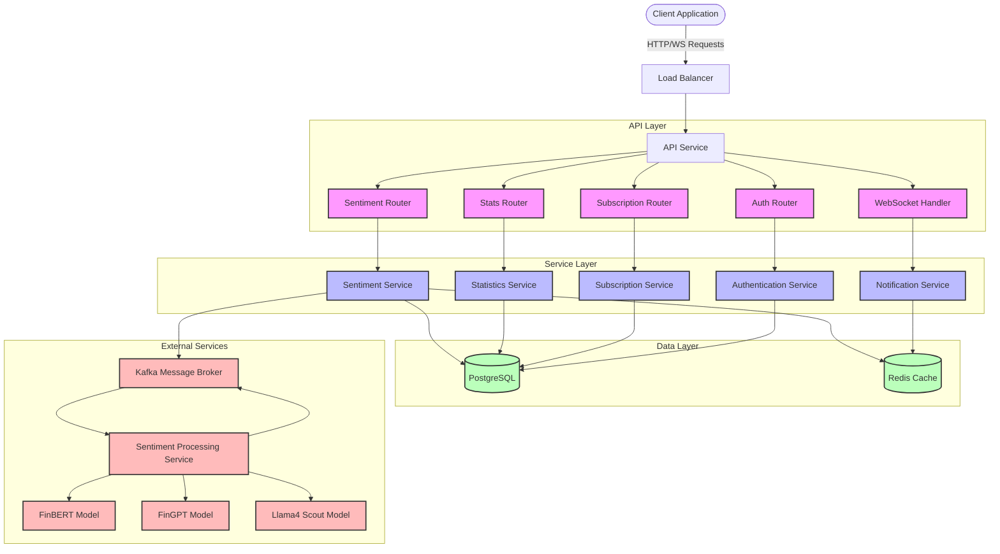
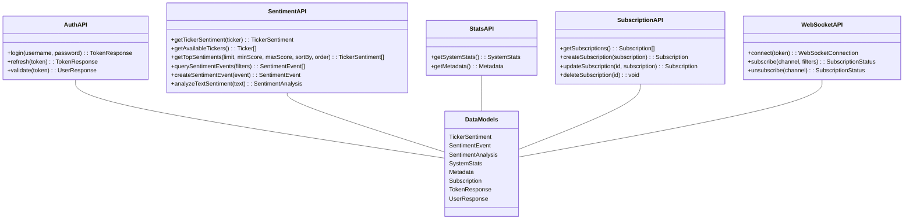
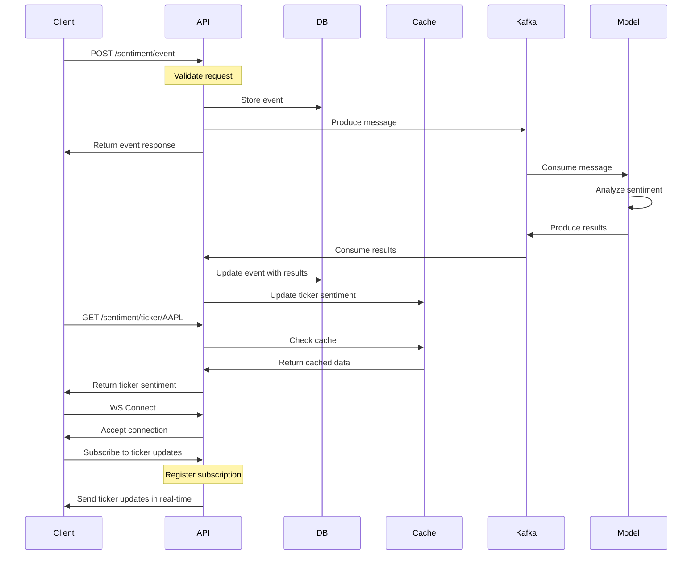
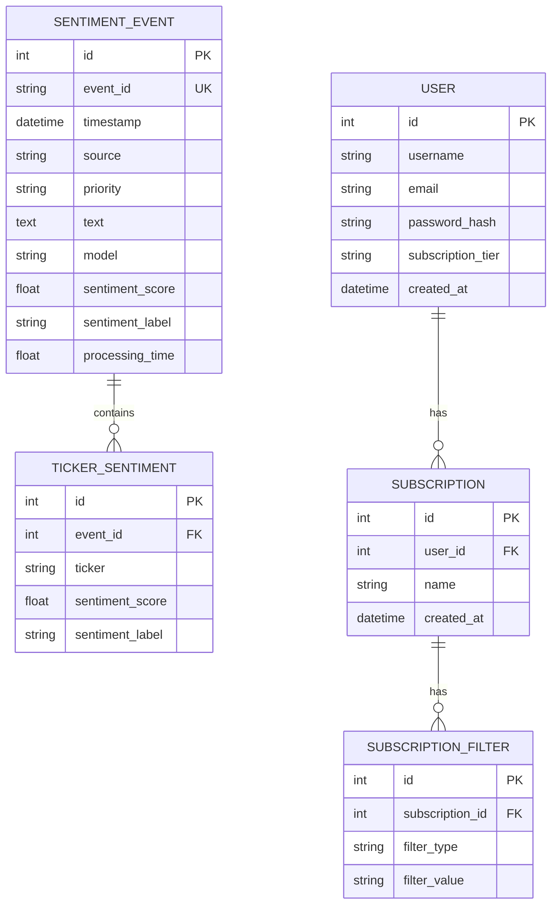

# Sentiment API Architecture Diagram

Below is a mermaid diagram representing the architecture of the Real-Time Sentiment Analysis API. This diagram shows the flow of data between components, the API endpoints, and the relationships between different services.

## API Component Diagram

## API Endpoint Diagram

## Data Flow Diagram

## Entity Relationship Diagram

