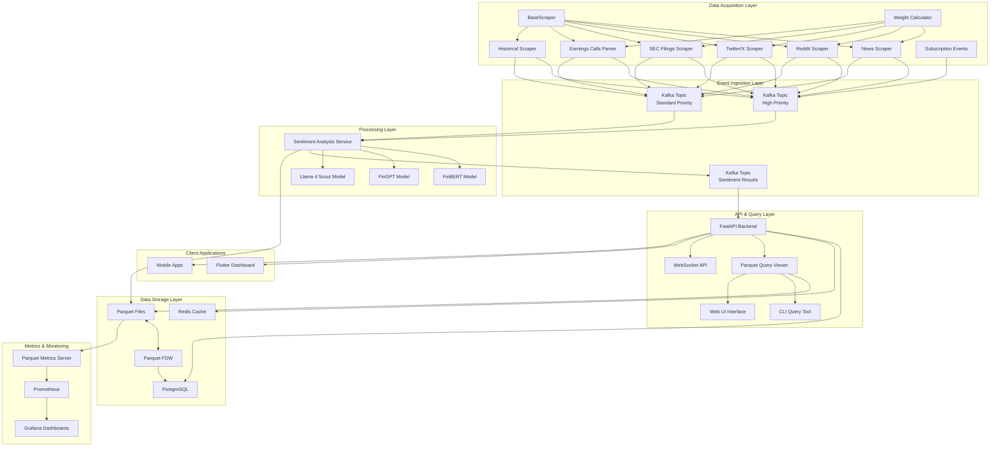
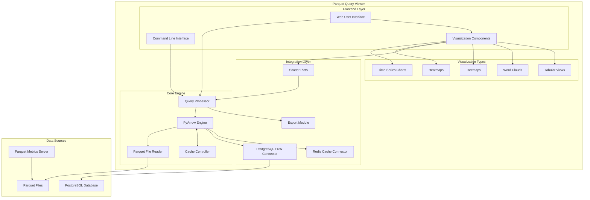

# Enhanced Financial Sentiment Analysis System Architecture

This document provides a comprehensive overview of the architecture for the enhanced financial sentiment analysis system. The enhancements focus on two main areas:

1. A Parquet Query Viewer with CLI and web UI capabilities
2. An Extended Scraper System for financial data acquisition

## System Architecture Overview

The enhanced system builds upon the existing Real-Time Sentiment Analysis platform, expanding its capabilities for data acquisition, storage, and analysis.



## Data Flow

The data flows through the system in the following sequence:

1. **Data Acquisition**:
   - Multiple specialized scrapers collect data from various sources
   - Data sources include news sites, Reddit, Twitter/X, SEC filings, and earnings calls
   - Each scraper extracts relevant information, including ticker symbols and sentiment indicators

2. **Event Processing**:
   - The Weight Calculator determines the priority of each item
   - Items are sent to Kafka with appropriate priority (high or standard)
   - Events are consumed by the Sentiment Analysis Service

3. **Sentiment Analysis**:
   - Multiple models analyze the text to determine sentiment
   - Results include sentiment score, confidence, and metadata
   - Processed data is saved to Parquet files organized by ticker

4. **Data Storage and Access**:
   - Parquet files provide efficient columnar storage
   - PostgreSQL FDW enables SQL access to Parquet data
   - Redis caches frequently accessed data

5. **Query and Visualization**:
   - Parquet Query Viewer provides CLI and web UI for data exploration
   - API endpoints expose sentiment data to client applications
   - WebSocket enables real-time updates

## Component Details

### 1. Extended Scraper System

The Extended Scraper System expands the data acquisition capabilities with additional data sources:

#### BaseScraper Interface

All scrapers inherit from the `BaseScraper` abstract class:

```python
class BaseScraper:
    """Base class for all scrapers."""
    
    def __init__(self, producer, config):
        """Initialize with event producer and configuration."""
        
    async def scrape(self) -> List[Dict[str, Any]]:
        """Scrape data from source. Must be implemented by subclasses."""
        
    async def process_data(self, data: List[Dict[str, Any]]):
        """Process scraped data and send to event producer."""
        
    def _determine_priority(self, item: Dict[str, Any]) -> str:
        """Determine priority of an item based on various factors."""
        
    def _save_to_parquet(self, data: List[Dict[str, Any]]) -> bool:
        """Save data to Parquet files, organized by ticker."""
```

#### New Scraper Components

1. **Twitter/X Scraper**:
   - Connects to Twitter API for financial tweets
   - Processes cashtags, hashtags, and financial content
   - Calculates engagement metrics

2. **SEC Filings Scraper**:
   - Monitors for new SEC filings (10-K, 10-Q, 8-K, etc.)
   - Extracts key information from filings
   - Identifies companies and related tickers

3. **Earnings Calls Scraper**:
   - Collects earnings call transcripts
   - Processes Q&A sections and management commentary
   - Extracts financial metrics and guidance

4. **Historical Scraper**:
   - Retrieves historical data for backtesting
   - Supports multiple source types
   - Maintains historical data organization

### 2. Parquet Query Viewer

The Parquet Query Viewer provides tools for exploring and analyzing sentiment data:

#### Architecture



#### Key Components

1. **CLI Tool**:
   - SQL-like query interface for Parquet files
   - Schema inspection and optimization
   - Data export capabilities

2. **Web UI**:
   - Interactive query builder
   - Rich visualizations (time series, heatmaps, etc.)
   - Data exploration and filtering

3. **Core Engine**:
   - PyArrow for efficient Parquet operations
   - SQL query parsing and execution
   - Caching for performance optimization

4. **Integration Layer**:
   - PostgreSQL FDW for database access
   - Redis for query result caching
   - Export capabilities for various formats

## Integration with Existing System

The enhanced components integrate seamlessly with the existing system:

1. **Data Acquisition Integration**:
   - New scrapers follow the same BaseScraper interface
   - Events flow through the same Kafka topics
   - Data is stored in the same Parquet file structure

2. **Storage Integration**:
   - Parquet files maintain consistent schema
   - PostgreSQL FDW connects to all Parquet files
   - Redis caching works with all data sources

3. **API Integration**:
   - Existing API endpoints work with new data sources
   - New endpoints added for specialized data access
   - WebSocket provides real-time updates for all data

## Deployment Architecture

The enhanced system is deployed using Docker containers:

```yaml
version: '3'

services:
  # Data Acquisition Services
  news-scraper:
    build:
      context: .
      dockerfile: data_acquisition/Dockerfile
    environment:
      - SCRAPER_TYPE=news
      - KAFKA_BOOTSTRAP_SERVERS=kafka:9092
    volumes:
      - ./data:/app/data

  reddit-scraper:
    build:
      context: .
      dockerfile: data_acquisition/Dockerfile
    environment:
      - SCRAPER_TYPE=reddit
      - KAFKA_BOOTSTRAP_SERVERS=kafka:9092
    volumes:
      - ./data:/app/data

  twitter-scraper:
    build:
      context: .
      dockerfile: data_acquisition/Dockerfile
    environment:
      - SCRAPER_TYPE=twitter
      - KAFKA_BOOTSTRAP_SERVERS=kafka:9092
      - TWITTER_API_KEY=${TWITTER_API_KEY}
      - TWITTER_API_SECRET=${TWITTER_API_SECRET}
      - TWITTER_BEARER_TOKEN=${TWITTER_BEARER_TOKEN}
    volumes:
      - ./data:/app/data

  sec-filings-scraper:
    build:
      context: .
      dockerfile: data_acquisition/Dockerfile
    environment:
      - SCRAPER_TYPE=sec
      - KAFKA_BOOTSTRAP_SERVERS=kafka:9092
    volumes:
      - ./data:/app/data

  # Processing Services
  sentiment-service:
    build:
      context: .
      dockerfile: sentiment_service/Dockerfile
    environment:
      - KAFKA_BOOTSTRAP_SERVERS=kafka:9092
      - REDIS_HOST=redis
    volumes:
      - ./data:/app/data
    depends_on:
      - kafka
      - redis

  # Storage Services
  postgres:
    build:
      context: ./dbengine
      dockerfile: postgres.Dockerfile
    environment:
      - POSTGRES_USER=pgadmin
      - POSTGRES_PASSWORD=localdev
      - POSTGRES_DB=sentimentdb
    volumes:
      - postgres-data:/var/lib/postgresql/data
      - ./data/output:/var/lib/postgresql/data/output:ro

  redis:
    image: redis:alpine
    volumes:
      - redis-data:/data

  # API and Query Services
  api:
    build:
      context: .
      dockerfile: api/Dockerfile
    ports:
      - "8001:8001"
    environment:
      - POSTGRES_HOST=postgres
      - REDIS_HOST=redis
    depends_on:
      - postgres
      - redis

  parquet-query-web:
    build:
      context: .
      dockerfile: parquet_query_viewer/Dockerfile
    ports:
      - "8050:8050"
    volumes:
      - ./data:/app/data
    environment:
      - PYTHONUNBUFFERED=1
      - REDIS_HOST=redis
      - POSTGRES_HOST=postgres
    depends_on:
      - redis
      - postgres

  # Infrastructure Services
  kafka:
    image: bitnami/kafka:latest
    environment:
      - KAFKA_CFG_LISTENERS=PLAINTEXT://:9092
      - KAFKA_CFG_ADVERTISED_LISTENERS=PLAINTEXT://kafka:9092
      - KAFKA_CFG_AUTO_CREATE_TOPICS_ENABLE=true
    volumes:
      - kafka-data:/bitnami/kafka

  # Monitoring Services
  prometheus:
    image: prom/prometheus
    volumes:
      - ./monitoring/prometheus:/etc/prometheus
      - prometheus-data:/prometheus
    ports:
      - "9090:9090"

  grafana:
    image: grafana/grafana
    volumes:
      - ./monitoring/grafana:/etc/grafana
      - grafana-data:/var/lib/grafana
    ports:
      - "3000:3000"
    depends_on:
      - prometheus

volumes:
  postgres-data:
  redis-data:
  kafka-data:
  prometheus-data:
  grafana-data:
```

## Monitoring and Observability

The system includes comprehensive monitoring:

1. **Prometheus Metrics**:
   - Scraper-specific metrics (success rate, items processed)
   - Storage metrics (file size, row count)
   - Query performance metrics (execution time, cache hit rate)

2. **Grafana Dashboards**:
   - Data acquisition dashboard for scraper performance
   - Query viewer dashboard for system usage
   - Sentiment analysis dashboard for model performance

3. **Logging**:
   - Structured JSON logs
   - Error tracking and alerting
   - Performance monitoring

## Configuration

The system is configured through:

1. **Configuration Files**:
   - `scraper_config.json` for data acquisition settings
   - `parquet_query_config.json` for query viewer settings

2. **Environment Variables**:
   - API credentials and keys
   - Connection parameters for databases
   - Service-specific settings

3. **Runtime Configuration**:
   - API endpoints for configuration updates
   - Dynamic reconfiguration of scrapers
   - Scheduled configuration updates

## Security Considerations

Security measures implemented in the system:

1. **API Security**:
   - Proper authentication for all API endpoints
   - Rate limiting to prevent abuse
   - Input validation to prevent injection attacks

2. **Data Protection**:
   - Secure storage of API credentials
   - Read-only access to Parquet files where appropriate
   - Input sanitization for all user-provided queries

3. **Deployment Security**:
   - Network isolation for containers
   - Least privilege principle for service accounts
   - Regular security updates

## Conclusion

The enhanced financial sentiment analysis system provides a comprehensive solution for collecting, analyzing, and visualizing sentiment data from various financial sources. The addition of the Extended Scraper System and Parquet Query Viewer significantly expands the system's capabilities, enabling deeper insights and more efficient data exploration.

Key benefits of the enhanced system include:

1. **Broader Data Coverage**: Additional data sources provide a more comprehensive view of market sentiment
2. **Improved Data Accessibility**: The Parquet Query Viewer makes it easier to explore and analyze sentiment data
3. **Enhanced Visualization**: Rich visualizations help identify trends and patterns in sentiment data
4. **Optimized Performance**: Efficient storage and querying capabilities ensure responsive performance
5. **Scalable Architecture**: Modular design enables easy extension and scaling as requirements evolve