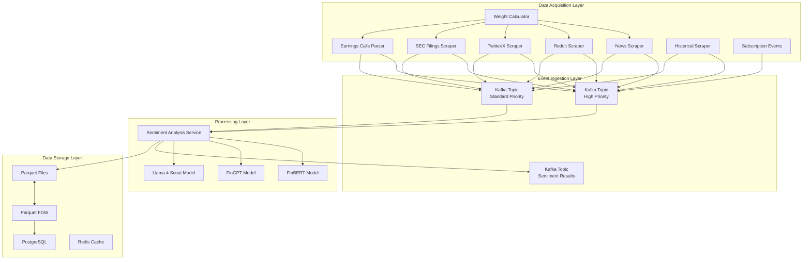

# Extended Scraper System Architecture

## Overview

The Extended Scraper System expands the Real-Time Sentiment Analysis platform's data acquisition capabilities to include additional financial data sources. This document outlines the architecture, implementation details, and configuration options for the system.

## System Architecture

```mermaid
classDiagram
    %% Base Class
    class BaseScraper {
        <<abstract>>
        +producer
        +config
        +name
        +running: bool
        +output_dir
        +__init__(producer, config)
        +scrape() List~Dict~ *
        +process_data(data) *
        +_determine_priority(item) str
        +_save_to_parquet(data) bool
        +_append_to_parquet_file(filename, items) bool
        +start()
        +stop()
    }
    
    %% Existing Scrapers
    class NewsScraper {
        +headers
        +interval
        +__init__(producer, config)
        +scrape() List~Dict~
        +process_data(data)
        +_scrape_source(session, source) List~Dict~
        +_parse_articles(html_content, source) List
        +_extract_title(article, source) str
        +_extract_summary(article, source) str
        +_extract_url(article, source, base_url) str
        +_extract_timestamp(article, source) str
        +_extract_tickers(article, source) List~str~
    }
    
    class RedditScraper {
        +subreddits
        +post_limit
        +__init__(producer, config)
        +scrape() List~Dict~
        +process_data(data)
        +_fetch_subreddit_posts(session, subreddit) List~Dict~
        +_extract_tickers(post) List~str~
        +_calculate_engagement(post) float
    }
    
    %% New Scrapers
    class TwitterScraper {
        +api_key
        +api_secret
        +bearer_token
        +client
        +__init__(producer, config)
        +scrape() List~Dict~
        +process_data(data)
        +_authenticate() client
        +_extract_tickers(tweet) List~str~
        +_calculate_engagement(tweet) float
    }
    
    class SECFilingsScraper {
        +sec_url
        +filing_types
        +companies
        +__init__(producer, config)
        +scrape() List~Dict~
        +process_data(data)
        +_fetch_filings(session, ticker, filing_type) List~Dict~
        +_parse_filing(filing_url) Dict
        +_extract_tickers(filing) List~str~
    }
    
    class EarningsCallsScraper {
        +sources
        +__init__(producer, config)
        +scrape() List~Dict~
        +process_data(data)
        +_fetch_transcripts(session, company) List~Dict~
        +_parse_transcript(html_content) Dict
        +_extract_segments(transcript) Dict
        +_extract_tickers(transcript) List~str~
    }
    
    class HistoricalScraper {
        +start_date
        +end_date
        +source_type
        +date_format
        +__init__(producer, config, start_date, end_date, source_type)
        +scrape() List~Dict~
        +process_data(data)
        +_get_historical_data(date) List~Dict~
        +_save_to_historical_cache(date, data) bool
    }

    %% Utilities
    class WeightCalculator {
        +calculate_weight(item) float
        +calculate_source_credibility(source) float
        +calculate_content_relevance(text) float
        +calculate_engagement_score(engagement) float
    }
    
    class EventProducer {
        +kafka_config
        +producer
        +__init__(kafka_config)
        +send(data, priority) bool
        +close()
    }
    
    %% Relationships
    BaseScraper <|-- NewsScraper
    BaseScraper <|-- RedditScraper
    BaseScraper <|-- TwitterScraper
    BaseScraper <|-- SECFilingsScraper
    BaseScraper <|-- EarningsCallsScraper
    BaseScraper <|-- HistoricalScraper
    
    NewsScraper ..> WeightCalculator
    RedditScraper ..> WeightCalculator
    TwitterScraper ..> WeightCalculator
    SECFilingsScraper ..> WeightCalculator
    EarningsCallsScraper ..> WeightCalculator
    
    BaseScraper ..> EventProducer
```



## Data Flow

The Extended Scraper System follows a consistent flow for acquiring and processing financial data:



## Component Interfaces

### Base Scraper

All scrapers inherit from the `BaseScraper` abstract class:

```python
class BaseScraper:
    def __init__(self, producer, config):
        """Initialize the scraper with event producer and configuration."""
        
    async def scrape(self) -> List[Dict[str, Any]]:
        """Scrape data from source. Must be implemented by subclasses."""
        
    async def process_data(self, data: List[Dict[str, Any]]):
        """Process scraped data and send to event producer."""
        
    def _determine_priority(self, item: Dict[str, Any]) -> str:
        """Determine priority of an item based on various factors."""
        
    def _save_to_parquet(self, data: List[Dict[str, Any]]) -> bool:
        """Save data to Parquet files, organized by ticker."""
        
    async def start(self):
        """Start the scraper operation."""
        
    async def stop(self):
        """Stop the scraper operation."""
```

### Twitter/X Scraper

```python
class TwitterScraper(BaseScraper):
    def __init__(self, producer, config):
        """Initialize the Twitter/X scraper."""
        
    async def scrape(self) -> List[Dict[str, Any]]:
        """Scrape Twitter/X for financial content."""
        
    async def process_data(self, data: List[Dict[str, Any]]):
        """Process scraped Twitter/X data."""
        
    async def _authenticate(self) -> Any:
        """Authenticate with Twitter/X API."""
        
    def _extract_tickers(self, tweet: Dict[str, Any]) -> List[str]:
        """Extract stock tickers from Twitter/X content."""
        
    def _calculate_engagement(self, tweet: Dict[str, Any]) -> float:
        """Calculate engagement metrics for Twitter/X content."""
```

### SEC Filings Scraper

```python
class SECFilingsScraper(BaseScraper):
    def __init__(self, producer, config):
        """Initialize the SEC filings scraper."""
        
    async def scrape(self) -> List[Dict[str, Any]]:
        """Scrape SEC filings for financial content."""
        
    async def process_data(self, data: List[Dict[str, Any]]):
        """Process scraped SEC filings data."""
        
    async def _fetch_filings(self, session, ticker, filing_type) -> List[Dict[str, Any]]:
        """Fetch SEC filings for a specific ticker and filing type."""
        
    async def _parse_filing(self, filing_url: str) -> Dict[str, Any]:
        """Parse an SEC filing document."""
        
    def _extract_tickers(self, filing: Dict[str, Any]) -> List[str]:
        """Extract stock tickers from SEC filing content."""
```

### Earnings Calls Scraper

```python
class EarningsCallsScraper(BaseScraper):
    def __init__(self, producer, config):
        """Initialize the earnings calls scraper."""
        
    async def scrape(self) -> List[Dict[str, Any]]:
        """Scrape earnings call transcripts for financial content."""
        
    async def process_data(self, data: List[Dict[str, Any]]):
        """Process scraped earnings call data."""
        
    async def _fetch_transcripts(self, session, company) -> List[Dict[str, Any]]:
        """Fetch earnings call transcripts for a specific company."""
        
    def _parse_transcript(self, html_content: str) -> Dict[str, Any]:
        """Parse an earnings call transcript document."""
        
    def _extract_segments(self, transcript: Dict[str, Any]) -> Dict[str, Any]:
        """Extract different segments from an earnings call transcript."""
        
    def _extract_tickers(self, transcript: Dict[str, Any]) -> List[str]:
        """Extract stock tickers from earnings call content."""
```

### Historical Scraper

```python
class HistoricalScraper(BaseScraper):
    def __init__(self, producer, config, start_date, end_date, source_type):
        """Initialize the historical data scraper."""
        
    async def scrape(self) -> List[Dict[str, Any]]:
        """Scrape historical financial content."""
        
    async def process_data(self, data: List[Dict[str, Any]]):
        """Process scraped historical data."""
        
    async def _get_historical_data(self, date: datetime) -> List[Dict[str, Any]]:
        """Get historical data for a specific date."""
        
    def _save_to_historical_cache(self, date: datetime, data: List[Dict[str, Any]]) -> bool:
        """Save historical data to cache directory."""
```

## Configuration

The Extended Scraper System uses a standardized configuration format:

```json
{
  "scrapers": {
    "twitter_scraper": {
      "enabled": true,
      "polling_interval": 180,
      "api_key": "your-api-key",
      "api_secret": "your-api-secret",
      "bearer_token": "your-bearer-token",
      "search_queries": [
        "$AAPL", "$TSLA", "$MSFT", 
        "stock market", "investing", "wallstreetbets"
      ],
      "accounts_to_follow": [
        "Bloomberg", "WSJ", "CNBC", "MarketWatch", "YahooFinance"
      ],
      "tweet_limit": 100
    },
    "sec_filings_scraper": {
      "enabled": true,
      "polling_interval": 3600,
      "sec_url": "https://www.sec.gov/",
      "filing_types": ["10-K", "10-Q", "8-K", "S-1", "424B"],
      "companies": [
        {"ticker": "AAPL", "cik": "0000320193"},
        {"ticker": "MSFT", "cik": "0000789019"},
        {"ticker": "TSLA", "cik": "0001318605"}
      ]
    },
    "earnings_calls_scraper": {
      "enabled": true,
      "polling_interval": 3600,
      "sources": [
        {"name": "Motley Fool", "url": "https://www.fool.com/earnings-call-transcripts/"},
        {"name": "Seeking Alpha", "url": "https://seekingalpha.com/earnings/earnings-call-transcripts"}
      ],
      "companies": ["AAPL", "MSFT", "TSLA", "GOOGL", "META"]
    },
    "historical_scraper": {
      "enabled": true,
      "source_type": "news",
      "date_format": "%Y-%m-%d",
      "output_dir": "./data/cache/historical/",
      "default_start_date": "2025-01-01",
      "default_end_date": "2025-04-01"
    }
  }
}
```

## Implementation Considerations

### Authentication and API Limits

When implementing API-based scrapers:

1. **Rate Limiting**: Implement exponential backoff for API failures
2. **Credential Management**: Store API credentials securely
3. **Request Throttling**: Respect API usage limits

### Content Extraction

For effective content extraction:

1. **Noise Reduction**: Remove boilerplate text and advertisements
2. **Ticker Identification**: Use robust regex patterns with context
3. **Sentiment Indicators**: Identify important financial sentiment clues

### Data Deduplication

To prevent duplicate processing:

1. **Content Hashing**: Generate unique hashes for content
2. **Short-term Cache**: Maintain a cache of recently processed items
3. **Database Checks**: Verify against existing records

## Deployment

The Extended Scraper System can be deployed using Docker:

```yaml
version: '3'

services:
  twitter-scraper:
    build:
      context: .
      dockerfile: data_acquisition/Dockerfile
    environment:
      - SCRAPER_TYPE=twitter
      - KAFKA_BOOTSTRAP_SERVERS=kafka:9092
      - KAFKA_HIGH_PRIORITY_TOPIC=high-priority-events
      - KAFKA_STANDARD_PRIORITY_TOPIC=standard-priority-events
    volumes:
      - ./data:/app/data
    depends_on:
      - kafka

  sec-filings-scraper:
    build:
      context: .
      dockerfile: data_acquisition/Dockerfile
    environment:
      - SCRAPER_TYPE=sec
      - KAFKA_BOOTSTRAP_SERVERS=kafka:9092
      - KAFKA_HIGH_PRIORITY_TOPIC=high-priority-events
      - KAFKA_STANDARD_PRIORITY_TOPIC=standard-priority-events
    volumes:
      - ./data:/app/data
    depends_on:
      - kafka

  earnings-calls-scraper:
    build:
      context: .
      dockerfile: data_acquisition/Dockerfile
    environment:
      - SCRAPER_TYPE=earnings
      - KAFKA_BOOTSTRAP_SERVERS=kafka:9092
      - KAFKA_HIGH_PRIORITY_TOPIC=high-priority-events
      - KAFKA_STANDARD_PRIORITY_TOPIC=standard-priority-events
    volumes:
      - ./data:/app/data
    depends_on:
      - kafka

  historical-scraper:
    build:
      context: .
      dockerfile: data_acquisition/Dockerfile
    environment:
      - SCRAPER_TYPE=historical
      - KAFKA_BOOTSTRAP_SERVERS=kafka:9092
      - KAFKA_HIGH_PRIORITY_TOPIC=high-priority-events
      - KAFKA_STANDARD_PRIORITY_TOPIC=standard-priority-events
    volumes:
      - ./data:/app/data
    depends_on:
      - kafka
```

## Testing and Monitoring

### Testing Scrapers

Each scraper includes comprehensive tests:

```python
# Example test for the Twitter scraper
async def test_twitter_scraper():
    """Test the Twitter scraper functionality."""
    # Mock configuration
    config = {
        "twitter_scraper": {
            "enabled": True,
            "polling_interval": 180,
            "search_queries": ["$AAPL"],
            "accounts_to_follow": ["Bloomberg"],
            "tweet_limit": 10
        }
    }
    
    # Mock producer
    mock_producer = MagicMock()
    mock_producer.send = AsyncMock()
    
    # Create scraper
    scraper = TwitterScraper(mock_producer, config)
    
    # Mock Twitter API responses
    with patch("aiohttp.ClientSession.get") as mock_get:
        mock_get.return_value.__aenter__.return_value.status = 200
        mock_get.return_value.__aenter__.return_value.json = AsyncMock(
            return_value={"data": [...]}  # Sample Twitter API response
        )
        
        # Run scraper
        data = await scraper.scrape()
        
        # Assert results
        assert len(data) > 0
        assert "tickers" in data[0]
        assert "text" in data[0]
```

### Monitoring

The system exposes Prometheus metrics:

```python
# Example metrics for Twitter scraper
twitter_requests_total = Counter(
    "twitter_scraper_requests_total",
    "Total number of requests made to Twitter API",
    ["endpoint"]
)

twitter_request_errors = Counter(
    "twitter_scraper_request_errors",
    "Total number of Twitter API request errors",
    ["endpoint", "status"]
)

twitter_tweets_scraped = Counter(
    "twitter_tweets_scraped",
    "Total number of tweets scraped",
    ["query"]
)

twitter_processing_time = Histogram(
    "twitter_processing_time_seconds",
    "Time spent processing Twitter data",
    buckets=[0.1, 0.5, 1.0, 5.0, 10.0, 30.0, 60.0]
)
```

## Conclusion

The Extended Scraper System enhances the Real-Time Sentiment Analysis platform by incorporating additional financial data sources, providing a more comprehensive view of market sentiment. Its modular, extensible design allows for easy integration of new data sources as they become available.