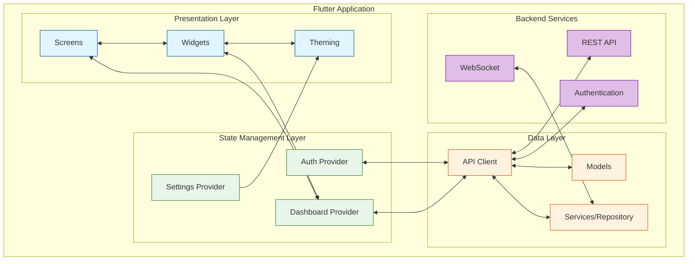
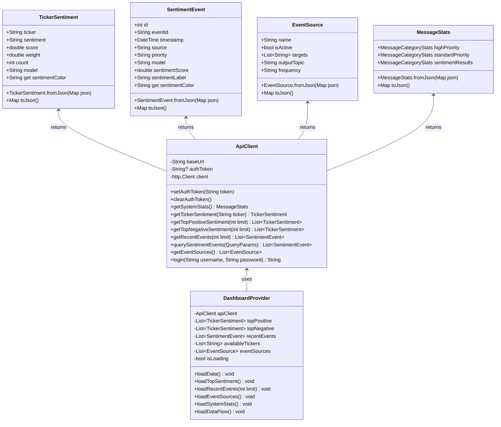
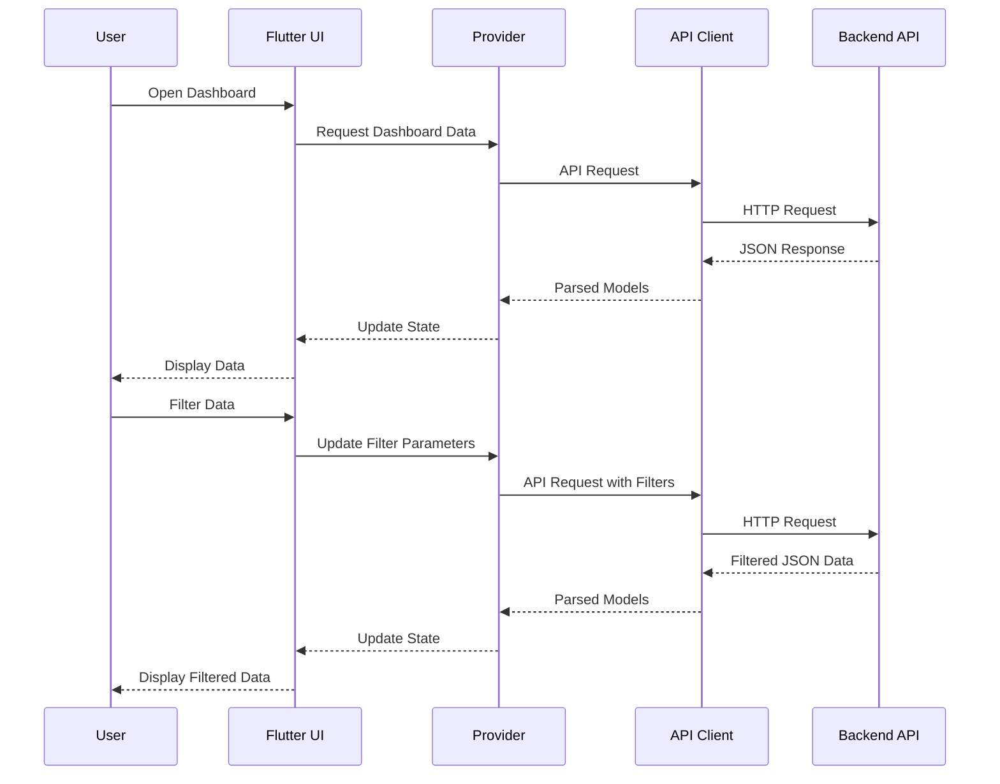

# Flutter Dashboard Architecture

This document outlines the architecture of the Flutter dashboard for the Real-Time Sentiment Analysis system.

## Architecture Overview



## Component Details

### Presentation Layer

The presentation layer is responsible for the UI and user interactions:

#### Screens
- `HomeScreen`: Main dashboard with tabs for different views
- `LoginScreen`: Authentication screen
- `SplashScreen`: Loading screen for app initialization

#### Widgets
- `TopSentimentsChart`: Bar chart for top positive/negative sentiments
- `DataFlowChart`: Line chart showing real-time data flow
- `SystemOverviewCard`: System metrics visualization
- `RecentEventsList`: List of recent sentiment events

#### Theming
- Light/dark mode support
- Consistent styling across the application
- Responsive design for multiple screen sizes

### State Management Layer

State management uses the Provider pattern for reactive state handling:

#### Providers
- `DashboardProvider`: Manages dashboard data and UI state
- `AuthProvider`: Handles authentication state and token management
- `SettingsProvider`: Manages user preferences

### Data Layer

The data layer handles API communication and data models:

#### API Client
- RESTful API client with HTTP package
- Error handling and retry logic
- Authentication token management

#### Models
- `TickerSentiment`: Sentiment data for financial tickers
- `SentimentEvent`: Individual sentiment analysis events
- `EventSource`: Data sources configuration
- `MessageStats`: System statistics and metrics
- `QueryParams`: Parameters for data filtering

#### Services/Repository
- Data caching and persistence
- Business logic implementation
- WebSocket connection management (planned)

### Backend Services

External services that the Flutter app communicates with:

- REST API: HTTP endpoints for data access
- WebSocket: Real-time data updates (planned)
- Authentication: JWT-based authentication service

## Class Diagram



## Data Flow



## Directory Structure

```
flutter_dashboard/
├── lib/
│   ├── api/
│   │   └── api_client.dart         # API communication
│   ├── constants/
│   │   └── app_theme.dart          # Theming constants
│   ├── models/
│   │   ├── ticker_sentiment.dart   # Sentiment data model
│   │   ├── sentiment_event.dart    # Event data model
│   │   ├── event_source.dart       # Source configuration
│   │   ├── message_stats.dart      # System metrics
│   │   └── query_params.dart       # Query parameters
│   ├── providers/
│   │   ├── dashboard_provider.dart # Dashboard state
│   │   ├── auth_provider.dart      # Authentication state
│   │   └── settings_provider.dart  # User preferences
│   ├── screens/
│   │   ├── home_screen.dart        # Main dashboard
│   │   ├── login_screen.dart       # Login screen
│   │   └── splash_screen.dart      # Loading screen
│   ├── widgets/
│   │   ├── top_sentiments_chart.dart    # Sentiment visualization
│   │   ├── system_overview_card.dart    # System metrics cards
│   │   ├── data_flow_chart.dart         # Data flow graph
│   │   └── recent_events_list.dart      # Recent events list
│   └── main.dart                   # App entry point
├── assets/
│   └── images/                     # Image assets
└── pubspec.yaml                    # Dependencies
```

## Future Enhancements

1. **WebSocket Integration**: Real-time updates using WebSocket connection
2. **Offline Mode**: Local caching for offline operation
3. **Advanced Visualizations**: More interactive and detailed charts
4. **Push Notifications**: Alerts for significant sentiment changes
5. **Customizable Dashboard**: User-configurable dashboard layout
6. **Deep Linking**: Direct navigation to specific views
7. **Widget Testing**: Comprehensive test coverage