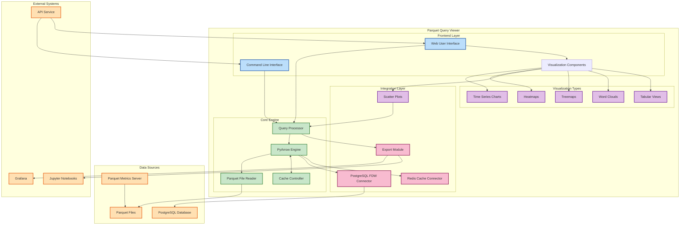
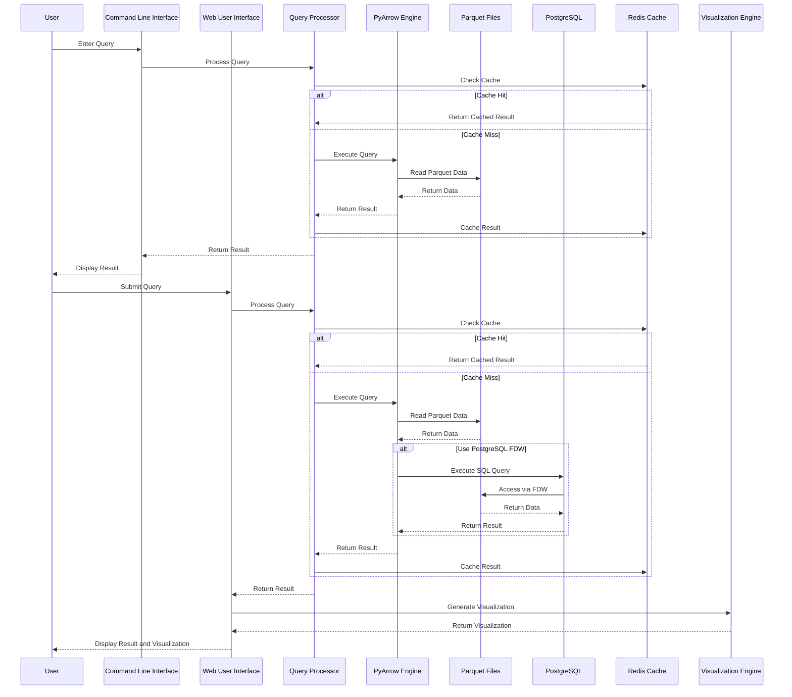

# Parquet Query Viewer Architecture

## Overview

The Parquet Query Viewer provides a comprehensive solution for querying, analyzing, and visualizing sentiment data stored in Parquet files. It offers both a command-line interface (CLI) and a web-based user interface (UI), enabling users to interact with sentiment data through SQL-like queries and rich visualizations.

## System Architecture



## Component Interfaces

### Core Engine

The core engine provides the foundation for the Parquet Query Viewer:

```python
class QueryProcessor:
    """
    Process queries on Parquet data.
    """
    def __init__(self, config):
        """Initialize the query processor with configuration."""
        
    def execute_query(self, query, parameters=None):
        """Execute a SQL-like query on Parquet data."""
        
    def get_available_tables(self):
        """Get list of available Parquet files/tables."""
        
    def get_table_schema(self, table_name):
        """Get schema information for a specific table."""
        
    def get_query_plan(self, query):
        """Get the execution plan for a query."""


class ParquetEngine:
    """
    Interface with PyArrow for Parquet operations.
    """
    def __init__(self, config):
        """Initialize the PyArrow engine."""
        
    def read_parquet(self, file_path):
        """Read a Parquet file into memory."""
        
    def filter_data(self, table, filter_expr):
        """Filter data using PyArrow expressions."""
        
    def project_columns(self, table, columns):
        """Select specific columns from the table."""
        
    def sort_data(self, table, sort_keys, ascending=True):
        """Sort data by specified columns."""
        
    def aggregate_data(self, table, group_by, aggregations):
        """Perform aggregation operations."""
```

### CLI Interface

The Command-Line Interface provides a user-friendly way to query Parquet data:

```python
class CommandLineInterface:
    """
    Command-line interface for Parquet queries.
    """
    def __init__(self, query_processor):
        """Initialize the CLI with a query processor."""
        
    def run_interactive_mode(self):
        """Run the CLI in interactive mode."""
        
    def execute_query_command(self, query):
        """Execute a single query and display results."""
        
    def export_results(self, results, format, output_file):
        """Export results to a file in the specified format."""
        
    def show_help(self):
        """Display help information."""
```

### Web UI Interface

The Web User Interface provides a rich, interactive experience:

```python
class WebUserInterface:
    """
    Web-based interface for Parquet queries.
    """
    def __init__(self, query_processor, visualization_engine):
        """Initialize the web UI."""
        
    def render_dashboard(self):
        """Render the main dashboard page."""
        
    def render_query_interface(self):
        """Render the query interface page."""
        
    def render_visualization_page(self):
        """Render the visualization page."""
        
    def process_query_request(self, request):
        """Process a query request from the web UI."""
        
    def generate_visualization(self, data, viz_type, options):
        """Generate a visualization from query results."""
```

### Visualization Engine

The Visualization Engine creates intuitive visualizations of Parquet data:

```python
class VisualizationEngine:
    """
    Create visualizations from Parquet data.
    """
    def __init__(self, config):
        """Initialize the visualization engine."""
        
    def create_time_series(self, data, x_col, y_col, title=None):
        """Create a time series chart."""
        
    def create_heatmap(self, data, x_col, y_col, value_col, title=None):
        """Create a heatmap visualization."""
        
    def create_scatter_plot(self, data, x_col, y_col, color_col=None, title=None):
        """Create a scatter plot."""
        
    def create_treemap(self, data, size_col, group_cols, title=None):
        """Create a treemap visualization."""
        
    def create_word_cloud(self, data, text_col, weight_col=None, title=None):
        """Create a word cloud visualization."""
        
    def create_table_view(self, data, columns=None, title=None):
        """Create a tabular view of the data."""
```

## Integration with External Systems

### PostgreSQL FDW

```python
class PostgreSQLFDWConnector:
    """
    Connect to PostgreSQL with Parquet FDW.
    """
    def __init__(self, connection_params):
        """Initialize the PostgreSQL connector."""
        
    def execute_query(self, query, parameters=None):
        """Execute a SQL query via PostgreSQL."""
        
    def get_fdw_tables(self):
        """Get list of foreign tables defined in PostgreSQL."""
        
    def create_fdw_table(self, table_name, schema, parquet_file):
        """Create a new foreign table in PostgreSQL."""
        
    def refresh_fdw_table(self, table_name):
        """Refresh a foreign table to reflect changes in Parquet file."""
```

### Redis Cache

```python
class RedisCacheConnector:
    """
    Connect to Redis for query caching.
    """
    def __init__(self, connection_params):
        """Initialize the Redis connector."""
        
    def get_cached_result(self, query_hash):
        """Get cached query result if available."""
        
    def cache_result(self, query_hash, result, ttl=3600):
        """Cache a query result with time-to-live."""
        
    def invalidate_cache(self, table_name=None):
        """Invalidate cache entries for a specific table or all tables."""
```

## Data Flow

The Parquet Query Viewer implements the following data flow:



## Configuration

The Parquet Query Viewer can be configured via a YAML file:

```yaml
# Parquet Query Viewer Configuration

# Core Engine Configuration
engine:
  cache_enabled: true
  cache_ttl: 3600  # Cache time-to-live in seconds
  max_rows: 1000000  # Maximum number of rows to process in memory
  temp_dir: "/tmp/parquet_viewer"  # Temporary directory for query processing
  log_level: "INFO"

# Data Source Configuration
data_sources:
  parquet:
    directory: "./data/output"
    default_files:
      - "aapl_sentiment.parquet"
      - "tsla_sentiment.parquet"
      - "multi_ticker_sentiment.parquet"
    scan_subdirectories: true

  postgresql:
    host: "localhost"
    port: 5432
    database: "sentimentdb"
    user: "pgadmin"
    password: "localdev"
    fdw_server: "parquet_srv"
    schema: "public"

  redis:
    host: "localhost"
    port: 6379
    db: 0
    password: ""

# CLI Configuration
cli:
  history_file: "~/.parquet_viewer_history"
  max_history: 1000
  output_format: "table"  # table, csv, json
  pretty_print: true
  color_output: true

# Web UI Configuration
web_ui:
  host: "0.0.0.0"
  port: 8050
  debug: false
  title: "Parquet Query Viewer"
  theme: "light"  # light, dark
  default_page: "dashboard"
  max_upload_size: 100  # MB

# Visualization Configuration
visualization:
  default_colormap: "viridis"
  date_format: "%Y-%m-%d %H:%M:%S"
  chart_height: 500  # pixels
  chart_width: 800   # pixels
  font_family: "Arial, sans-serif"
  word_cloud:
    max_words: 200
    background_color: "white"
  heatmap:
    colorscale: "Viridis"
```

## Technology Stack

The Parquet Query Viewer is built using the following technologies:

### Backend

- Python 3.7+
- PyArrow for Parquet file operations
- pandas for data manipulation
- SQL parsing and execution
- FastAPI for web API endpoints
- Redis for caching
- psycopg2 for PostgreSQL connectivity

### Frontend

- Streamlit for web UI
- Plotly for interactive visualizations
- Matplotlib for static visualizations
- rich for enhanced CLI output
- HTML/CSS/JavaScript for custom web components

## Deployment

The Parquet Query Viewer can be deployed using Docker:

```yaml
version: '3'

services:
  parquet-viewer-web:
    build:
      context: .
      dockerfile: parquet_query_viewer/Dockerfile
    ports:
      - "8050:8050"
    volumes:
      - ./data:/app/data
    environment:
      - PYTHONUNBUFFERED=1
      - REDIS_HOST=redis
      - POSTGRES_HOST=postgres
    depends_on:
      - redis
      - postgres

  redis:
    image: redis:alpine
    ports:
      - "6379:6379"
    volumes:
      - redis-data:/data

  postgres:
    build:
      context: ./dbengine
      dockerfile: postgres.Dockerfile
    environment:
      - POSTGRES_USER=pgadmin
      - POSTGRES_PASSWORD=localdev
      - POSTGRES_DB=sentimentdb
    ports:
      - "5432:5432"
    volumes:
      - postgres-data:/var/lib/postgresql/data
      - ./data/output:/var/lib/postgresql/data/output:ro

volumes:
  redis-data:
  postgres-data:
```

## Conclusion

The Parquet Query Viewer provides a flexible, powerful solution for interacting with sentiment data stored in Parquet files. Its dual CLI and web interfaces, coupled with rich visualization capabilities, make it an essential tool for analyzing financial sentiment data.