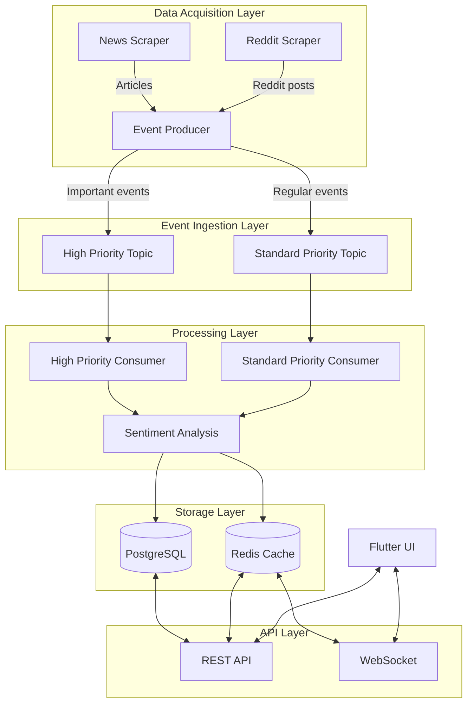
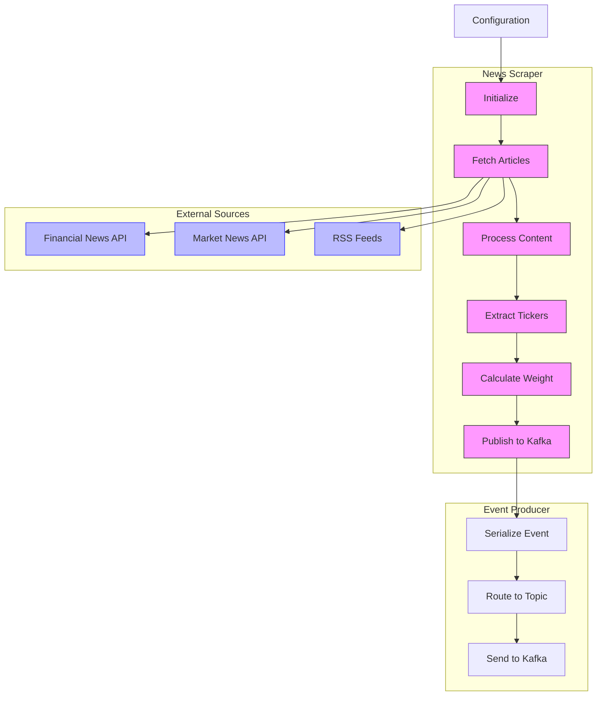
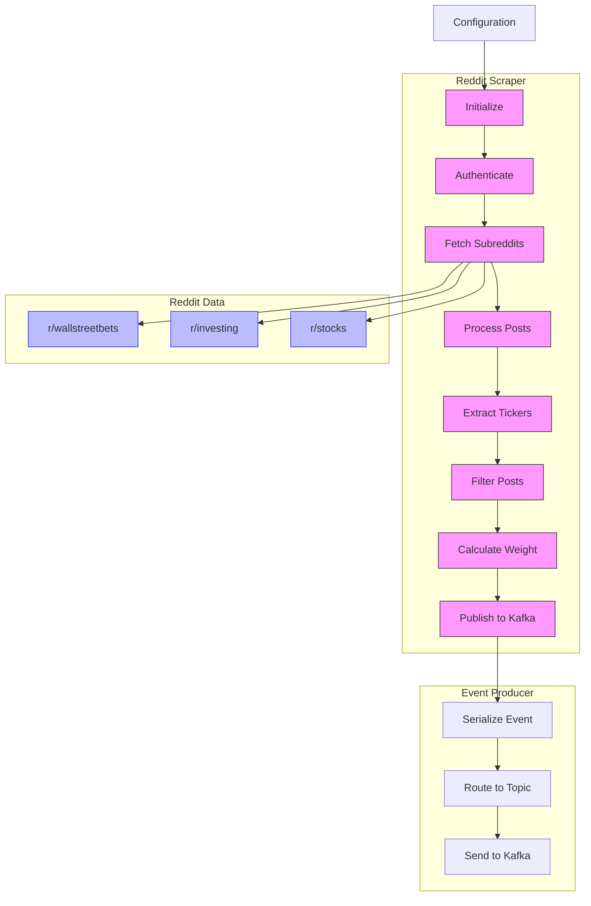
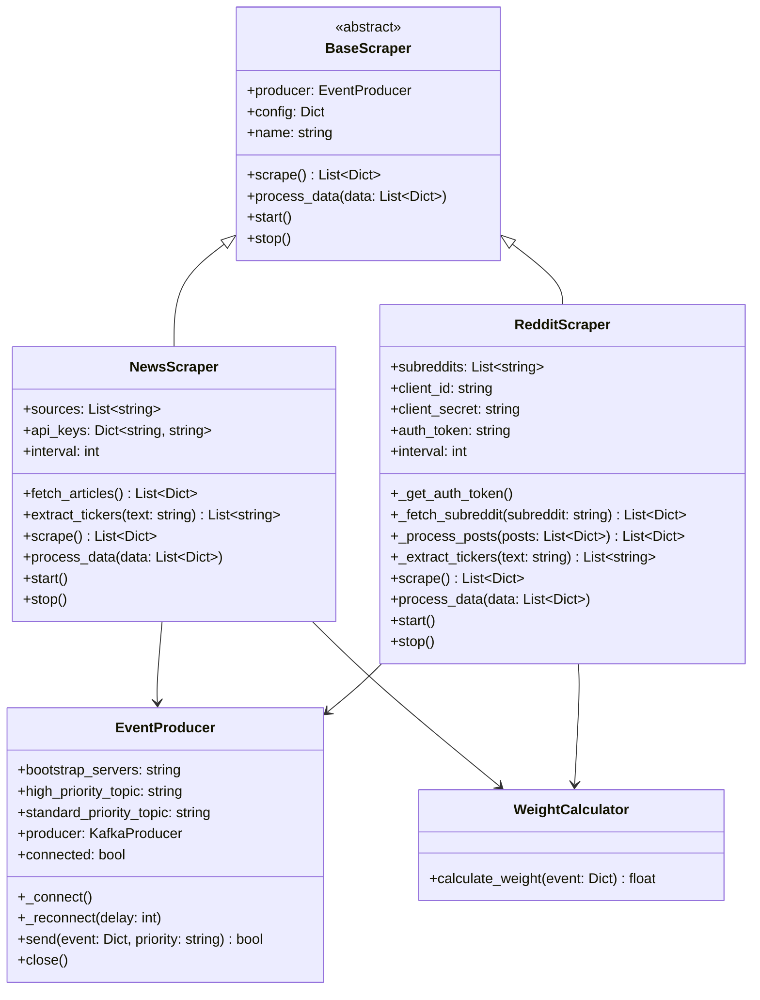
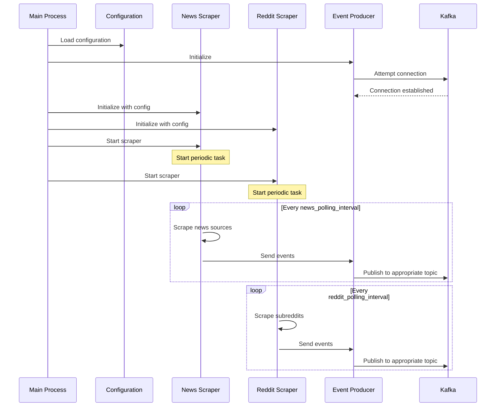

# Scraper Architecture

This document outlines the architecture of the data acquisition scrapers using Mermaid diagrams.

## Installation Requirements

Before running the scrapers, you need to install the following dependencies:

```bash
# For production usage (not in virtual environment)
python3 -m pip install -r data_acquisition/requirements.txt

# For production usage (in virtual environment)
pip install -r data_acquisition/requirements.txt

# For test scripts (in virtual environment)
pip install -r tests/requirements.txt

# For test scripts (not in virtual environment)
python3 -m pip install -r tests/requirements.txt
```

## Overall Data Flow



## News Scraper Architecture



## Reddit Scraper Architecture



## Components and Interfaces



## Scraper Initialization Sequence

