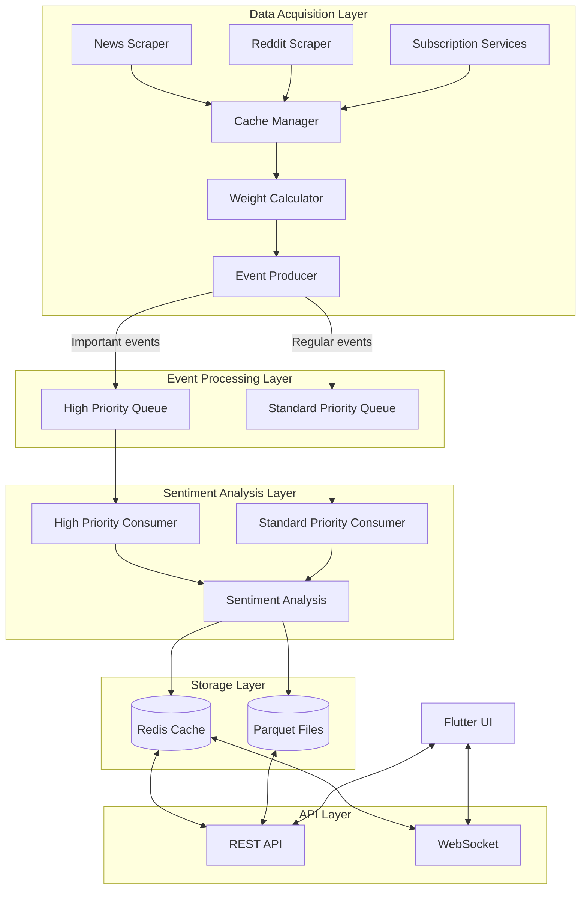
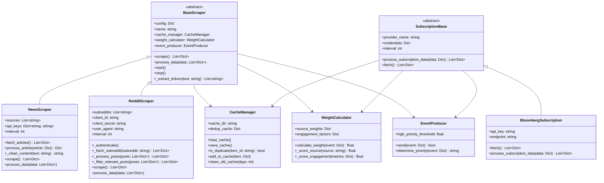
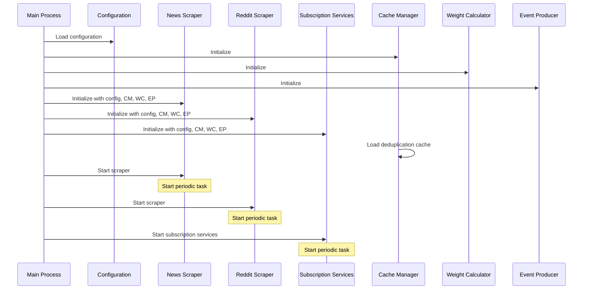
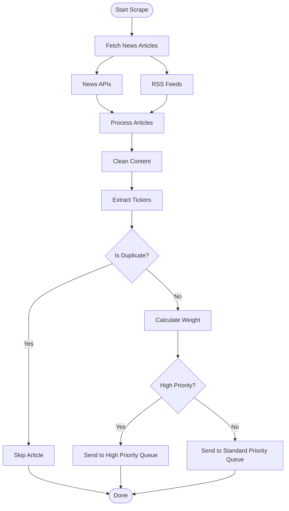
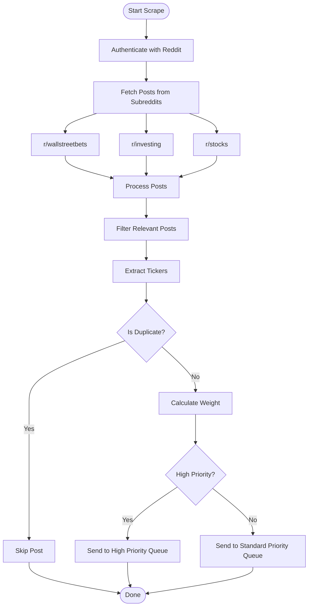

# Data Acquisition Architecture

This document outlines the architecture of the data acquisition system, which is responsible for gathering financial sentiment data from various sources.

## Core Components

The data acquisition system consists of these key components:

1. **Base Scraper**: Abstract class defining common scraper functionality
2. **Specialized Scrapers**: News, Reddit, and other source-specific implementations
3. **Event Producer**: Manages sending events to the processing pipeline
4. **Cache Manager**: Handles deduplication and caching
5. **Weight Calculator**: Assigns importance weight to data points
6. **Subscription Services**: Processes premium data sources

## Overall Data Flow



## Scraper Hierarchy



## Scraper Configuration

The scrapers are configured using JSON configuration files located in `data_acquisition/config/`. The main configuration file is `scraper_config.json`:

```json
{
  "news_scraper": {
    "enabled": true,
    "interval": 900,
    "sources": ["reuters", "bloomberg", "wsj", "cnbc"],
    "api_keys": {
      "newsapi": "YOUR_API_KEY"
    }
  },
  "reddit_scraper": {
    "enabled": true,
    "interval": 1800,
    "subreddits": ["wallstreetbets", "investing", "stocks"],
    "client_id": "YOUR_CLIENT_ID",
    "client_secret": "YOUR_CLIENT_SECRET",
    "user_agent": "SentimentTracker/1.0"
  },
  "subscription_services": {
    "bloomberg": {
      "enabled": true,
      "interval": 3600,
      "api_key": "YOUR_API_KEY",
      "endpoint": "https://api.bloomberg.com/market-data"
    }
  },
  "cache": {
    "enabled": true,
    "deduplication_window_days": 7,
    "cache_dir": "data/cache/deduplication"
  },
  "weight_calculation": {
    "source_weights": {
      "bloomberg": 0.9,
      "reuters": 0.85,
      "wsj": 0.8,
      "cnbc": 0.75,
      "reddit_wallstreetbets": 0.6,
      "reddit_investing": 0.7,
      "reddit_stocks": 0.65,
      "default": 0.5
    },
    "engagement_factors": {
      "comments": 0.4,
      "upvotes": 0.3,
      "shares": 0.3
    },
    "high_priority_threshold": 0.75
  }
}
```

## Data Acquisition Process

### Initialization



### News Scraper Flow



### Reddit Scraper Flow



## Implementation Details

### Base Scraper (`base.py`)

The `BaseScraper` class provides the foundation for all scrapers with these key methods:

```python
class BaseScraper:
    def __init__(self, name, config, cache_manager, weight_calculator, event_producer):
        self.name = name
        self.config = config
        self.cache_manager = cache_manager
        self.weight_calculator = weight_calculator
        self.event_producer = event_producer
        self.running = False
        self.interval = config.get("interval", 3600)  # Default 1 hour
        
    def start(self):
        """Start the scraper in a background thread."""
        self.running = True
        self._run_schedule()
        
    def stop(self):
        """Stop the scraper."""
        self.running = False
        
    def scrape(self):
        """Perform the scraping operation. Must be implemented by subclasses."""
        raise NotImplementedError
        
    def process_data(self, data):
        """Process scraped data. Must be implemented by subclasses."""
        raise NotImplementedError
        
    def _extract_tickers(self, text):
        """Extract ticker symbols from text."""
        # Common implementation for ticker extraction
        
    def _run_schedule(self):
        """Run the scraper on a schedule."""
        while self.running:
            try:
                data = self.scrape()
                if data:
                    self.process_data(data)
            except Exception as e:
                logging.error(f"Error in {self.name} scraper: {e}")
            
            time.sleep(self.interval)
```

### Cache Manager (`cache_manager.py`)

The `CacheManager` handles deduplication to avoid processing the same content multiple times:

```python
class CacheManager:
    def __init__(self, config):
        self.cache_dir = config.get("cache_dir", "data/cache/deduplication")
        self.dedup_window_days = config.get("deduplication_window_days", 7)
        self.dedup_cache = {}
        self.load_cache()
        
    def load_cache(self):
        """Load the deduplication cache from disk."""
        
    def save_cache(self):
        """Save the deduplication cache to disk."""
        
    def is_duplicate(self, item_id):
        """Check if an item is a duplicate."""
        
    def add_to_cache(self, item):
        """Add an item to the deduplication cache."""
        
    def clean_old_cache(self):
        """Remove old entries from the cache."""
```

### Weight Calculator (`weight_calculator.py`)

The `WeightCalculator` assigns importance weights to scraped content:

```python
class WeightCalculator:
    def __init__(self, config):
        self.source_weights = config.get("source_weights", {})
        self.engagement_factors = config.get("engagement_factors", {})
        self.default_weight = self.source_weights.get("default", 0.5)
        
    def calculate_weight(self, event):
        """Calculate the weight of an event based on source and engagement."""
        source_score = self._score_source(event.get("source"))
        engagement_score = self._score_engagement(event.get("engagement_metrics", {}))
        
        # Combine scores with appropriate weighting
        return (source_score * 0.7) + (engagement_score * 0.3)
        
    def _score_source(self, source):
        """Score the credibility of a source."""
        
    def _score_engagement(self, metrics):
        """Score the engagement metrics of a post/article."""
```

### Event Producer (`event_producer.py`)

The `EventProducer` handles sending processed events to the sentiment analysis pipeline:

```python
class EventProducer:
    def __init__(self, config):
        self.high_priority_threshold = config.get("high_priority_threshold", 0.75)
        
    def send(self, event):
        """Send an event to the appropriate queue."""
        priority = self.determine_priority(event)
        # Logic to send to appropriate queue
        
    def determine_priority(self, event):
        """Determine if an event is high or standard priority."""
        if event.get("weight", 0) >= self.high_priority_threshold:
            return "high"
        return "standard"
```

## Adding a New Scraper

To add a new scraper:

1. Create a new class that extends `BaseScraper`
2. Implement the required methods: `scrape()` and `process_data()`
3. Add configuration to `scraper_config.json`
4. Register the scraper in `data_acquisition/main.py`

Example for a new scraper:

```python
class TwitterScraper(BaseScraper):
    """Scraper for Twitter financial content."""
    
    def __init__(self, config, cache_manager, weight_calculator, event_producer):
        super().__init__("twitter", config, cache_manager, weight_calculator, event_producer)
        self.api_key = config.get("api_key")
        self.api_secret = config.get("api_secret")
        self.accounts = config.get("accounts", [])
        
    def scrape(self):
        """Scrape tweets from financial accounts."""
        # Implementation for Twitter scraping
        
    def process_data(self, data):
        """Process tweets into sentiment events."""
        # Implementation for tweet processing
```

## Testing

The data acquisition system includes comprehensive tests:

1. **Unit Tests**: Test individual scraper components
2. **Integration Tests**: Test scrapers with mock data sources
3. **End-to-End Tests**: Test full data flow from scraping to processing

Example test run:

```bash
# Run all scraper tests
pytest tests/data_acquisition/

# Run specific scraper test
pytest tests/data_acquisition/test_news_scraper.py

# Run with coverage
pytest tests/data_acquisition/ --cov=data_acquisition
```