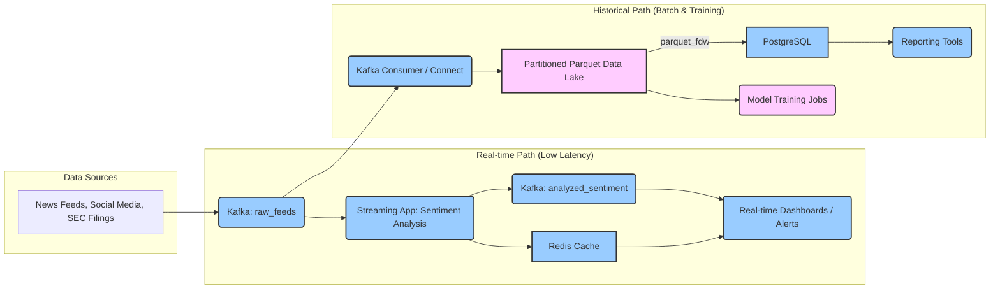

# Definitive Data Tier Plan: Real-time & Historical Sentiment Analysis

## Objective

Enhance our existing data architecture to better support both low-latency sentiment analysis and comprehensive historical data analysis, with specific focus on schema improvements for model training, including the enhancement of the `text` field to store complete article content.

## 1. Current Architecture and Proposed Enhancements

Our system already implements a comprehensive data architecture with two parallel paths. This plan proposes targeted enhancements to leverage existing components while addressing scalability and performance requirements.



## 2. Existing Components vs. Required Enhancements

### 2.1. Already Implemented Components

Our codebase already has these systems in place:

1. **Kafka Infrastructure**:
   * Kafka server configuration (`/sentiment_service/config.py`)
   * Topic configuration: `hipri-events` and `stdpri-events` topics
   * Consumer implementation (`/sentiment_service/event_consumers/`)
   * Basic producer functionality (`/data_acquisition/utils/event_producer.py`)

2. **PostgreSQL with Parquet FDW**:
   * PostgreSQL server setup with FDW extension (`/dbengine/init-fdw.sql`)
   * Foreign table definitions for several tickers
   * View for combined sentiment data (`all_sentiment`)
   * API queries utilizing the FDW (`/api/database.py`)

3. **Redis Cache System**:
   * Implementation for real-time sentiment data
   * Ticker-based caching structure
   * TTL management for data freshness

4. **Sentiment Models**:
   * Multiple model types (FinBERT, FinGPT, Llama4)
   * Model routing based on content requirements 
   * Priority-based processing

### 2.2. Required Enhancements

These are the specific enhancements needed:

1. **Parquet Schema Enhancements**:
   * **Enhance `text` field** in all Parquet files to store complete article content for model training
   * Standardize schema across all ticker-specific files
   * Enhance metadata with timestamp and processing information

2. **Storage Organization**:
   * Implement Hive-style partitioning for better query performance
   * Organize by data source, date hierarchy, and data type
   * Update parquet readers to handle the new structure

3. **FDW Configuration Updates**:
   * Update foreign tables to include the `article_text` field
   * Modify SQL queries to utilize the enhanced schema
   * Optimize table definitions for performance

4. **Kafka Topic Refinement**:
   * Review and optimize topic partitioning based on data volume
   * Enhance error handling and retry logic
   * Implement better monitoring for Kafka streams

## 3. Implementation Details

### 3.1. Parquet Schema Updates

#### Current Schema (Simplified):
```sql
-- Current schema from init-fdw.sql
CREATE FOREIGN TABLE aapl_sentiment (
    timestamp TEXT,
    ticker TEXT,
    sentiment FLOAT8,
    confidence FLOAT8,
    source TEXT,
    model TEXT,
    article_id TEXT,
    article_title TEXT
) SERVER parquet_srv
OPTIONS (
    filename '/parquet_data/aapl_sentiment.parquet'
);
```

#### Enhanced Schema:
```sql
-- Enhanced schema with improved text field and adjusted column order
CREATE FOREIGN TABLE sentiment_data (
    timestamp TEXT,
    ticker TEXT,
    article_title TEXT,
    sentiment FLOAT8,
    confidence FLOAT8,
    source TEXT,
    source_url TEXT, -- New field for article source URL
    model TEXT,
    article_id TEXT,
    text TEXT, -- CRITICAL: Enhanced to store complete article content
    fetch_timestamp_utc TIMESTAMPTZ,
    processing_timestamp_utc TIMESTAMPTZ,
    raw_source_payload_json JSONB
) SERVER parquet_srv
OPTIONS (
    dirname '/parquet_data/',
    use_hive_partitioning 'true',
    fail_safe 'true'
);
```

### 3.2. Code Updates Required

1. **Parquet Writer Updates** (`/sentiment_analyzer/data/parquet_loader.py`):
```python
# Modification to ensure text field is enhanced to store complete article content
def write_sentiment_to_parquet(data, ticker):
    schema = pa.schema([
        # Fields in specified order
        ('timestamp', pa.timestamp('us')),
        ('ticker', pa.string()),
        ('article_title', pa.string()),
        ('sentiment', pa.float64()),
        ('confidence', pa.float64()),
        ('source', pa.string()),
        ('source_url', pa.string()),  # New field for source URL
        ('model', pa.string()),
        ('article_id', pa.string()),
        
        # Enhanced field to store complete article content
        ('text', pa.string()),  # Full article text
        ('fetch_timestamp_utc', pa.timestamp('us')),
        ('processing_timestamp_utc', pa.timestamp('us'))
    ])
    
    # Continue with existing write logic, ensuring text field contains complete article content
```

2. **Scraper Updates** (minimal changes to `/data_acquisition/scrapers/base.py`):
```python
# Ensure complete article text and source URL are captured and preserved
def process_article(self, article_data):
    # Existing processing...
    
    # Ensure text field contains complete article content
    if 'body' in article_data and article_data['body']:
        processed_data['text'] = article_data['body']
    elif 'content' in article_data and article_data['content']:
        processed_data['text'] = article_data['content']
    elif 'text' in article_data and article_data['text']:
        # If text already exists but might be truncated, ensure we get the full content
        processed_data['text'] = article_data['text']
    else:
        processed_data['text'] = ""  # Empty string as fallback
    
    # Ensure source_url is included
    if 'url' in article_data and article_data['url']:
        processed_data['source_url'] = article_data['url']
    elif 'link' in article_data and article_data['link']:
        processed_data['source_url'] = article_data['link']
    else:
        processed_data['source_url'] = ""  # Empty string as fallback
        
    # Continue with existing processing...
```

3. **FDW Configuration Updates** (`/dbengine/init-fdw.sql`):
```sql
-- Update the SQL view with the adjusted column order and enhanced text field
CREATE OR REPLACE VIEW all_sentiment AS
SELECT 
    timestamp,
    ticker,
    article_title,
    sentiment,
    confidence,
    source,
    source_url,
    model,
    article_id,
    text,
    fetch_timestamp_utc,
    processing_timestamp_utc
FROM sentiment_data;
```

### 3.3. Data Storage Structure

Implement the simplified Parquet storage structure as specified:

```
/parquet_data/
├── year=2025/
│   ├── month=04/
│   │   ├── day=25/
│   │   │   └── sentiment.parquet
│   │   └── ...
│   └── ...
└── ...
```

This structure consolidates all sentiment data into a single file per day, simplifying management and query performance by eliminating the need to query multiple ticker-specific files.

## 4. Implementation Strategy

### 4.1. Phase 1: Schema Enhancement

1. **Update Parquet Schema**:
   * Modify parquet writers to enhance the `text` field to store complete article content
   * Ensure all scrapers preserve full article content
   * Test data integrity with sample articles

2. **Update FDW Configuration**:
   * Modify foreign table definitions to include new fields
   * Update views and queries to accommodate schema changes
   * Test SQL access to verify field availability

### 4.2. Phase 2: Storage Structure Evolution

1. **Implement Partitioning Structure**:
   * Create migration script for existing data
   * Update writers to use new directory structure
   * Test partition-aware queries

2. **Update Parquet Readers**:
   * Modify `ParquetReader` class to handle partitioning
   * Ensure backward compatibility for existing code
   * Add support for partition-based filtering

### 4.3. Phase 3: Kafka Optimization

1. **Review Topic Configuration**:
   * Analyze current usage patterns
   * Optimize partition count and replication factor
   * Update consumer groups if needed

2. **Enhance Error Handling**:
   * Review and improve circuit breaker implementation
   * Implement better dead-letter queue handling
   * Add more detailed logging for troubleshooting

## 5. Code Examples for Implementation

### Example 1: Updated ParquetReader to Handle Enhanced Schema

```python
# Updated ParquetReader method to support full article text with the new column order
def read_ticker_data_with_text(self, ticker: str, 
                             include_full_text: bool = False,
                             start_date: Optional[datetime.datetime] = None,
                             end_date: Optional[datetime.datetime] = None) -> pd.DataFrame:
    """
    Read sentiment data for a specific ticker with option to include full article text.
    
    Args:
        ticker: Ticker symbol
        include_full_text: Whether to include the full article text (default: False)
        start_date: Optional start date filter
        end_date: Optional end date filter
        
    Returns:
        DataFrame with sentiment data
    """
    ticker = ticker.upper()
    
    # Build list of columns to read in the correct order
    columns = [
        'timestamp', 
        'ticker', 
        'article_title',
        'sentiment', 
        'confidence',
        'source', 
        'source_url',
        'model', 
        'article_id'
    ]
    
    # Conditionally include full text (can be large)
    if include_full_text:
        columns.append('text')
    
    # Determine the date parts for partitioning
    if start_date:
        year = start_date.year
        month = start_date.month
        day = start_date.day
    else:
        # Default to recent data if no date provided
        now = datetime.datetime.now()
        year = now.year
        month = now.month
        day = now.day
    
    # Construct path to partitioned data
    partition_path = f'/parquet_data/year={year}/month={month:02d}/day={day:02d}/sentiment.parquet'
    
    # Read data with filters applied
    try:
        # Use PyArrow for more efficient filtering
        filters = [('ticker', '=', ticker)]
        
        if start_date:
            filters.append(('timestamp', '>=', start_date))
        if end_date:
            filters.append(('timestamp', '<=', end_date))
            
        table = pq.read_table(
            partition_path,
            columns=columns,
            filters=filters
        )
        
        if table.num_rows > 0:
            df = table.to_pandas()
            return df
        else:
            return pd.DataFrame(columns=columns)
            
    except Exception as e:
        logger.error(f"Error reading {partition_path} for {ticker}: {e}")
        return pd.DataFrame(columns=columns)
```

### Example 2: SQL Query for Accessing Full Article Text

```sql
-- SQL query to access articles with specific sentiment for training
SELECT
    timestamp,
    ticker,
    article_title,
    sentiment,
    confidence,
    source,
    source_url,
    model,
    article_id,
    text
FROM
    all_sentiment
WHERE
    source = 'news'
    AND sentiment > 0.8
    AND text IS NOT NULL
    AND length(text) > 100
ORDER BY timestamp DESC
LIMIT 1000;
```

### Example 3: SQL Query for Model Training Data Extraction

```sql
-- Query to extract balanced training data with full article text
WITH positive_samples AS (
    SELECT
        text,
        sentiment,
        source
    FROM
        all_sentiment
    WHERE
        sentiment > 0.6
        AND text IS NOT NULL
        AND length(text) > 50
    ORDER BY RANDOM()
    LIMIT 500
),
negative_samples AS (
    SELECT
        text,
        sentiment,
        source
    FROM
        all_sentiment
    WHERE
        sentiment < -0.6
        AND text IS NOT NULL
        AND length(text) > 50
    ORDER BY RANDOM()
    LIMIT 500
),
neutral_samples AS (
    SELECT
        text,
        sentiment,
        source
    FROM
        all_sentiment
    WHERE
        sentiment BETWEEN -0.2 AND 0.2
        AND text IS NOT NULL
        AND length(text) > 50
    ORDER BY RANDOM()
    LIMIT 500
)
SELECT * FROM positive_samples
UNION ALL
SELECT * FROM negative_samples
UNION ALL
SELECT * FROM neutral_samples;
```

## 6. Migration Strategy

To implement these changes with minimal disruption:

1. **Data Migration Script**:
   ```python
   # Migration script to convert existing files to new format and structure
   import os
   import pyarrow as pa
   import pyarrow.parquet as pq
   from datetime import datetime
   import pandas as pd
   import glob
   
   # Source and destination paths
   SOURCE_DIR = "/data/output/"
   DEST_DIR = "/parquet_data/"
   
   def migrate_parquet_files():
       """Migrate existing parquet files to new structure with article_text field."""
       # Get all parquet files
       parquet_files = glob.glob(os.path.join(SOURCE_DIR, "*.parquet"))
       
       # Process each file
       for file_path in parquet_files:
           try:
               # Read the existing parquet file
               table = pq.read_table(file_path)
               df = table.to_pandas()
               
               # Add or enhance required fields if missing
               if 'text' not in df.columns:
                   # Try to populate from content or article_text fields if they exist
                   if 'content' in df.columns:
                       df['text'] = df['content']
                   elif 'article_text' in df.columns:
                       df['text'] = df['article_text']
                   else:
                       df['text'] = "[HISTORICAL DATA - TEXT NOT AVAILABLE]"
               
               if 'source_url' not in df.columns:
                   if 'url' in df.columns:
                       df['source_url'] = df['url']
                   else:
                       df['source_url'] = ""
               
               # Ensure all required fields exist
               for field in ['timestamp', 'ticker', 'article_title', 'sentiment', 'confidence', 
                            'source', 'source_url', 'model', 'article_id', 'text']:
                   if field not in df.columns:
                       if field == 'article_title':
                           df[field] = ""
                       elif field in ['sentiment', 'confidence']:
                           df[field] = 0.0
                       else:
                           df[field] = ""
               
               # Add timestamp fields for partitioning
               if isinstance(df['timestamp'].iloc[0], str):
                   # Convert string timestamps to datetime
                   df['timestamp'] = pd.to_datetime(df['timestamp'])
               
               # Add processing timestamps
               df['fetch_timestamp_utc'] = df['timestamp']
               df['processing_timestamp_utc'] = datetime.utcnow()
               
               # Group by date and write to new partitioned structure
               for (year, month, day), group_df in df.groupby([
                   df['timestamp'].dt.year, 
                   df['timestamp'].dt.month, 
                   df['timestamp'].dt.day
               ]):
                   # Create partition directory if it doesn't exist
                   partition_dir = os.path.join(
                       DEST_DIR, 
                       f"year={year}", 
                       f"month={month:02d}", 
                       f"day={day:02d}"
                   )
                   os.makedirs(partition_dir, exist_ok=True)
                   
                   # Determine output path
                   output_path = os.path.join(partition_dir, "sentiment.parquet")
                   
                   # Reorder columns to match new schema
                   ordered_df = group_df[[
                       'timestamp', 'ticker', 'article_title', 'sentiment', 'confidence',
                       'source', 'source_url', 'model', 'article_id', 'text',
                       'fetch_timestamp_utc', 'processing_timestamp_utc'
                   ]]
                   
                   # Write to parquet file in append mode if exists
                   if os.path.exists(output_path):
                       existing_table = pq.read_table(output_path)
                       existing_df = existing_table.to_pandas()
                       combined_df = pd.concat([existing_df, ordered_df])
                       pq.write_table(pa.Table.from_pandas(combined_df), output_path)
                   else:
                       pq.write_table(pa.Table.from_pandas(ordered_df), output_path)
                   
               print(f"Successfully migrated {file_path}")
           except Exception as e:
               print(f"Error migrating {file_path}: {e}")
   
   if __name__ == "__main__":
       # Create destination directory if it doesn't exist
       os.makedirs(DEST_DIR, exist_ok=True)
       migrate_parquet_files()
   ```

2. **Foreign Data Wrapper Update Script**:
   ```sql
   -- Update script for FDW configuration to match new structure
   
   -- Drop existing foreign tables
   DROP FOREIGN TABLE IF EXISTS aapl_sentiment;
   DROP FOREIGN TABLE IF EXISTS tsla_sentiment;
   DROP FOREIGN TABLE IF EXISTS multi_ticker_sentiment;
   
   -- Drop existing view
   DROP VIEW IF EXISTS all_sentiment;
   
   -- Create new foreign table for the consolidated structure
   CREATE FOREIGN TABLE sentiment_data (
       timestamp TIMESTAMPTZ,
       ticker TEXT,
       article_title TEXT,
       sentiment FLOAT8,
       confidence FLOAT8,
       source TEXT,
       source_url TEXT,
       model TEXT,
       article_id TEXT,
       text TEXT,
       fetch_timestamp_utc TIMESTAMPTZ,
       processing_timestamp_utc TIMESTAMPTZ,
       
       -- Partition columns
       year INTEGER,
       month INTEGER,
       day INTEGER
   ) SERVER parquet_srv
   OPTIONS (
       dirname '/parquet_data/',
       use_hive_partitioning 'true',
       fail_safe 'true'
   );
   
   -- Create a new view for backward compatibility
   CREATE OR REPLACE VIEW all_sentiment AS
   SELECT 
       timestamp,
       ticker,
       article_title,
       sentiment,
       confidence,
       source,
       source_url,
       model,
       article_id,
       text,
       fetch_timestamp_utc,
       processing_timestamp_utc
   FROM sentiment_data;
   
   -- Create indexes on the materialized view for better performance
   CREATE MATERIALIZED VIEW IF NOT EXISTS all_sentiment_mv AS
       SELECT * FROM all_sentiment;
       
   CREATE INDEX IF NOT EXISTS idx_all_sentiment_ticker ON all_sentiment_mv (ticker);
   CREATE INDEX IF NOT EXISTS idx_all_sentiment_timestamp ON all_sentiment_mv (timestamp);
   CREATE INDEX IF NOT EXISTS idx_all_sentiment_sentiment ON all_sentiment_mv (sentiment);
   ```

3. **Migration Test Script**:
   ```python
   # Script to verify data integrity after migration
   
   import pandas as pd
   import pyarrow.parquet as pq
   import glob
   import os
   
   def verify_migration():
       """Verify the integrity of migrated data."""
       # Check source data counts
       source_dir = "/data/output/"
       source_files = glob.glob(os.path.join(source_dir, "*.parquet"))
       source_row_count = 0
       
       for file_path in source_files:
           try:
               table = pq.read_table(file_path)
               source_row_count += table.num_rows
           except Exception as e:
               print(f"Error reading source file {file_path}: {e}")
       
       # Check destination data counts
       dest_dir = "/parquet_data/"
       parquet_files = []
       
       for root, dirs, files in os.walk(dest_dir):
           for file in files:
               if file.endswith(".parquet"):
                   parquet_files.append(os.path.join(root, file))
       
       dest_row_count = 0
       for file_path in parquet_files:
           try:
               table = pq.read_table(file_path)
               dest_row_count += table.num_rows
           except Exception as e:
               print(f"Error reading destination file {file_path}: {e}")
       
       # Compare row counts
       print(f"Source row count: {source_row_count}")
       print(f"Destination row count: {dest_row_count}")
       
       if source_row_count == dest_row_count:
           print("✅ Row count verification passed!")
       else:
           print(f"❌ Row count mismatch: {dest_row_count - source_row_count} row difference")
       
       # Verify schema of destination files
       required_columns = [
           'timestamp', 'ticker', 'article_title', 'sentiment', 'confidence',
           'source', 'source_url', 'model', 'article_id', 'text'
       ]
       
       sample_file = parquet_files[0] if parquet_files else None
       if sample_file:
           table = pq.read_table(sample_file)
           df = table.to_pandas()
           
           missing_columns = [col for col in required_columns if col not in df.columns]
           if missing_columns:
               print(f"❌ Missing columns in destination schema: {missing_columns}")
           else:
               print("✅ Schema verification passed!")
       else:
           print("❌ No destination files found for schema verification")
   
   if __name__ == "__main__":
       verify_migration()
   ```

4. **Detailed Phased Implementation Plan**:

Each phase includes specific tasks, verification steps, and completion criteria that must be met before proceeding to the next phase. A report will be generated at the end of each phase detailing all activities performed and verification results.

### **Phase 1: Development and Testing Environment Setup**

**Tasks:**
1. Create development branch for schema changes
2. Set up isolated test environment with:
   - Test dataset (minimum 1,000 records)
   - Test Parquet storage location
   - Separate PostgreSQL instance
   - Test Redis instance
   - Test Kafka broker

**Verification Steps:**
1. Run environment validation script
2. Confirm test data loading
3. Verify service connections (PostgreSQL, Redis, Kafka)

**Completion Criteria:**
- [ ] All test services are running and accessible
- [ ] Test data successfully loaded in original format
- [ ] Environment isolation verified (no connection to production)

**Deliverable:**
- Phase 1 Completion Report including:
  - Environment configuration details
  - Connection validation results
  - Test dataset statistics

### **Phase 2: Schema Enhancement Development**

**Tasks:**
1. Implement enhanced Parquet schema in code
2. Create field mapping between old and new schema
3. Develop schema validation functions
4. Update code with `article_text` field handling:
   - Modify core schema definitions
   - Create field mapping utilities
   - Build validation functions

**Verification Steps:**
1. Run static code analysis
2. Perform unit tests on schema transformations
3. Verify field mapping accuracy with test data

**Completion Criteria:**
- [ ] All code updates pass static analysis
- [ ] Unit tests for schema transformation achieve 95%+ coverage
- [ ] Field mapping successfully converts test records

**Deliverable:**
- Phase 2 Completion Report including:
  - Code changes summary
  - Test coverage metrics
  - Field mapping validation results

### **Phase 3: Data Acquisition Code Updates**

**Tasks:**
1. Modify `/data_acquisition/scrapers/base.py` to:
   - Update `_save_data_to_parquet` method to include `article_text` field
   - Add `source_url` field handling
   - Implement improved ticker extraction from article text
   - Update Parquet item creation to match new schema

2. Update scraper implementations:
   - Modify `NewsScraper` to capture and preserve full article text
   - Update `RedditScraper` to properly extract and store source URLs
   - Enhance content extraction for all scrapers

3. Update parquet writer code to use partitioned storage structure:
   - Modify `_append_to_parquet_file` method to use new path structure
   - Implement date-based partitioning logic
   - Create necessary directory hierarchies dynamically

4. Add logging and metrics for schema versioning:
   - Track schema versions in metrics
   - Add logging for data format changes
   - Implement validation for required fields

**Verification Steps:**
1. Run scrapers in test mode with new schema
2. Verify field population for different data sources
3. Check partitioning structure creation
4. Validate full article text preservation

**Completion Criteria:**
- [ ] All scrapers successfully capture and store `article_text` field
- [ ] Parquet files correctly organized in new directory structure
- [ ] New metrics properly track schema versions
- [ ] No data loss compared to original scrapers

**Deliverable:**
- Phase 3 Completion Report including:
  - Code changes summary with highlights for each scraper
  - Field population statistics (% of records with article_text)
  - Directory structure validation results
  - Performance comparison with original code

### **Phase 4: Migration Script Development**

**Tasks:**
1. Develop migration script for test dataset
2. Implement schema conversion logic
3. Add data validation between source and destination
4. Create rollback capability

**Verification Steps:**
1. Run migration on 10% of test data
2. Validate field-by-field data integrity 
3. Test rollback functionality
4. Measure performance metrics

**Completion Criteria:**
- [ ] Migration script successfully converts test subset with 100% field accuracy
- [ ] Rollback functionality restores original state
- [ ] Performance metrics within acceptable range (< 10ms per record)

**Deliverable:**
- Phase 3 Completion Report including:
  - Migration script functionality overview
  - Data validation results table
  - Performance metrics
  - Rollback test results

### **Phase 5: Storage Structure Implementation**

**Tasks:**
1. Implement Hive-style partitioning structure
2. Create directory structure generation code
3. Update parquet writer for new structure
4. Modify storage path resolution logic

**Verification Steps:**
1. Generate directory structure with test data
2. Validate partition naming and nesting
3. Test edge cases (missing dates, special characters)
4. Verify file placement accuracy

**Completion Criteria:**
- [ ] Directory structure properly created with correct partitioning
- [ ] All test records placed in correct partitions
- [ ] Path resolution logic correctly finds partitioned data
- [ ] EdgePart cases handled without errors

**Deliverable:**
- Phase 4 Completion Report including:
  - Directory structure diagram
  - Partition validation results
  - Edge case test results
  - File placement accuracy metrics

### **Phase 6: PostgreSQL FDW Update**

**Tasks:**
1. Create updated FDW SQL scripts
2. Modify foreign table definitions
3. Update SQL views with new schema
4. Implement query compatibility layer

**Verification Steps:**
1. Execute FDW configuration on test PostgreSQL
2. Run test queries against new structure
3. Compare query results to original data
4. Measure query performance impact

**Completion Criteria:**
- [ ] FDW configured successfully with new structure
- [ ] Queries return identical results to original schema
- [ ] Query performance within 10% of original
- [ ] All SQL views operational with new schema

**Deliverable:**
- Phase 5 Completion Report including:
  - FDW configuration details
  - Query validation results
  - Performance comparison metrics
  - SQL view compatibility status

### **Phase 7: Redis Cache Integration**

**Tasks:**
1. Update Redis cache schema for new fields
2. Modify RedisSentimentCache class implementation
3. Update consumer cache update methods
4. Implement memory optimization for article_text

**Verification Steps:**
1. Run Redis update functions with test data
2. Measure Redis memory impact
3. Verify field mapping accuracy
4. Test TTL and expiration behavior

**Completion Criteria:**
- [ ] Redis cache successfully updated with new schema
- [ ] Memory increase within acceptable limits (<20%)
- [ ] All fields correctly mapped and stored
- [ ] TTL behavior consistent with requirements

**Deliverable:**
- Phase 6 Completion Report including:
  - Redis schema modifications
  - Memory usage comparison
  - Field mapping validation results
  - TTL behavior test results

### **Phase 8: Kafka Message Enhancement**

**Tasks:**
1. Update Kafka producer code for enhanced schema
2. Modify consumer processing for new fields
3. Configure brokers for larger message sizes
4. Implement message compression

**Verification Steps:**
1. Send test messages with new schema
2. Verify consumer processing with new fields
3. Measure message size impact
4. Test compression efficiency

**Completion Criteria:**
- [ ] Producers successfully send messages with new schema
- [ ] Consumers correctly process enhanced messages
- [ ] Message size increase within acceptable range
- [ ] Compression achieving at least 30% size reduction

**Deliverable:**
- Phase 7 Completion Report including:
  - Producer/consumer modifications
  - Message size impact analysis
  - Compression efficiency metrics
  - End-to-end message flow validation

### **Phase 9: Monitoring Infrastructure Updates**

**Tasks:**
1. Update Prometheus metrics configuration to track:
   - Article text presence/absence metrics
   - Parquet file size changes
   - Schema version tracking
   - Migration progress metrics
2. Create new Grafana dashboards for:
   - Schema migration progress tracking
   - Article text metrics (avg length, coverage %)
   - Parquet storage structure visualization
   - Schema version distribution
3. Modify existing dashboards to accommodate new schema
4. Configure new alerts for:
   - Missing article_text when expected
   - Parquet storage structure anomalies
   - Schema version mismatches
   - Migration process monitoring

**Verification Steps:**
1. Test all new metrics collection in test environment
2. Verify dashboard data accuracy against known test data
3. Trigger test alerts to verify alert rules
4. Perform load testing on metrics collection

**Completion Criteria:**
- [ ] All new metrics successfully collected and stored
- [ ] New Grafana dashboards accurately visualize test data
- [ ] Existing dashboards adapted to new schema
- [ ] Alert rules trigger correctly on test conditions
- [ ] Metrics collection overhead < 5% of system resources

**Deliverable:**
- Phase 8 Completion Report including:
  - Screenshots of new dashboards
  - Metrics collection performance analysis
  - Alert rule validation results
  - Documentation of new monitoring capabilities

### **Phase 10: Integration Testing**

**Tasks:**
1. Set up end-to-end test pipeline with all components
2. Create test data generator for enhanced schema
3. Develop automated validation suite
4. Perform load testing with realistic volumes

**Verification Steps:**
1. Execute end-to-end data flow tests
2. Validate data integrity across all components
3. Run benchmark tests under load
4. Test failure scenarios and recovery

**Completion Criteria:**
- [ ] End-to-end tests pass with 100% data integrity
- [ ] System performance within 15% of original
- [ ] All components correctly handle the enhanced schema
- [ ] System recovers appropriately from failure scenarios

**Deliverable:**
- Phase 9 Completion Report including:
  - End-to-end test results
  - Performance benchmark comparison
  - Component integration status
  - Failure recovery test results

### **Phase 11: Limited Production Deployment**

**Tasks:**
1. Select subset of production data for migration (10%)
2. Schedule migration during low-traffic period
3. Execute migration with real-time monitoring
4. Implement dual-read strategy for backward compatibility

**Verification Steps:**
1. Monitor migration progress and resource usage
2. Validate production data accuracy post-migration
3. Test application functionality with migrated data
4. Verify fallback mechanisms

**Completion Criteria:**
- [ ] Production subset successfully migrated with 100% accuracy
- [ ] All applications function correctly with new schema
- [ ] Resource usage within capacity limits
- [ ] Rollback capability verified in production context

**Deliverable:**
- Phase 10 Completion Report including:
  - Migration execution details
  - Production validation results
  - Application compatibility status
  - Resource utilization metrics

### **Phase 12: Full Production Migration**

**Tasks:**
1. Schedule full migration during maintenance window
2. Execute complete data migration
3. Update all application configurations
4. Enable monitoring for new schema metrics

**Verification Steps:**
1. Comprehensive data validation post-migration
2. Full application test suite execution
3. Performance benchmark comparison
4. User acceptance testing

**Completion Criteria:**
- [ ] All production data successfully migrated
- [ ] All applications fully functional with new schema
- [ ] System performance meets or exceeds baseline
- [ ] No user-facing issues identified

**Deliverable:**
- Phase 11 Completion Report including:
  - Full migration status and statistics
  - Application verification results
  - Performance impact analysis
  - Project completion summary

### **Phase 13: Post-Implementation Review**

**Tasks:**
1. Gather metrics for 2 weeks post-migration
2. Identify any performance bottlenecks
3. Collect user feedback
4. Document lessons learned

**Verification Steps:**
1. Analyze long-term performance trends
2. Compare actual vs. expected benefits
3. Review error rates and system stability
4. Assess integration with other systems

**Completion Criteria:**
- [ ] No critical issues for 2 consecutive weeks
- [ ] Performance metrics stable or improving
- [ ] Actual benefits align with project goals
- [ ] Complete documentation updated

**Deliverable:**
- Final Project Report including:
  - Achievement of project objectives
  - Performance and stability metrics
  - Lessons learned
  - Recommendations for future improvements

## 10. Redis Cache Updates

The schema changes in our Parquet files require corresponding updates to the Redis caching layer to maintain consistency throughout the system.

### 10.1. Current Redis Implementation

Our codebase uses Redis for two primary sentiment-related purposes:

1. **Real-time Ticker Sentiment** - Storing latest sentiment scores with keys like `sentiment:{ticker}`
2. **Parquet Metadata Caching** - Caching information about Parquet data with keys like `parquet:sentiment:{ticker}`

The `RedisSentimentCache` class in `/sentiment_service/utils/redis_sentiment_cache.py` handles the Parquet-related caching, while the base consumer's `update_redis_cache` method in `/sentiment_service/event_consumers/base_consumer.py` manages real-time sentiment updates.

### 10.2. Required Redis Updates

To accommodate our schema changes:

```python
# Updated Redis caching code for sentiment_service/utils/redis_sentiment_cache.py

async def cache_ticker_sentiment(
    self, 
    ticker: str, 
    sentiment_data: Dict[str, Any], 
    ttl: Optional[int] = None
):
    """Cache sentiment data for a ticker with enriched schema."""
    if not self.is_connected:
        logger.warning("Redis not connected")
        return
    
    key = self._get_ticker_key(ticker)
    expire_time = ttl if ttl is not None else self.default_ttl
    
    # Ensure source_url field exists
    if 'source_url' not in sentiment_data:
        sentiment_data['source_url'] = ""
    
    # If text is present but too large for Redis caching, truncate it to save space
    if 'text' in sentiment_data and len(sentiment_data['text']) > 100:
        # Store just a preview of the article text to conserve Redis memory
        sentiment_data['text_preview'] = sentiment_data['text'][:100] + "..."
        del sentiment_data['text']
    
    try:
        # Serialize and store the sentiment data
        await self.client.setex(key, expire_time, json.dumps(sentiment_data))
        
        # Add ticker to the set of available parquet tickers
        await self.client.sadd(self.parquet_tickers_key, ticker)
        
        # Update the last updated timestamp
        await self.client.set(self.last_updated_key, str(time.time()))
        
        logger.debug(f"Cached sentiment data for ticker {ticker}")
    except Exception as e:
        logger.error(f"Error caching sentiment data for ticker {ticker}: {str(e)}")
```

### 10.3. Consumer Update Implementation

The base consumer's `update_redis_cache` method needs minor updates to support the enriched schema:

```python
async def update_redis_cache(
    self, 
    ticker: str, 
    sentiment_score: float, 
    article_title: str = "", 
    source_url: str = "", 
    weight: float = 1.0, 
    model_type: ModelType = None
):
    """
    Update sentiment score in Redis cache with enriched data.
    
    Args:
        ticker (str): Stock ticker symbol
        sentiment_score (float): Sentiment score (-1 to +1)
        article_title (str): Title of the article (optional)
        source_url (str): URL of the source (optional)
        weight (float): Weight of the sentiment score (default: 1.0)
        model_type (ModelType, optional): Model type used for analysis
    """
    # Get current sentiment state from Redis
    current = await self.redis_client.get(f"sentiment:{ticker}")
    if current:
        current = json.loads(current)
        current_score = current.get("score", 0.0)
        current_weight = current.get("weight", 0.0)
        current_count = current.get("count", 0)
        
        # Calculate weighted average
        total_weight = current_weight + weight
        new_score = ((current_score * current_weight) + (sentiment_score * weight)) / total_weight
        
        # Update values
        current["score"] = new_score
        current["weight"] = total_weight
        current["count"] = current_count + 1
        current["last_updated"] = asyncio.get_event_loop().time()
        
        # Update article_title and source_url if provided
        if article_title:
            current["article_title"] = article_title
        if source_url:
            current["source_url"] = source_url
        
        # Track model usage if provided
        if model_type:
            model_counts = current.get("model_counts", {})
            model_name = model_type.name
            model_counts[model_name] = model_counts.get(model_name, 0) + 1
            current["model_counts"] = model_counts
    else:
        # Initialize new entry with enriched fields
        current = {
            "ticker": ticker,
            "score": sentiment_score,
            "weight": weight,
            "count": 1,
            "article_title": article_title,
            "source_url": source_url,
            "last_updated": asyncio.get_event_loop().time()
        }
        
        # Track model usage if provided
        if model_type:
            current["model_counts"] = {model_type.name: 1}
    
    # Store in Redis
    await self.redis_client.set(f"sentiment:{ticker}", json.dumps(current))
    logger.debug(f"Updated sentiment for {ticker}: {current['score']:.4f}")
    
    # Also update the ticker list if needed
    await self.redis_client.sadd("tickers", ticker)
```

### 10.4. Redis Memory Considerations

Enhancing the `text` field to store complete article content could significantly increase Redis memory usage. To mitigate this:

1. **Exclude Full Article Content**: Only store a preview of the text field in Redis (first 100 characters)
2. **TTL Management**: Ensure proper TTL values are set for all cached items
3. **Compression**: Consider enabling Redis compression for text-heavy data
4. **Memory Monitoring**: Add monitoring for Redis memory usage to detect potential issues

These Redis updates should be implemented as part of the migration process to ensure the entire data pipeline remains consistent with the new schema.

## 11. Kafka Message Structure Updates

Our system uses Kafka for event streaming between components, and these message structures need updating to accommodate our schema changes.

### 11.1. Current Kafka Implementation

The codebase currently uses Kafka for two priority levels of events:

1. **High-Priority Events**: Processed by `HighPriorityConsumer` (topic: "hipri-events")
2. **Standard-Priority Events**: Processed by `StandardPriorityConsumer` (topic: "stdpri-events")

The `EventProducer` class in `/data_acquisition/utils/event_producer.py` handles sending events to these topics, while consumers in `/sentiment_service/event_consumers/` process incoming messages.

### 11.2. Required Kafka Message Updates

#### 11.2.1. Current Message Structure

Current message structure in the `EventProducer.send()` method:

```json
{
  "event_id": "uuid-string",
  "timestamp": "2025-04-25T16:45:00Z",
  "text": "Example Corp announces record profits...",
  "source": "Reuters",
  "type": "news",
  "tickers": ["EXM", "COMP"],
  "weight": 1.0,
  "premium_tier": "standard"
}
```

#### 11.2.2. Enhanced Message Structure

```json
{
  "event_id": "uuid-string",
  "timestamp": "2025-04-25T16:45:00Z",
  "text": "Example Corp announces record profits...",
  "source": "Reuters",
  "source_url": "https://reuters.com/articles/example-corp-profits",
  "type": "news",
  "tickers": ["EXM", "COMP"],
  "weight": 1.0,
  "premium_tier": "standard",
  "article_title": "Example Corp Announces Record Profits",
  "text": "Example Corp (EXM) today reported record profits for the quarter...",
  "processed_at": "2025-04-25T16:46:00Z"
}
```

### 11.3. Producer Implementation Updates

Updates needed for the `EventProducer` class:

```python
# Updates to event_producer.py send method to include new fields
async def send(self, event: Dict[str, Any], priority: str = "standard") -> bool:
    """
    Send an event to the appropriate topic with enhanced schema.
    
    Args:
        event: Event data to send
        priority: Priority level ("high" or "standard")
        
    Returns:
        bool: True if sent successfully, False otherwise
    """
    # ... existing connection checks ...
    
    # Add required fields if missing
    if "event_id" not in event:
        event["event_id"] = str(uuid.uuid4())
    
    if "timestamp" not in event:
        event["timestamp"] = datetime.utcnow().isoformat()
    
    # Ensure required fields for enhanced schema
    if "article_title" not in event and "title" in event:
        event["article_title"] = event["title"]
    
    if "source_url" not in event and "url" in event:
        event["source_url"] = event["url"]
        
    # Ensure text field contains the complete article content
    if "text" not in event and "body" in event:
        event["text"] = event["body"]
    elif "text" not in event and "content" in event:
        event["text"] = event["content"]
    
    # Add processing timestamp
    event["processed_at"] = datetime.utcnow().isoformat()
    
    # ... existing topic determination and sending logic ...
```

### 11.4. Scraper Base Class Updates

Updates needed for the `BaseScraper` class to send enhanced data:

```python
# Update to BaseScraper._process_article method
def _process_article(self, article_data: Dict[str, Any]) -> Dict[str, Any]:
    """
    Process article data into standardized format with enhanced schema.
    
    Args:
        article_data: Raw article data
    
    Returns:
        Dict[str, Any]: Processed article data
    """
    processed = {}
    
    # Basic fields
    processed["event_id"] = str(uuid.uuid4())
    processed["timestamp"] = datetime.utcnow().isoformat()
    processed["source"] = self.name
    
    # Enhanced schema fields
    processed["article_title"] = article_data.get("title", "")
    processed["source_url"] = article_data.get("url", "")
    
    # Ensure text field contains complete article content
    if "body" in article_data and article_data["body"]:
        processed["text"] = article_data["body"]
    elif "content" in article_data and article_data["content"]:
        processed["text"] = article_data["content"]
    elif "text" in article_data and article_data["text"]:
        processed["text"] = article_data["text"]
    else:
        processed["text"] = ""
    
    # Extract tickers from title and content
    processed["tickers"] = self._extract_tickers(
        processed["article_title"], 
        processed["text"]
    )
    
    # Calculate weight based on source
    processed["weight"] = self._calculate_weight(processed)
    
    return processed
```

### 11.5. Consumer Updates

Updates to the `HighPriorityConsumer` to handle the enhanced schema:

```python
# Update to process_message method
async def process_message(self, message):
    """
    Process a high-priority event message with enhanced schema.
    
    Args:
        message: Kafka message
    """
    try:
        event = message.value
        event_id = event.get("id", "unknown")
        logger.debug(f"Processing high-priority event: {event_id}")
        
        # Extract relevant data with enhanced schema support
        event_type = event.get("type", "unknown")
        source = event.get("source", "unknown")
        source_url = event.get("source_url", "")
        weight = event.get("weight", 1.0)
        tickers = event.get("tickers", [])
        text = event.get("text", "")
        article_title = event.get("article_title", "")
        
        if not text or not tickers:
            logger.warning("Event missing text or tickers, skipping")
            return
        
        # Select appropriate model based on event characteristics
        model_type = await self.select_model_for_event(event)
        logger.info(f"Selected model {model_type.name} for event {event_id}")
        
        # Analyze sentiment with full article text content
        sentiment_results = await self.analyze_sentiment([text], model_type=model_type)
        if not sentiment_results:
            logger.warning("Failed to analyze sentiment, skipping")
            return
        
        sentiment_result = sentiment_results[0]
        sentiment_score = sentiment_result["sentiment_score"]
        
        # Apply source-based weight adjustment
        adjusted_weight = self._adjust_weight(weight, source, event_type)
        
        # Update sentiment for each ticker with enhanced data
        for ticker in tickers:
            await self.update_redis_cache(
                ticker, 
                sentiment_score, 
                article_title=article_title,
                source_url=source_url,
                weight=adjusted_weight, 
                model_type=model_type
            )
        
        # ... rest of the method ...
    except Exception as e:
        logger.error(f"Error processing high-priority event: {str(e)}")
        raise
```

### 11.6. Message Size Considerations

The enhanced schema with full article content in the `text` field will increase message sizes significantly. Considerations:

1. **Kafka Configuration**: Ensure `message.max.bytes` and `max.request.size` are configured appropriately (recommended at least 10MB)
2. **Compression**: Enable Kafka compression (e.g., `compression.type=snappy`) to reduce bandwidth usage
3. **Retention Policy**: Review topic retention settings as disk usage will increase
4. **Monitoring**: Add monitoring for message sizes and broker disk usage
5. **Batching**: Consider batching smaller messages to improve throughput

These Kafka updates should be implemented alongside the Redis changes as part of the comprehensive data tier enhancement.

## 12. Conclusion

This data tier enhancement plan focuses on targeted improvements to our existing architecture rather than wholesale replacements. By enhancing the `text` field to store complete article content and implementing better organization through Hive-style partitioning, we can significantly enhance our model training capabilities while maintaining compatibility with current components.

The plan leverages our existing Kafka and PostgreSQL FDW infrastructure while making specific enhancements to schema definitions and storage structure. These improvements, along with the corresponding Redis cache updates, will provide better data for model training, more efficient queries, and a more scalable architecture for future growth.