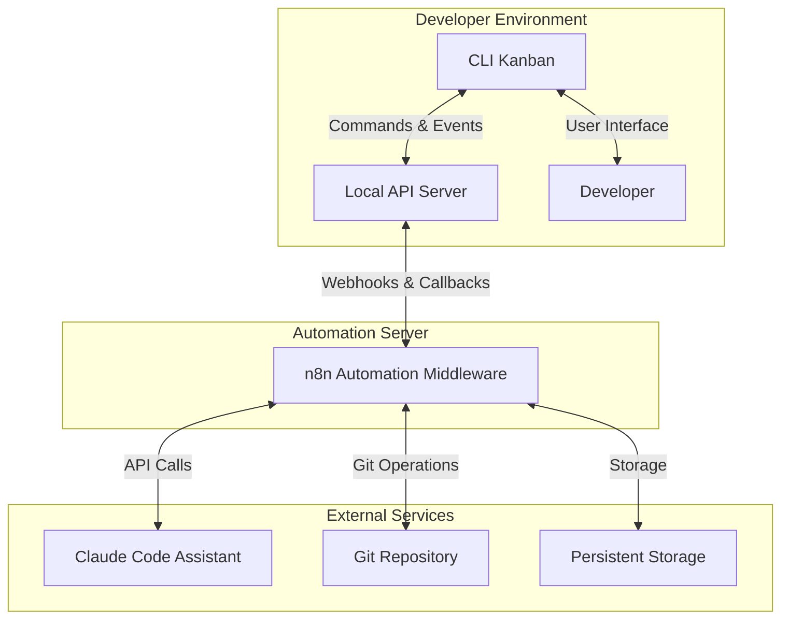

# Refined Agentic Coding Pipeline with CLI Kanban and n8n

This document outlines a complete agentic coding pipeline that integrates CLI Kanban, n8n automation middleware, and Claude Code Assistant to create a powerful, AI-enhanced software development workflow.

## Complete System Architecture



## Refined Workflow with Implementation Details

### 0. System Setup (Pre-requisites)

**CLI Kanban Companion Server:**
- CLI Kanban includes a small Express.js server that runs alongside the CLI
- Provides API endpoints for n8n callbacks (http://localhost:3000/api/kanban/...)
- Secures webhooks with shared secrets

**n8n Environment Configuration:**
- Git credentials stored securely in n8n
- Working directory configured for Git operations
- Error handling and retry policies defined globally

**Initial Repository Setup:**
- Developer initializes their Git repository with standard structure
- CLI Kanban is connected to this repository

### 1. Epic Planning Phase

**Developer initiates the process:**
```bash
kanban epic create "Sentiment Analysis Module" --ai-plan
```

**Behind the scenes:**
1. CLI Kanban creates the epic card
2. CLI sends webhook to n8n with epic details and a correlation ID
3. n8n immediately responds with 202 Accepted
4. n8n workflow asynchronously:
   - Formats prompt for context gathering
   - Calls Claude API with planning prompt
   - Processes response with error handling
   - Calls back to CLI Kanban server with context questions
5. CLI Kanban displays the context questions to the developer

**Developer provides context answers:**
```bash
kanban epic context EPIC-123 --answers "answers.json"
```

Where answers.json contains:
```json
{
  "questions": [
    {
      "question": "What data sources will the sentiment analysis module integrate with?",
      "answer": "We'll integrate with Finnhub, Alpha Vantage, and RSS feeds of financial news."
    },
    {
      "question": "What is the expected volume of data to be processed?",
      "answer": "Approximately 20,000 news items daily across all S&P 500 companies."
    },
    // Additional Q&A pairs
  ]
}
```

6. CLI Kanban stores these answers with the epic for future reference

### 2. Task Breakdown Phase

**Developer initiates breakdown:**
```bash
kanban epic breakdown EPIC-123 --ai --complexity
```

**Behind the scenes:**
1. CLI Kanban sends webhook to n8n with:
   - Epic details
   - Context answers previously stored
   - Project structure information 
   - Correlation ID
2. n8n immediately responds with 202 Accepted
3. n8n workflow asynchronously:
   - Formats prompt for task breakdown including context answers
   - Calls Claude API with robust error handling and retries
   - Parses response into task structure with fallback parsing
   - On successful parsing:
     - Calls back to CLI Kanban server to create tasks
   - On parsing failure:
     - Simplifies parsing approach (e.g., extract text sections if JSON fails)
     - If still failing, sends notification to developer with raw response
4. CLI Kanban shows newly created tasks in the "Ready" column

**Fallback Parsing Logic:**
```javascript
// Example robust parsing function for task breakdown
function parseTasksWithFallback(response) {
  // First attempt: Try to find JSON block
  const jsonMatch = response.match(/```json\n([\s\S]*?)\n```/);
  if (jsonMatch && jsonMatch[1]) {
    try {
      return JSON.parse(jsonMatch[1]);
    } catch (e) {
      console.log("Failed to parse JSON, trying fallback", e);
    }
  }
  
  // Second attempt: Look for numbered list with titles
  const tasks = [];
  const taskRegex = /(\d+)\.\s+[\*\-]?\s*\*\*([^\*]+)\*\*\s*\n([\s\S]*?)(?=\n\d+\.\s+[\*\-]?\s*\*\*|\n*$)/g;
  let match;
  
  while ((match = taskRegex.exec(response)) !== null) {
    const taskNumber = match[1];
    const title = match[2].trim();
    const body = match[3].trim();
    
    // Extract description, complexity, etc. from body
    const complexityMatch = body.match(/Complexity[:\s]+(\d+)/i);
    const complexity = complexityMatch ? parseInt(complexityMatch[1]) : 3;
    
    tasks.push({
      id: `TASK-${taskNumber}`,
      title: title,
      description: body,
      complexity: complexity
    });
  }
  
  if (tasks.length > 0) {
    return tasks;
  }
  
  // Final fallback: Return error status for human intervention
  return { error: "Could not parse tasks automatically", rawResponse: response };
}
```

### 3. Task Implementation Phase

**Developer selects a task for implementation:**
```bash
kanban move TASK-456 "In Progress" --assign-ai
```

**Behind the scenes:**
1. CLI Kanban sends webhook to n8n with:
   - Task details
   - Epic context
   - Current project branch name
   - Correlation ID
2. n8n workflow processes the implementation:

**Implementation details for Git operations:**
```javascript
// Git: Clone/Pull Repository
const repoPath = `/app/repositories/${projectId}`;
let gitCommand;

if (fs.existsSync(repoPath)) {
  gitCommand = `cd ${repoPath} && git fetch origin && git checkout ${baseBranch} && git pull origin ${baseBranch}`;
} else {
  gitCommand = `git clone ${repoUrl} ${repoPath} && cd ${repoPath} && git checkout ${baseBranch}`;
}

// Git: Create Feature Branch
const featureBranch = `ai-implement/task-${taskId}`;
gitCommand = `cd ${repoPath} && git checkout -b ${featureBranch}`;

// Write files within loop
for (const file of codeFiles) {
  const filePath = path.join(repoPath, file.fileName);
  // Ensure directory exists
  fs.mkdirSync(path.dirname(filePath), { recursive: true });
  fs.writeFileSync(filePath, file.code);
}

// Git: Commit Changes
gitCommand = `cd ${repoPath} && git add . && git commit -m "AI implementation for ${taskTitle}"`;

// Git: Push Branch
gitCommand = `cd ${repoPath} && git push origin ${featureBranch}`;

// Create Pull Request (using GitHub API example)
// This would be done in a separate node
```

3. n8n sends implementation details back to CLI Kanban:
   - Feature branch name and URL
   - List of files created
   - Pull request URL (if created)
   - Implementation status

4. CLI Kanban updates the task card with implementation details

### 4. Review and Refinement Phase

**Developer initiates review:**
```bash
kanban task review TASK-456
```

**Behind the scenes:**
1. CLI Kanban sends webhook to n8n with task details
2. n8n workflow:
   - Fetches current code from the feature branch
   ```javascript
   // Get code from feature branch for review
   const featureBranch = task.featureBranch;
   const repoPath = `/app/repositories/${projectId}`;
   
   // Ensure we're on the right branch
   gitCommand = `cd ${repoPath} && git fetch origin && git checkout ${featureBranch} && git pull origin ${featureBranch}`;
   
   // Get list of files changed in this branch (compared to base branch)
   const diffCommand = `cd ${repoPath} && git diff --name-only ${baseBranch}...${featureBranch}`;
   const changedFiles = execSync(diffCommand).toString().trim().split('\n');
   
   // Read content of changed files
   const codeToReview = {};
   for (const file of changedFiles) {
     if (fs.existsSync(path.join(repoPath, file))) {
       codeToReview[file] = fs.readFileSync(path.join(repoPath, file), 'utf8');
     }
   }
   ```
   - Formats review prompt with actual code
   - Calls Claude API for self-review
   - Processes review feedback
   - Updates task in Kanban with review comments

**Developer requests refinement based on review:**
```bash
kanban task refine TASK-456 --feedback "Improve error handling and add documentation"
```

**Behind the scenes:**
1. CLI Kanban sends webhook to n8n with:
   - Task details
   - Developer feedback
   - Feature branch information
2. n8n workflow:
   - Fetches current code from feature branch
   - Formats refinement prompt with:
     - Original task details
     - Current code implementation
     - Developer feedback
     - Code standards
   - Calls Claude API for code improvement
   - Parses response to identify changes
   - Updates files in feature branch
   - Commits and pushes changes
   - Updates task in Kanban with refinement details

### 5. Integration Phase

**Developer completes the task after reviewing changes:**
```bash
kanban move TASK-456 "Done" --integrate
```

**Behind the scenes:**
1. CLI Kanban sends webhook to n8n with task details
2. n8n workflow with pre-checks:
   - Runs linters on the feature branch
   ```javascript
   // Run linters
   const lintCommand = `cd ${repoPath} && npm run lint`;
   try {
     const lintResult = execSync(lintCommand).toString();
     // Process lint results
   } catch (error) {
     // Handle lint errors
     return { error: "Linting failed", details: error.toString() };
   }
   
   // Run tests if they exist
   if (fs.existsSync(path.join(repoPath, 'test'))) {
     const testCommand = `cd ${repoPath} && npm test`;
     try {
       const testResult = execSync(testCommand).toString();
       // Process test results
     } catch (error) {
       // Handle test failures
       return { error: "Tests failed", details: error.toString() };
     }
   }
   ```
   - If pre-checks pass:
     - Creates pull request if not already created
     - Adds integration status to task
   - If pre-checks fail:
     - Sends details back to CLI Kanban
     - Prompts developer to address issues

3. CLI Kanban shows integration status and pre-check results

## Error Handling Strategies

### 1. API Errors
- Implement exponential backoff for Claude API calls
- Store intermediate results to avoid repeating successful steps
- Provide clear error messages that indicate where the process failed

### 2. Parsing Failures
- Implement multi-stage fallback parsing:
  1. Try strict JSON parsing first
  2. Fall back to regex-based structured text parsing
  3. Fall back to simpler extraction patterns
  4. When all else fails, return raw response for manual handling

### 3. Git Operation Failures
- Check for Git conflicts before operations
- Provide detailed error context (branch status, conflict files)
- Allow retry options after manual intervention

### 4. Idempotency
- Use correlation IDs to track operations
- Check for existing branches/PRs before creating new ones
- Implement "continue from" functionality to resume failed workflows

## Asynchronous Processing Model

The architecture uses an asynchronous processing model:

1. CLI Kanban companion server exposes a local API (localhost:3000)
2. Each CLI command sends a webhook to n8n and returns immediately
3. n8n processes asynchronously and calls back to the local API
4. The CLI Kanban UI refreshes to show updated state

```javascript
// Example of the CLI Kanban companion server
const express = require('express');
const app = express();
app.use(express.json());

// Secure webhook endpoints with shared secret
app.use('/api/kanban/*', (req, res, next) => {
  const secret = req.headers['x-webhook-secret'];
  if (secret !== process.env.WEBHOOK_SECRET) {
    return res.status(403).json({ error: 'Invalid webhook secret' });
  }
  next();
});

// Endpoint for task updates from n8n
app.post('/api/kanban/task/:taskId/update', (req, res) => {
  const { taskId } = req.params;
  const updates = req.body;
  
  // Update task in CLI Kanban's data store
  updateTask(taskId, updates);
  
  // Notify CLI about updates if it's listening
  notifyCliIfActive(taskId, updates);
  
  res.json({ success: true });
});

// Start the server when CLI Kanban starts
app.listen(3000, () => {
  console.log('CLI Kanban companion server listening on port 3000');
});
```

## n8n Workflow Examples

### Epic Planning Workflow

```json
{
  "nodes": [
    {
      "parameters": {
        "path": "epic/create",
        "responseMode": "onReceived"
      },
      "name": "Webhook: Epic Create",
      "type": "n8n-nodes-base.webhook",
      "typeVersion": 1,
      "position": [
        250,
        300
      ]
    },
    {
      "parameters": {
        "jsCode": "return {\n  json: {\n    prompt: `I'm planning an epic called \"${$input.item.json.epicName}\". Please ask me 5-7 specific questions to gather necessary context for detailed planning. The epic description is: ${$input.item.json.description}`\n  }\n};"
      },
      "name": "Prepare Context Questions",
      "type": "n8n-nodes-base.code",
      "typeVersion": 1,
      "position": [
        450,
        300
      ]
    },
    {
      "parameters": {
        "url": "https://api.anthropic.com/v1/messages",
        "authentication": "genericCredentialType",
        "genericAuthType": "httpHeaderAuth",
        "method": "POST",
        "sendBody": true,
        "bodyParameters": {
          "parameters": [
            {
              "name": "model",
              "value": "claude-3-opus-20240229"
            },
            {
              "name": "max_tokens",
              "value": 1000
            },
            {
              "name": "messages",
              "value": "=[{\n  \"role\": \"user\",\n  \"content\": \"{{$node[\"Prepare Context Questions\"].json[\"prompt\"]}}\"\n}]"
            }
          ]
        },
        "options": {
          "allowUnauthorizedCerts": true,
          "response": {
            "response": {
              "fullResponse": true,
              "responseFormat": "json"
            }
          }
        }
      },
      "name": "Call Claude API",
      "type": "n8n-nodes-base.httpRequest",
      "typeVersion": 2,
      "position": [
        650,
        300
      ]
    },
    {
      "parameters": {
        "errorHandling": "retry",
        "url": "=http://localhost:3000/api/kanban/epic/{{$input.item.json.epicId}}/update",
        "sendHeaders": true,
        "headerParameters": {
          "parameters": [
            {
              "name": "x-webhook-secret",
              "value": "={{$env.WEBHOOK_SECRET}}"
            }
          ]
        },
        "method": "POST",
        "sendBody": true,
        "bodyParameters": {
          "parameters": [
            {
              "name": "contextQuestions",
              "value": "={{$node[\"Call Claude API\"].json[\"content\"][0][\"text\"]}}"
            }
          ]
        }
      },
      "name": "Update Kanban with Questions",
      "type": "n8n-nodes-base.httpRequest",
      "typeVersion": 2,
      "position": [
        850,
        300
      ]
    },
    {
      "parameters": {
        "values": {
          "number": [
            {
              "name": "maxRetries",
              "value": 3
            },
            {
              "name": "retryDelay",
              "value": 5
            }
          ]
        }
      },
      "name": "Retry Settings",
      "type": "n8n-nodes-base.set",
      "typeVersion": 1,
      "position": [
        450,
        150
      ]
    }
  ],
  "connections": {
    "Webhook: Epic Create": {
      "main": [
        [
          {
            "node": "Prepare Context Questions",
            "type": "main",
            "index": 0
          }
        ]
      ]
    },
    "Prepare Context Questions": {
      "main": [
        [
          {
            "node": "Call Claude API",
            "type": "main",
            "index": 0
          }
        ]
      ]
    },
    "Call Claude API": {
      "main": [
        [
          {
            "node": "Update Kanban with Questions",
            "type": "main",
            "index": 0
          }
        ]
      ]
    },
    "Retry Settings": {
      "main": [
        [
          {
            "node": "Call Claude API",
            "type": "main",
            "index": 0
          }
        ]
      ]
    }
  }
}
```

### Task Implementation Workflow

```json
{
  "nodes": [
    {
      "parameters": {
        "path": "task/implement",
        "responseMode": "onReceived"
      },
      "name": "Webhook: Implement Task",
      "type": "n8n-nodes-base.webhook",
      "typeVersion": 1,
      "position": [
        250,
        300
      ]
    },
    {
      "parameters": {
        "url": "=http://localhost:3000/api/kanban/task/{{$input.item.json.taskId}}/details",
        "sendHeaders": true,
        "headerParameters": {
          "parameters": [
            {
              "name": "x-webhook-secret",
              "value": "={{$env.WEBHOOK_SECRET}}"
            }
          ]
        },
        "method": "GET"
      },
      "name": "Get Task Details",
      "type": "n8n-nodes-base.httpRequest",
      "typeVersion": 2,
      "position": [
        450,
        300
      ]
    },
    {
      "parameters": {
        "url": "=http://localhost:3000/api/standards/get",
        "method": "GET"
      },
      "name": "Get Code Standards",
      "type": "n8n-nodes-base.httpRequest",
      "typeVersion": 2,
      "position": [
        450,
        450
      ]
    },
    {
      "parameters": {
        "functionCode": "const repo = $input.item.json.repo;\nconst branch = $input.item.json.branch;\nconst repoPath = `/app/repositories/${$input.item.json.projectId}`;\nconst { execSync } = require('child_process');\nconst fs = require('fs');\n\ntry {\n  if (fs.existsSync(repoPath)) {\n    // Repo exists, fetch latest\n    const gitCommand = `cd ${repoPath} && git fetch origin && git checkout ${branch} && git pull origin ${branch}`;\n    const result = execSync(gitCommand).toString();\n    return {json: {success: true, message: 'Repository updated', result}};\n  } else {\n    // Clone repo\n    const gitCommand = `git clone ${repo} ${repoPath} && cd ${repoPath} && git checkout ${branch}`;\n    const result = execSync(gitCommand).toString();\n    return {json: {success: true, message: 'Repository cloned', result}};\n  }\n} catch (error) {\n  return {json: {success: false, error: error.toString()}};\n}"
      },
      "name": "Git: Clone/Pull Repository",
      "type": "n8n-nodes-base.function",
      "typeVersion": 1,
      "position": [
        650,
        300
      ]
    },
    {
      "parameters": {
        "functionCode": "const repoPath = `/app/repositories/${$input.item.json.projectId}`;\nconst baseBranch = $input.item.json.branch;\nconst taskId = $input.item.json.taskId;\nconst { execSync } = require('child_process');\n\ntry {\n  const featureBranch = `ai-implement/task-${taskId}`;\n  const gitCommand = `cd ${repoPath} && git checkout -b ${featureBranch}`;\n  \n  try {\n    const result = execSync(gitCommand).toString();\n    return {json: {success: true, featureBranch, message: 'Feature branch created', result}};\n  } catch (error) {\n    // Branch might already exist\n    if (error.toString().includes('already exists')) {\n      const checkoutCommand = `cd ${repoPath} && git checkout ${featureBranch}`;\n      const result = execSync(checkoutCommand).toString();\n      return {json: {success: true, featureBranch, message: 'Feature branch already exists, checked out', result}};\n    } else {\n      throw error;\n    }\n  }\n} catch (error) {\n  return {json: {success: false, error: error.toString()}};\n}"
      },
      "name": "Git: Create Feature Branch",
      "type": "n8n-nodes-base.function",
      "typeVersion": 1,
      "position": [
        850,
        300
      ]
    },
    {
      "parameters": {
        "jsCode": "const task = $input.item.json;\nconst standards = $node[\"Get Code Standards\"].json.standards;\nconst featureBranch = $node[\"Git: Create Feature Branch\"].json.featureBranch;\n\nreturn {\n  json: {\n    prompt: `I need you to implement the following task:\\n\\nTitle: ${task.title}\\nDescription: ${task.description}\\n\\nFollowing these coding standards:\\n${standards}\\n\\nPlease provide:\\n1. Implementation code\\n2. Unit tests\\n3. Documentation\\n\\nFormat your response with separate markdown code blocks for each file to be created. Begin each code block with a comment containing the file path, like this:\\n\\n\\`\\`\\`javascript\\n// src/utils/example.js\\nconsole.log('Hello world');\\n\\`\\`\\``\n  }\n};"
      },
      "name": "Prepare Implementation Prompt",
      "type": "n8n-nodes-base.code",
      "typeVersion": 1,
      "position": [
        1050,
        300
      ]
    },
    {
      "parameters": {
        "url": "https://api.anthropic.com/v1/messages",
        "authentication": "genericCredentialType",
        "genericAuthType": "httpHeaderAuth",
        "method": "POST",
        "sendBody": true,
        "bodyParameters": {
          "parameters": [
            {
              "name": "model",
              "value": "claude-3-opus-20240229"
            },
            {
              "name": "max_tokens",
              "value": 4000
            },
            {
              "name": "messages",
              "value": "=[{\n  \"role\": \"user\",\n  \"content\": \"{{$node[\"Prepare Implementation Prompt\"].json[\"prompt\"]}}\"\n}]"
            }
          ]
        }
      },
      "name": "Call Claude API",
      "type": "n8n-nodes-base.httpRequest",
      "typeVersion": 2,
      "position": [
        1250,
        300
      ]
    },
    {
      "parameters": {
        "jsCode": "// Extract code blocks from Claude's response\nconst response = $input.item.json.content[0].text;\nconst codeBlocks = [];\n\n// Regex to find markdown code blocks with file names in comments\nconst codeBlockRegex = /```([\\w]+)\\s*\\n\\/\\/\\s*([\\w\\/\\.]+)\\s*\\n([\\s\\S]*?)\\n```/g;\n\nlet match;\nwhile ((match = codeBlockRegex.exec(response)) !== null) {\n  codeBlocks.push({\n    language: match[1],\n    fileName: match[2],\n    code: match[3]\n  });\n}\n\nreturn { json: { codeBlocks } };"
      },
      "name": "Parse Code Files",
      "type": "n8n-nodes-base.code",
      "typeVersion": 1,
      "position": [
        1450,
        300
      ]
    },
    {
      "parameters": {
        "jsCode": "const repoPath = `/app/repositories/${$input.item.json.projectId}`;\nconst codeBlocks = $node[\"Parse Code Files\"].json.codeBlocks;\nconst fs = require('fs');\nconst path = require('path');\n\nconst savedFiles = [];\n\ntry {\n  for (const block of codeBlocks) {\n    const filePath = path.join(repoPath, block.fileName);\n    \n    // Ensure directory exists\n    fs.mkdirSync(path.dirname(filePath), { recursive: true });\n    \n    // Write file\n    fs.writeFileSync(filePath, block.code);\n    \n    savedFiles.push({\n      path: block.fileName,\n      language: block.language\n    });\n  }\n  \n  return { json: { success: true, savedFiles } };\n} catch (error) {\n  return { json: { success: false, error: error.toString() } };\n}"
      },
      "name": "Save Code Files",
      "type": "n8n-nodes-base.code",
      "typeVersion": 1,
      "position": [
        1650,
        300
      ]
    },
    {
      "parameters": {
        "functionCode": "const repoPath = `/app/repositories/${$input.item.json.projectId}`;\nconst taskTitle = $input.item.json.title;\nconst { execSync } = require('child_process');\n\ntry {\n  const gitCommand = `cd ${repoPath} && git add . && git commit -m \"AI implementation for ${taskTitle}\"`;\n  const result = execSync(gitCommand).toString();\n  return {json: {success: true, message: 'Changes committed', result}};\n} catch (error) {\n  return {json: {success: false, error: error.toString()}};\n}"
      },
      "name": "Git: Commit Changes",
      "type": "n8n-nodes-base.function",
      "typeVersion": 1,
      "position": [
        1850,
        300
      ]
    },
    {
      "parameters": {
        "functionCode": "const repoPath = `/app/repositories/${$input.item.json.projectId}`;\nconst featureBranch = $node[\"Git: Create Feature Branch\"].json.featureBranch;\nconst { execSync } = require('child_process');\n\ntry {\n  const gitCommand = `cd ${repoPath} && git push origin ${featureBranch}`;\n  const result = execSync(gitCommand).toString();\n  return {json: {success: true, message: 'Branch pushed', result}};\n} catch (error) {\n  return {json: {success: false, error: error.toString()}};\n}"
      },
      "name": "Git: Push Branch",
      "type": "n8n-nodes-base.function",
      "typeVersion": 1,
      "position": [
        2050,
        300
      ]
    },
    {
      "parameters": {
        "errorHandling": "retry",
        "url": "=http://localhost:3000/api/kanban/task/{{$input.item.json.taskId}}/update",
        "sendHeaders": true,
        "headerParameters": {
          "parameters": [
            {
              "name": "x-webhook-secret",
              "value": "={{$env.WEBHOOK_SECRET}}"
            }
          ]
        },
        "method": "POST",
        "sendBody": true,
        "bodyParameters": {
          "parameters": [
            {
              "name": "status",
              "value": "Implemented"
            },
            {
              "name": "featureBranch",
              "value": "={{$node[\"Git: Create Feature Branch\"].json.featureBranch}}"
            },
            {
              "name": "implementation",
              "value": "={{$node[\"Call Claude API\"].json[\"content\"][0][\"text\"]}}"
            },
            {
              "name": "files",
              "value": "={{$node[\"Save Code Files\"].json.savedFiles}}"
            }
          ]
        }
      },
      "name": "Update Kanban with Implementation",
      "type": "n8n-nodes-base.httpRequest",
      "typeVersion": 2,
      "position": [
        2250,
        300
      ]
    }
  ],
  "connections": {
    "Webhook: Implement Task": {
      "main": [
        [
          {
            "node": "Get Task Details",
            "type": "main",
            "index": 0
          },
          {
            "node": "Get Code Standards",
            "type": "main",
            "index": 0
          }
        ]
      ]
    },
    "Get Task Details": {
      "main": [
        [
          {
            "node": "Git: Clone/Pull Repository",
            "type": "main",
            "index": 0
          }
        ]
      ]
    },
    "Git: Clone/Pull Repository": {
      "main": [
        [
          {
            "node": "Git: Create Feature Branch",
            "type": "main",
            "index": 0
          }
        ]
      ]
    },
    "Git: Create Feature Branch": {
      "main": [
        [
          {
            "node": "Prepare Implementation Prompt",
            "type": "main",
            "index": 0
          }
        ]
      ]
    },
    "Prepare Implementation Prompt": {
      "main": [
        [
          {
            "node": "Call Claude API",
            "type": "main",
            "index": 0
          }
        ]
      ]
    },
    "Call Claude API": {
      "main": [
        [
          {
            "node": "Parse Code Files",
            "type": "main",
            "index": 0
          }
        ]
      ]
    },
    "Parse Code Files": {
      "main": [
        [
          {
            "node": "Save Code Files",
            "type": "main",
            "index": 0
          }
        ]
      ]
    },
    "Save Code Files": {
      "main": [
        [
          {
            "node": "Git: Commit Changes",
            "type": "main",
            "index": 0
          }
        ]
      ]
    },
    "Git: Commit Changes": {
      "main": [
        [
          {
            "node": "Git: Push Branch",
            "type": "main",
            "index": 0
          }
        ]
      ]
    },
    "Git: Push Branch": {
      "main": [
        [
          {
            "node": "Update Kanban with Implementation",
            "type": "main",
            "index": 0
          }
        ]
      ]
    }
  }
}
```

## Setup and Configuration

### 1. Install CLI Kanban and Companion Server

```bash
# Install CLI Kanban
npm install -g cli-kanban

# Initialize a project with API server
kanban init my-sentiment-project --with-server

# Configure webhook endpoint and secret
kanban config set webhook-url http://n8n-server:5678/webhook
kanban config set webhook-secret "your-secure-secret-here"

# Configure local API for callbacks
kanban config set local-api-port 3000
```

### 2. Configure n8n with Secure Credentials

```bash
# Install and start n8n
docker run -it --name n8n -p 5678:5678 -v ~/.n8n:/home/node/.n8n n8nio/n8n

# Configure credentials in the n8n UI:
# 1. Claude API Key
# 2. Git SSH key or token
# 3. Webhook secret (same as CLI Kanban)
```

### 3. Configure Git Integration

```bash
# Set up working directory for n8n's Git operations
docker exec -it n8n mkdir -p /app/repositories

# Add SSH key for Git operations
docker cp ~/.ssh/id_rsa n8n:/home/node/.ssh/id_rsa
docker exec -it n8n chmod 600 /home/node/.ssh/id_rsa

# Test Git access
docker exec -it n8n git clone git@github.com:your-org/your-repo.git /tmp/test-repo
```

## Implementation Roadmap

1. **Phase 1**: CLI Kanban with local API server
2. **Phase 2**: Basic n8n workflows for epic planning and task breakdown
3. **Phase 3**: Git integration for implementation workflows
4. **Phase 4**: Review and refinement workflows
5. **Phase 5**: Integration and quality assurance workflows
6. **Phase 6**: Error handling and resilience improvements

## Benefits of This Integrated Approach

1. **Unified Developer Experience**: Developers interact with a familiar CLI Kanban interface
2. **Automated Workflow**: n8n handles the complex interaction patterns
3. **Flexible Integration**: Easy to add new capabilities or integrate with other tools
4. **Visible Process**: All steps in the AI-assisted development process are visible
5. **Extensible Architecture**: Can add more AI services or tools as needed
6. **Open Source Stack**: All components can be self-hosted and modified
7. **Robust Error Handling**: Multi-stage fallbacks and clear error reporting
8. **Proper Git Integration**: Complete Git workflow with feature branches and PRs
9. **Code Quality Assurance**: Pre-integration checks for linting and testing
10. **Asynchronous Processing**: Responsive CLI even during long-running operations